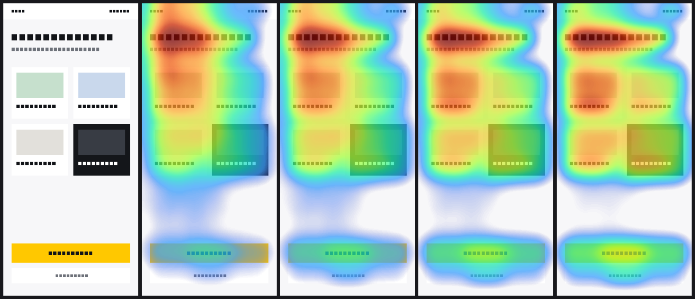
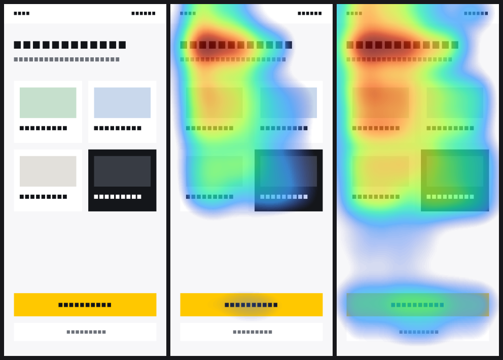
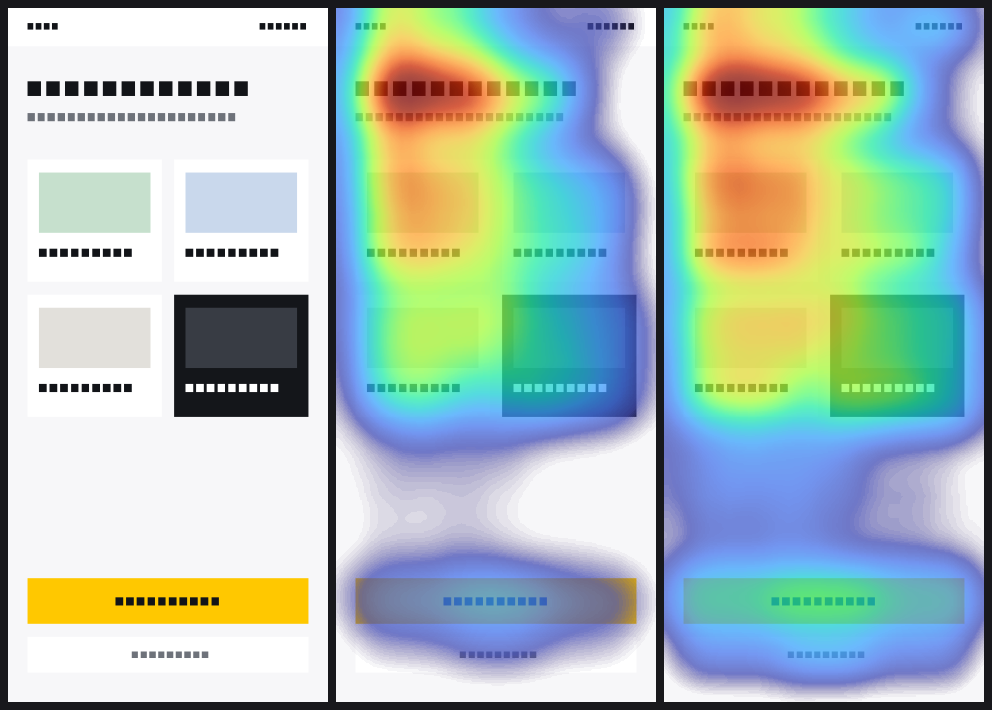
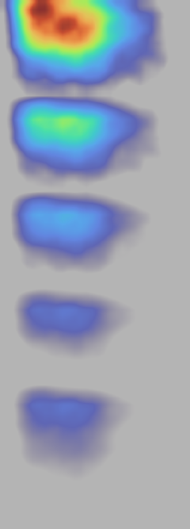
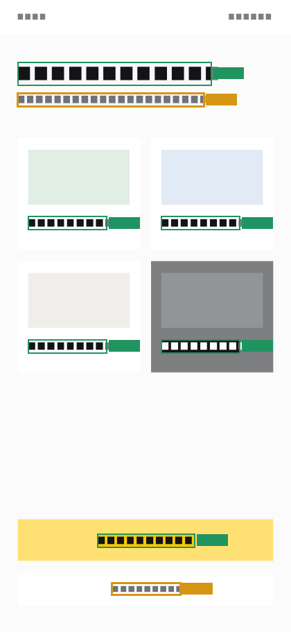
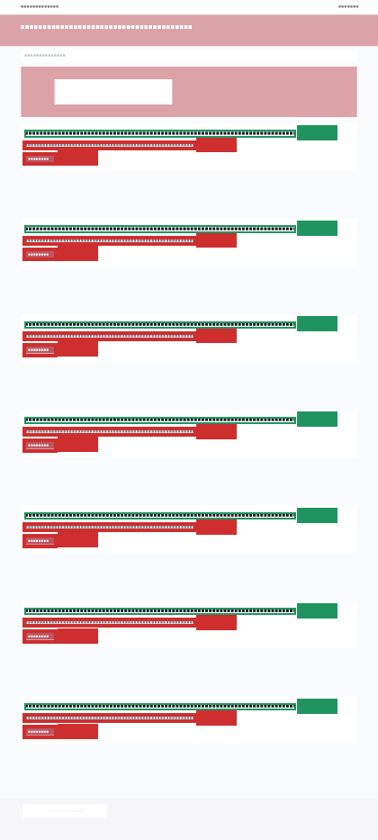

# Figmaps — Figma Plugin

**Version 1.1** — „Messbar und handlungsleitend"

Erzeugt für einen ausgewählten Frame Visualisierungen und legt sie als Bild
rechts neben dem Original auf dem Canvas ab:

- **Heatmap** — vorhergesagte Verteilung visueller Aufmerksamkeit (Turbo-Colormap)
- **Focusmap** — der Screen bleibt dort scharf, wo Aufmerksamkeit vorhergesagt
  wird, und wird zum ruhigen Rand hin **stufenlos** abgedunkelt und unscharf
- **Above the Fold** — bei langen Frames zusätzlich der erste Abschnitt allein
- **Befunde** — 3–6 Sätze in Deutsch, im Panel und als Textframe neben den Maps
- **Clickmap** — implementiert, aber derzeit nicht im Panel angeboten, siehe
  „Clickmap — warum sie nicht im Panel steht"

> Die Ausgabe ist eine **algorithmische Vorhersage**, keine Messung. Es fließen
> keine Daten echten Nutzerverhaltens ein. Auf die Screenshots wird **nichts**
> gemalt außer der Vorhersage selbst; Titel, Disclaimer, Parameter und die
> CC-BY-Nennung stehen als Figma-Textebenen daneben (`figma/place.ts`).

Kein Backend, kein Login, keine Netzwerkanfragen — `networkAccess` steht auf
`["none"]`, das Design verlässt die Maschine nicht.

> **Namensnennung:** Das Plugin liefert einen Ortsprior mit, der aus dem
> UEyes-Datensatz abgeleitet ist (Jiang et al., CHI 2023), lizenziert unter
> CC BY 4.0. Details und die Stellen, an denen die Nennung stehen muss:
> **[`NOTICE.md`](NOTICE.md)**.

### Was 1.1 hinzufügt

| | |
|---|---|
| **Eval-Harness** | `npm run eval` misst die Engine gegen ein Referenz-Set (AUC-Judd, CC, NSS, KL) und immer gegen Center-Bias, Uniform und die eingefrorene 1.0-Konfiguration. Ohne diese Zahl ist jede weitere Arbeit an der Engine Glaubenssache. |
| **Abschnittsweise Analyse** | Frames über 1,5 Viewport-Höhen werden in überlappende Abschnitte geschnitten und einzeln analysiert. Saliency ist relativ zum sichtbaren Ausschnitt, nicht zum Gesamtdokument. |
| **Befunde** | Ein deterministisches Regelwerk formuliert, was gemessen wurde — mit „Im Canvas zeigen" auf die betroffene Ebene. |
| **Betrachtungsdauer** | Drei Profile (`glance` 1 s, `scan` 3 s, `read` 7 s), **gemessen belegt**: sie tauschen den Ortsprior, nicht die Gewichte. |

### Was 1.2 bisher ändert

1.2 lief in drei Blöcken (A Alpha-Kurve, B Regeln für Ein-Viewport-Screens,
C Contrastmap). **A und C sind fertig, B ist abgeschlossen — aber nur eine
seiner vier Aufgaben hat eine Regel hervorgebracht:**

| | |
|---|---|
| **B1** `competition` auf die Diagonale | gebaut und neu kalibriert |
| **B2** Kopfbereich gegen Inhalt | gemessen und **verworfen** — die Größe ordnet die bekannten Fälle nicht |
| **B3** CTA in der ruhigsten Zone | **nicht angefangen.** Kein Code, keine Messung |
| **B4** `cta-below-fold` auf `localMean` | gebaut, gemessen, **bleibt abgeschaltet** — der Umbau behebt den Defekt nicht |

Das Regelwerk hat 1.2 damit **keine neue Regel** hinzugefügt; es hat zwei
bestehende neu kalibriert und zwei Ideen widerlegt.

| | |
|---|---|
| **`blendAlpha` 0,3 → 0,5** | Kreuzvalidiert und out-of-sample nachgemessen statt in-sample abgelesen. AUC, CC und NSS haben ihr Optimum einstimmig bei 0,5, in beiden Kategorien. Siehe [Alpha-Kurve](#alpha-kurve-12-a). |
| **Befund: unsere Karten sind zu weich** | Die gemessene Aufmerksamkeit ist um **Faktor 3,4** konzentrierter als unsere Vorhersage. Die Verteilungen überlappen nicht. `blendAlpha` ist dafür der falsche Hebel — ein höheres α macht die Karten weicher, nicht schärfer. |
| **Contrastmap — die Hauptausgabe, nicht die dritte Karte** | Auf dem Onboarding-Screen stehen **8 gemessene Kontrastaussagen gegen 1 Vorhersagebefund**, auf einem Desktop-Frame **14 durchgefallene von 21 gemessenen Elementen gegen Ø 1,67 Vorhersagebefunde**. Sie braucht weder Folds noch Abschnitte noch Kandidaten noch Kalibrierung und sagt auf **jeder** Frame-Form etwas — als einzige Ausgabe des Plugins. Siehe [Contrastmap](#contrastmap-12-c). |
| **Schärfe: Blur 0,035 + `blendGamma` 1,6** | Der A1-Befund ist zu gut einem Drittel behoben, bei **besseren Werten in allen vier Metriken**, KL eingeschlossen. Der entscheidende Hebel war der, den 1.1 wegen KL ausgebaut hatte. Nicht 2,0, obwohl der Mittelwert dafür spräche: dieser Wert lässt die Gruppe stehen, für die das Plugin existiert. Siehe [Schärfe](#a6--schärfe-die-nachbearbeitung-nicht-das-mischungsverhältnis) und [A7](#a7--derselbe-mittelwert-zwei-gegenläufige-hälften). |
| **Transparenzschwelle nachgezogen** | 0,08 → 0,02. Dieselbe Schwelle hätte auf der neuen Karte 37,5 % statt 18,0 % verdeckt — ein Gutteil von „das Overlay ist leerer" war der Renderer, nicht die Vorhersage. |
| **CI grün, Gate scharf** | Sechs von sechs Läufen waren an `npm ci` gescheitert; danach lief das Gate, meldete aber „übersprungen"; und als es lief, bewachte es die **eingefrorene** 1.0-Referenz. Dreimal dieselbe Lücke. Jetzt: 40 Bilder im Repo, echte Messung bei jedem PR, und ein CI-Schritt, der beweist, dass das Gate rot werden **kann**. Die Zahlen des Gates sind **kein Qualitätsbeleg** — siehe unten. |
| **Nebenwirkungen ausgewiesen** | `competition` verdreifacht seine Feuerrate, ohne dass die Regel angefasst wurde. Nicht nachjustiert: der Umbau in B kalibriert sie neu. |
| **Erreichbarkeitstests robust** | Drei der zwölf Fälle hingen an der dritten Nachkommastelle eines Engine-Parameters. Repariert und durch einen zweiten Test abgesichert, der sie unter verstellten Parametern wiederholt. |
| **Beta-Marker im Panel** | Der Kopf zeigt „Beta v1.2" — eine Aussage über die Vorhersage, nicht über die Stabilität des Codes. Die Version kommt aus `package.json` und nur von dort; die Zahl im Kopf folgt dem Versionssprung automatisch. |

**Aktueller Stand:** gemessen gegen UEyes, getrennt für Webpage und Mobile UI.
`hybrid-v1` — datengeschätzter Ortsprior plus additive Bildanalyse — schlägt in
einer 5-fachen Kreuzvalidierung über je 495 Bilder **jede bildunabhängige
Baseline in allen vier Metriken**, in beiden Kategorien. **S-2 ist erfüllt.**
Siehe [Kreuzvalidierung](#kreuzvalidierung-495-bilder-je-kategorie).

---

## Setup

```bash
npm install
npm run build
```

Danach in der **Figma Desktop App**: `Plugins → Development → Import plugin from
manifest…` → `manifest.json` aus diesem Verzeichnis wählen.

Während der Entwicklung:

```bash
npm run watch     # esbuild im Watch-Modus (unminified, inline sourcemaps)
npm run verify    # typecheck + tests + build
npm run lint      # eslint inkl. @figma/eslint-plugin-figma-plugins
```

Eval-Harness (läuft offline in Node, nicht im Plugin):

```bash
# Referenz-Daten importieren — Pfad als Parameter, nie im Code
npm run eval:fixtures -- --ueyes /pfad/zum/UEyes_dataset
# alternativ: UEYES_DIR=/pfad/zum/UEyes_dataset npm run eval:fixtures -- --ueyes

npm run eval -- --fixtures ueyes-web --set test --duration 3 --report out/eval.md
npm run eval -- --help

# 1.2 A — die Alpha-Kurve (siehe „Alpha-Kurve")
npm run alpha                                     # Sweep, Tuning-Split, kreuzvalidiert
npm run visual-check                              # die zwei Prüffälle als Bild
npm run side-effects -- --before 0.3 --after 0.5  # Feuerraten vorher/nachher
```

Die `id` in `manifest.json` ist ein lokaler Platzhalter. Beim Publishing vergibt
Figma eine echte ID, die dann eingetragen wird.

### Welcher Weg wofür da ist

**Es gibt drei Wege, wie dieses Plugin in ein Figma kommt, und sie sind nicht
gleichwertig.** Ohne diese Tabelle pflegen wir in vier Wochen zwei Verteilwege
und wissen nicht mehr, welcher der verbindliche ist.

| Weg | für wen | Stand |
|---|---|---|
| **Privates Publishing in der Organisation** | **alle Nutzer** — Designerinnen, Reviewer, jeder ohne Repo-Zugriff | **der verbindliche Weg**, sobald er steht. Noch offen, siehe unten |
| **Release-Zip am Tag** | Entwicklung, Archiv, Notlage | steht (`v1.2.0`), bleibt — aber **nicht** der Weg, den man Kollegen nennt |
| **Dev-Import aus dem Worktree** | nur Entwicklung, nur lokal | steht (`npm run watch`) |

**Warum der GitHub-Weg als Verteilweg nicht taugt, und zwar unabhängig davon,
wie gut er geprüft ist.** Das Repo ist privat. Wer keinen Zugriff hat, sieht das
Release nicht, bekommt auf jede Asset-URL 404 und kann das Zip nicht laden — und
Designerinnen haben typischerweise keinen Repo-Zugriff. Dazu kommt alles, was
der Weg an Handgriffen verlangt: das richtige Archiv erwischen (die beiden
automatischen „Source code"-Archive sind Quellcode ohne `build/`), entpacken, an
einen dauerhaften Ort legen, „Import plugin from manifest…" finden, die richtige
`manifest.json` wählen. Jeder dieser Handgriffe ist eine Stelle, an der es
scheitert, und einer davon hat schon gescheitert.

**Privates Publishing löst das vollständig.** Das Plugin erscheint in Figma unter
den Plugins der Organisation, Installation ist ein Klick, Aktualisierung
passiert ohne Zutun. Damit entfallen Zip, Manifest-Import, Archiv-Verwechslung
und der Release-Prüfer **als Verteilweg**.

**Was bleibt, und warum.** Der Tag-Release bleibt als **Archiv**: er ist der
einzige Ort, an dem ein geprüfter, reproduzierbarer Stand pro Version liegt —
gebaut aus einem Commit, mit `check-release.mjs` gegen die Ortsprior-Nutzdaten
geprüft, entpackt nachgemessen. Das ist wertvoll, wenn eine Frage lautet „was
genau war in 1.2.0 drin", und es ist der Rückfallweg, wenn Publishing einmal
nicht geht. `release-verify.yml` bewacht weiterhin, dass dieses Archiv nicht
still leer ist — dieselbe Prüfung, anderer Zweck.

**Die Regel, damit es nicht wieder auseinanderläuft:** einem Kollegen wird
**nur** der Publishing-Weg genannt. Steht das private Publishing, wird der
Dev-Import aus dem Worktree in Figma entfernt — sonst stehen zwei Einträge
namens „Figmaps" mit derselben Plugin-Id im Entwicklungs-Menü, und niemand
sieht, welcher gerade läuft. Genau das war beim Start dieses Branches der Fall
(einer aus `~/Downloads/figmaps-1.2.0`, einer aus dem Worktree).

#### Was für das private Publishing noch fehlt

Geprüft gegen Figmas Angaben zum Publish-Dialog (Stand August 2026) und gegen
das, was im Repo liegt.

| Feld | verlangt | im Repo | fehlt |
|---|---|---|---|
| Name | — | `Figmaps` | — |
| **Icon** | empfohlen **128 × 128 px** | nur `assets/logo.svg` | **der Export.** Kein PNG in dieser Größe ist versioniert |
| **Thumbnail / Cover** | empfohlen **1920 × 1080 px** | nichts in der Nähe (größtes Bild: 1648 × 710, eine Messgrafik) | **ganz** |
| **Tagline** | ein Satz | nirgends | **ganz** — und es ist nicht die Repo-Beschreibung, siehe unten |
| **Beschreibung** | Fließtext | nirgends als veröffentlichbarer Text | **ganz.** `RELEASE.md` sind Release-Notizen, die README hat über 4.000 Zeilen |
| Kategorie | eine auswählen | — | Entscheidung |
| **Support-Kontakt** | **Pflicht** | — | Entscheidung. **Nicht** „Issues im Repo" — genau die Leute, für die wir das machen, kommen dort nicht hin |
| Carousel-Bilder | optional, bis 9 | die Messgrafiken unter `assets/messungen/` wären Kandidaten | — |
| Playground-Datei | optional | — | — |
| Sicherheitsangaben | optional | `networkAccess: none` im Manifest | eine wahre und starke Aussage, die man machen sollte |
| Plugin-Id | Figma vergibt sie beim Publishing | Platzhalter `1000000000000000001` | muss danach in `manifest.json` zurückwandern |

Zwei Punkte, die nicht auf der Liste stehen und trotzdem entscheiden:

- **Der Plan.** Privates Publishing gibt es laut Figma nur in den Plänen
  **Organization und Enterprise**. Steht das nicht, ist der ganze Weg zu.
- **Keine Prüfung durch Figma.** „Figma doesn't review any plugins you choose to
  share privately within an organization." Das ist bequem und verschiebt die
  Verantwortung vollständig zu uns: was hier an Text steht, steht ungeprüft vor
  Kollegen.

**Und ein Befund, der hierher gehört, weil er dieselbe Klasse ist wie der Rest
dieses Kapitels.** Die Repo-Beschreibung — die im veröffentlichten Release als
Text stand — lautet „A Figma Plugin for creating Heatmaps, Focusmaps and
Contrastmaps". Das ist die Reihenfolge von 1.1: Vorhersage zuerst. Seit 1.2 ist
sie falsch, und diese README begründet an anderer Stelle ausführlich, warum: wer
das Plugin öffnet, bekommt zuerst eine **Kontrastprüfung nach WCAG** und
zusätzlich eine Aufmerksamkeitsvorhersage, nicht umgekehrt. Tagline und
Beschreibung sind neu zu schreiben und nicht aus dem Vorhandenen zu übernehmen —
sonst tragen wir die alte Reihenfolge in den Store.

### Ein Release bauen

```bash
git tag v1.2.0 && git push origin v1.2.0
```

`.github/workflows/release.yml` baut daraufhin, prüft und hängt
`figmaps-1.2.0.zip` an ein **Release im Entwurfsstatus** — der Text
(`RELEASE.md`) wird vor der Veröffentlichung gelesen. Ein Zip, das schon
jemand geladen hat, lässt sich nicht zurückziehen.

Im Zip liegt `manifest.json` neben `build/`, sodass „Import plugin from
manifest…" direkt greift, dazu `NOTICE.md` und eine dreizeilige
`LIESMICH.txt`.

**Warum zwischen Bau und Zip eine eigene Prüfung steht
(`scripts/check-release.mjs`).** Der Ortsprior ist das einzige Stück dieses
Plugins, dessen Fehlen **still** bleibt: ohne Asset fällt die Engine auf die
analytische F-Muster-Glocke zurück — keine Meldung im Panel, kein Fehler im
Log, nur schlechtere Karten. Ein Release, das den Prior verliert, sieht
funktionierend aus. Geprüft werden deshalb die **Nutzdaten**, nicht die
Dateinamen: für jeden der zwölf Schlüssel eine Karte mit 32 × 32 dekodierten
Bytes und einem Maximum, das kein Nullfeld verrät. Dazu die CC-BY-4.0-Nennung
(über beide Realms zusammen — die Daten liegen im Hauptthread, der
Nennungstext entsteht im Panel) und die eingebetteten Schriften, die ohne
Netzzugriff sonst genauso lautlos ausfallen.

Danach wird das Zip an einem anderen Ort **wieder ausgepackt** und dort
geprüft, was Figma prüfen würde: zeigen `manifest.main` und `manifest.ui` auf
Dateien, die es gibt. Gepackt ist nicht installierbar.

Der Tag muss zur Version in `package.json` passen; ein Schritt im Workflow
bricht sonst ab. Sonst wäre die eine Stelle, an der die Version steht, wieder
zwei — und das Panel zeigte etwas anderes an, als das Release heißt.

`package-lock.json` trägt die alte Version weiter und bleibt unangetastet;
`npm ci` stört das nicht (nachgemessen, nicht angenommen). Die offene Frage am
Lockfile ist eine andere und steht unter den offenen Punkten.

#### Der Entwurf ist die Stelle, an der v1.2.0 schiefgegangen ist

**Es gab zwei Release-Objekte zum Tag `v1.2.0`.** Den Entwurf des Workflows, an
dem `figmaps-1.2.0.zip` hing, und ein von Hand angelegtes, veröffentlichtes
Release ohne jedes Asset und mit der Repo-Beschreibung als Text. Wer dem Tag
folgte, bekam nur die beiden automatischen „Source code"-Archive — Quellcode ohne
`build/`, und der Figma-Import scheitert daran. Gemerkt hat es ein Kollege.

Der Release-Workflow war dabei grün, und er hatte alles geprüft, was er prüfen
konnte. Nur die letzte Frage nicht:

> Liegt die Datei dort, wo eine Nutzerin sie sucht?

**Ein Entwurf kann diese Frage nicht beantworten**, und das ist keine
Nachlässigkeit, sondern eine Eigenschaft von GitHub: ein Entwurf hängt nicht am
Tag, bekommt eine `untagged-…`-URL, und `GET /releases/tags/<tag>` findet ihn
überhaupt nicht (nachgemessen — der Aufruf lieferte das veröffentlichte Objekt
mit null Assets und den Entwurf gar nicht). Die Antwort entsteht erst bei der
Veröffentlichung, also muss die Prüfung dort laufen.

Daraus sind drei Änderungen geworden:

| | vorher | jetzt |
|---|---|---|
| **Anlegen** | `gh release create --draft` | erst fragen, was zum Tag existiert: nichts → Entwurf anlegen; genau eines → **ergänzen**; mehr als eines → abbrechen |
| **Nachweis am Tag-Push** | keiner | das Asset wird am Objekt **nachgesehen**, Größe und Link stehen in der Zusammenfassung, und bei einem Entwurf steht ausdrücklich dort, dass am Tag noch nichts liegt |
| **Nachweis am Tag** | keiner | `release-verify.yml` am `release: published`-Ereignis **lädt die Datei aus dem Release und packt sie aus** |

**Warum `gh release create` nicht bleiben konnte.** Nachgemessen mit zwei
Aufrufen auf denselben, nicht existierenden Tag: es entstehen **zwei**
`untagged-`Objekte, ohne Fehler und ohne Hinweis. Ein Entwurf ist nicht an den
Tag gebunden, es gibt also nichts, womit er kollidieren könnte — ein erneuter
Lauf auf demselben Tag doppelt still.

```bash
npm run check-published-release -- v1.2.0
```

Der Prüfer (`scripts/check-published-release.mjs`) stellt fünf Fragen, und jede
einzelne hätte den Vorfall gefunden:

1. Trägt **genau ein** Objekt diesen Tag? (Bei v1.2.0: zwei.)
2. Findet die Tag-Suche etwas, und ist es kein Entwurf?
3. Hängt das erwartete Zip dran und ist es nicht leer? (Bei v1.2.0: kein Asset.)
4. Lädt es sich herunter, entpacken, liegen `manifest.json` und `build/` richtig,
   und sind die Ortsprior-Nutzdaten im ausgelieferten Bundle? — geprüft an der
   **Datei**, nicht an ihren Metadaten.
5. Enthält der veröffentlichte Text den Download-Hinweis aus `RELEASE.md`? (Bei
   v1.2.0: der Text war 65 Zeichen lang, die Repo-Beschreibung.)

Der Hinweis steht in `RELEASE.md` zwischen zwei Markern
(`<!-- download-hinweis:anfang -->`), damit es für ihn **eine** Quelle gibt und
der Prüfer nicht gegen eine Kopie vergleicht.

Geladen wird über den Asset-Endpunkt der API mit Token — das Repo ist privat, ein
anonymer Abruf liefert 404, und das wäre fehlende Anmeldung und kein Defekt.

**Dieselbe Klasse wie das Eval-Gate, das dreimal grün war, ohne zu messen** — mit
einem Unterschied: hier sah die Prüfung nicht das Falsche an, sie lief zu früh.
Und gemerkt hat es diesmal ein Nutzer, nicht wir.

---

## Vor einem öffentlichen Repo zu klären

Bestandsaufnahme, Stand 11.08.2026. **Nichts davon ist entschieden**, und drei
der fünf Punkte sind keine technischen Fragen.

**Suchraum:** 77 Commits, erreichbar von den 11 Branches und dem Tag `v1.2.0`
auf `origin` — das ist, was öffentlich würde. Die 145 weiteren Commits im
lokalen Repo sind Conductor-Checkpoints unter `refs/conductor-*` und werden
nicht gepusht.

> **Zur Methode, weil sie beim ersten Versuch falsch war.** Der erste Suchlauf
> meldete für *jedes* Muster null Treffer — auch für `Figmaps`, was unmöglich
> ist. Ursache: zsh trennt eine unquotierte Variable nicht an Zeilenumbrüchen,
> `git grep` bekam die 77 SHAs als ein einziges Argument, und die Fehlermeldung
> lief nach `/dev/null`. Aufgefallen ist es nur durch eine **Positivkontrolle**
> mit Mustern, die es geben muss. Jede Zahl unten steht hinter einem Lauf, der
> `Figmaps` (75 Commits) und `UEyes` (73) findet.

### 1. Git-History — und der Unterschied zu HEAD

**Die beiden Fragen sind verschieden, und die Antworten fallen weit auseinander.**

#### HEAD ist sauber, bis auf zwei Stellen

Die Bereinigung von 1.2 hat gehalten. Auf `main` enthält **keine** der Dateien,
die damals angefasst wurden, noch ein Vorkommen:

| Datei | HEAD |
|---|---|
| `NOTICE.md` | sauber |
| `src/engine/config.ts` | sauber |
| `src/figma/__tests__/traverse.test.ts` | sauber |
| `src/figma/__tests__/place.test.ts` | sauber — der interne Produktname als Fixture-Ebenenname ist weg |
| `eval/fixtures/README.md` | sauber |
| `eval/fixtures-cli.ts` | sauber |
| `README.md` | sauber auf `main` (0 Zeilen für jedes Muster) |

Übrig auf HEAD sind genau zwei:

1. **`package-lock.json`** — 211 Adressen der internen Registry. Siehe Punkt 3;
   seit 1.3 behoben.
2. **`assets/logo.svg`, `assets/logo-light.svg`, `src/ui/logo.tsx`** — die
   Markenfarbe, und über `logo.tsx` auch in `build/ui.html`, also im Release-Zip
   und in jedem veröffentlichten Plugin.

#### Die History ist es nicht

| Muster | Dateiinhalte in 77 Commits | Dateinamen | Commit-Messages |
|---|---|---|---|
| Firmenname | 76 Commits, 7 Dateien | keine | **keine** |
| Firmenname mit Leerzeichen | keine | keine | keine |
| interner Produktname | 22 Commits, 1 Datei | keine | keine |
| interner Registry-Host | 76 Commits, 2 Dateien | keine | keine |
| Markenfarbe (primär) | 75 Commits, 3 Dateien | keine | keine |
| Markenfarbe (sekundär) | keine | keine | keine |

Die sieben Dateien sind dieselben wie oben. **Was in HEAD entfernt wurde, steht
in der History weiter** — und aus ihr lässt es sich nicht durch einen Commit
nehmen, sondern nur durch ein Umschreiben aller Commits mit neuen SHAs. Deshalb
Punkt 6.

Inhaltlich sichtbar würde: dass dieses Werkzeug in einem Unternehmen entstanden
ist, für welches Produkt, mit welchem Forschungsplan (First-Click-Test, ~50
Teilnehmer über Lyssna oder Maze), und dass die Lizenzfrage zu UEyes intern
offen war. Keine Zugangsdaten, keine Tokens, keine Kundendaten.

> **Die konkreten Zeichenketten stehen hier nicht.** Dieser Abschnitt beschreibt,
> was bei einer Veröffentlichung sichtbar würde — er darf sie nicht selbst
> sichtbar machen. Beim ersten Schreiben tat er genau das: die erste Fassung
> nannte Host, Produktnamen und Markenfarbe im Klartext und war damit die
> einzige Datei auf HEAD, die alle drei Muster wieder enthielt. Aufgefallen ist
> das nur, weil die Suche nach HEAD getrennt von der History wiederholt wurde.
> Die Werte liegen im Ticket, nicht im Repo.

Zwei Nebenbefunde:

- **Autorschaft.** Alle 77 Commits stehen auf einer privaten Mailadresse, nicht
  der dienstlichen. Das wird mit öffentlich und ist nicht rückholbar.
- **Branches.** Von elf Remote-Branches sind neun entfernt — jeder einzeln
  geprüft: PR gemergt, Inhalt in `main`, PR-Diffs bleiben abrufbar. Übrig sind
  `main` und der jeweils aktive Arbeitsbranch. **„Reines Aufräumen" war es
  nicht:** keiner der sechs ersten war Vorfahre von `main`, zusammen 27 eigene
  Commits. Dass nichts verloren geht, folgte erst aus den Squash-Merges — und das
  musste geprüft werden, nicht angenommen.
- **Gelöschte Branches.** Ihre Objekte sind über keinen Ref mehr erreichbar,
  können aber bis zur serverseitigen Garbage Collection per SHA abrufbar sein.
  Wer keinen SHA kennt, findet sie nicht.

### 2. Versionierte Bilder

**Kein einziges Bild zeigt ein reales Produktdesign des Unternehmens.** Nachgesehen, nicht
angenommen — jedes Bild geöffnet, dazu die Pixelfarben ausgezählt.

| Datei | zeigt | real oder Nachbau |
|---|---|---|
| `assets/messungen/a4-onboarding.png` | Onboarding-Frame + 4 Heatmap-Varianten | **Nachbau** (Generator) |
| `assets/messungen/a6-schaerfe-onboarding.png` | derselbe Frame, Schärfevergleich | **Nachbau** |
| `assets/messungen/a8-onboarding-cutoff.png` | derselbe Frame, Cutoff-Vergleich | **Nachbau** |
| `assets/messungen/a8-baender-grauer-frame.png` | grauer Testframe, Abschnittsbänder | **Nachbau** |
| `assets/messungen/c-contrastmap-onboarding.png` | Contrastmap auf dem Onboarding-Frame | **Nachbau** |
| `assets/messungen/c-contrastmap-desktop.png` | Contrastmap auf dem Desktop-Frame | **Nachbau** |

Alle sechs sind Ausgaben von `eval/onboarding.ts` bzw. `eval/constructed.ts`:
Text als abstrakte Glyphenbalken, Kacheln als Farbflächen, Beschriftungen
gattungstypisch erfunden. **Markenfarbe in keinem einzigen** — ausgezählt über
alle Pixel; das Gelb der Testframes ist `#FFC800` und nicht die Markenfarbe.

**Aber:** `assets/logo.svg`, `assets/logo-light.svg` und `src/ui/logo.tsx`
tragen die Markenfarbe, und über `logo.tsx` landet sie in `build/ui.html` — also im
Release-Zip und in jedem veröffentlichten Plugin. Ob das Logo die Markenfarbe
tragen darf, wenn das Repo öffentlich ist und das Plugin außerhalb der
Organisation erscheint, ist eine Marken- und keine Code-Frage.

**Und die 40 Bilder, die niemand auf der Liste hatte:**
`eval/fixtures/gate-web/images/` und `gate-mobile/images/` sind je 20 **echte
Screenshots fremder Apps und Websites** aus UEyes — nicht unsere Designs, aber
reale Produktoberflächen Dritter. Dazu je 20 Heatmaps und 20 Fixmaps, die
Ground Truth und keine Screens sind. Siehe Punkt 5.

### 3. `package-lock.json` — was daraus ablesbar wäre

Alle 211 `resolved`-Felder zeigen auf **einen** Host:

```
https://<interner-host>:443/artifactory/api/npm/<proxy-repo>/@esbuild/darwin-arm64/-/darwin-arm64-0.28.1.tgz
```

Ablesbar wäre daraus (die echten Werte im Ticket, nicht hier — siehe die Notiz
unter Punkt 1):

| | |
|---|---|
| Hostname | vollständig, **mit explizitem Port** `:443` |
| Produkt | JFrog Artifactory (aus `/artifactory/api/…`) |
| API-Pfadlayout | `/artifactory/api/npm/<repo>/<paket>/-/<datei>` |
| interne Repo-Benennung | `remote-npmjs.org-repo` — die Namenskonvention für Proxy-Repos |
| Umfang | 211 Pakete werden über diesen Proxy bezogen |

Dazu zwei Prosa-Stellen in `README.md`, die den Host im Klartext nennen.

**Es gibt eine Variante, die reproduzierbare Installationen erhält und die Hosts
nicht nennt — nachgemessen, nicht behauptet:**

| Variante | interne Hosts | Paketmenge | Version + `integrity` | `npm ci` |
|---|---|---|---|---|
| **A — `resolved` entfernen** (`scripts/ci-lockfile.mjs` auf die eingecheckte Datei) | **0** | 211, unverändert | **0 von 211 abweichend** | 163 Pakete, erfolgreich gegen die öffentliche Registry |
| **B — Lockfile neu erzeugen** gegen `registry.npmjs.org` | 0 | 211, unverändert | **38 Versionen wandern** (u. a. esbuild 0.28.1 → 0.28.2) | — |

**A ist umgesetzt** (1.3). Die 211 Adressen sind aus der eingecheckten Datei
entfernt, `scripts/ci-lockfile.mjs --check` bewacht die Invariante im Test und in
CI, und `scripts/__tests__/lockfile.test.ts` belegt beide Richtungen — dass die
echte Datei besteht und dass die Prüfung an einer wiedereingeschleppten Adresse
fehlschlägt. Entfernt wurde genau die Bezugsquelle, jede Zusicherung steht: `integrity` bleibt in allen 211 Einträgen und wird von
`npm ci` geprüft. Ein Paket mit falschem Inhalt schlägt weiterhin fehl. Die
Installation ist danach **exakt** dieselbe — dieselben Pakete, dieselben
Versionen, dieselben Hashes.

**B ist möglich, aber keine reine Metadaten-Änderung.** Ein neu erzeugtes
Lockfile löst die Semver-Bereiche neu auf und aktualisiert 38 Pakete. Bei
gleicher Version wichen keine Hashes ab (also kein Manipulationssignal), aber
ein Abhängigkeits-Update gehört in einen eigenen, gewollten Schritt und nicht in
eine Offenlegungsmaßnahme.

Für Security zusammengefasst: HEAD ist bereinigt, aber der Host steht in 76
Commits und lässt sich nicht durch eine Änderung an HEAD aus der History nehmen — das erforderte ein
Umschreiben aller Commits (`filter-repo`) und damit neue SHAs für alles.
Alternativ bleibt das Repo privat, oder es wird mit neuer History öffentlich
gemacht.

### 4. Lizenz — offen, und nicht technisch

**Es gibt keine `LICENSE`-Datei.** Ein öffentliches Repo ohne Lizenz steht unter
„alle Rechte vorbehalten": Lesen und Forken über GitHub ist erlaubt, jede
Nutzung, Änderung oder Weitergabe nicht. Für ein Werkzeug, das Kollegen und
womöglich Dritte benutzen sollen, ist das vermutlich nicht gewollt — die
Entscheidung, **ob** und **welche** Lizenz, gehört aber nicht in ein
Commit-Diff. Zu bedenken ist dabei, dass das Repo abgeleitete UEyes-Daten
enthält (CC BY 4.0), die eine eigene Lizenz behalten; eine Projektlizenz gilt
für unseren Code, nicht für sie.

### 5. UEyes-Fixtures unter CC BY 4.0 — reicht die Nennung?

**Ja, für die Anforderungen der Lizenz.** CC BY 4.0 erlaubt Weitergabe
ausdrücklich, auch öffentlich und kommerziell; Pflicht ist die Nennung. Die vier
Elemente aus §3(a) sind vorhanden und geprüft:

| verlangt | wo |
|---|---|
| Urheber genannt | `NOTICE.md`, dazu `citation` in beiden `index.json` |
| Lizenz benannt und verlinkt | `CC BY 4.0` + `creativecommons.org/licenses/by/4.0/` |
| Änderungen angegeben | `NOTICE.md` und die `notes` beider Sets („auf dem Analyseraster", „maximum-gepoolt", „einmal mehr resampled") |
| Quelle nachvollziehbar | DOI `10.1145/3544548.3581096` |

Zusätzlich trägt `src/engine/priors/generated.ts` die Nennung im Kopf, und die
Datengrundlage steht unter jeder platzierten Vorhersage-Karte.

**Was mit einem öffentlichen Repo trotzdem hinzukommt, und es ist nicht die
Lizenz.** Die 40 Bilder in `images/` sind Screenshots **fremder** Apps und
Websites. UEyes stellt den Datensatz unter CC BY 4.0 — ob diese Lizenz die in den
Screenshots abgebildeten Oberflächen Dritter mitumfassen kann, können die
Datensatz-Autoren nicht für deren Rechteinhaber erklären. Für interne Nutzung ist
das ein kleines Risiko; öffentliche Weiterverbreitung von 40 Bildern ist eine
größere Fläche. Das gehört vor Security und nicht in eine Selbsteinschätzung.

#### Woher die 40 Bilder wirklich kommen — Korrektur

**Eine frühere Fassung dieses Abschnitts nannte Rico „den Ursprungsdatensatz
derselben Gattung" für alle 40 Bilder. Das war falsch, und zwar in einer
Richtung, die eine Vorlage an Security in die Irre geführt hätte:** Rico ist die
Quelle von *Enrico*, und für UEyes ist es die Quelle **einer** der vier
Kategorien. Wer prüft, muss fünf Vorgeschichten ansehen, nicht eine.

#### Die 40 Gate-Bilder: Vorlage für Security

**Die Einzelherkunft ist nicht rekonstruierbar, und das ist die tragende
Aussage.** UEyes hat je Kategorie 495 Bilder aus einem größeren Kandidatenpool
**ausgewählt** und nennt nicht, welches Bild aus welchem Upstream stammt. Aus dem
Datensatzpapier (arXiv 2402.05202, Abschnitt 3), wörtlich:

> „We collected 494 webpage images from the Alexa 500 dataset, 1,507 images from
> the Visual Complexity and Aesthetics dataset, and 200 images from the Imp1k
> dataset. We extended the breadth of the webpage image set by capturing 103
> additional webpage screenshots."

> „We extracted a sample of 1,761 images from among the 46,064 mobile UI images
> from the RICO dataset. We extended the set with 42 further mobile UI images."

| Kategorie | Kandidaten | ausgewählt | mögliche Vorgeschichten |
|---|---:|---:|---:|
| webpage | 2.304 | 495 | **4** |
| mobile | 1.803 | 495 | **2** |

**Die Formulierung für die Vorlage:** nicht „20 aus RICO, 20 aus drei Quellen",
sondern

> **40 Bilder mit nicht trennbarer Einzelherkunft. Fünf mögliche Vorgeschichten.
> Für jede Kategorie gilt der restriktivste in Frage kommende Upstream.**

Eine Präzisierung, die die Aussage nicht aufweicht, sondern schärft: trennbar ist
die Herkunft bis auf die **Kategorie**, nicht bis aufs Bild. Unsere 20
Mobile-Bilder haben zwei mögliche Vorgeschichten, unsere 20 Web-Bilder vier. Der
„restriktivste Upstream gilt" wird damit **pro Kategorie** angewandt — und das
Ergebnis ist für beide Kategorien unbequem, aber aus verschiedenen Gründen.

#### Die fünf Upstreams, Lizenzlage einzeln

| Upstream | was es ist | Lizenz | Stand |
|---|---|---|---|
| **Visual Complexity and Aesthetics** (1.507, webpage) | Harvard Dataverse, `doi:10.7910/DVN/XEYNYW`, enthält `stimuli.zip` mit den Screenshots (695 MB) | **CC0 1.0** | **belegt** über die Dataverse-API |
| **RICO** (1.761, mobile) | interactionmining.org | **keine Lizenz, sondern ein Nutzungsvertrag**: Zugang darf nur an Personen weitergegeben werden, die den Bedingungen zustimmen; „The screenshots contained in the Rico dataset may contain copyrighted work" | **belegt**, Volltext gelesen |
| **Alexa Top 500** (494, webpage) | **kein Bilddatensatz.** Die Literaturangabe lautet „Alexa Top 500 Websites. 2022. expireddomains.net/alexa-top-websites" — eine **Domainliste** | **es existiert keine Upstream-Lizenz.** Die Bilder sind Screenshots lebender Websites, aufgenommen anhand dieser Liste; der einzige Rechtsanspruch darüber ist die CC-BY-Erklärung der UEyes-Autoren | **belegt** über die Literaturangabe |
| **eigene Aufnahmen der Autoren** (103 webpage, 42 mobile) | Teil des UEyes-Deposits | **CC BY 4.0** über Zenodo — die abgebildeten Oberflächen bleiben fremd | belegt für das Deposit, **abgeleitet** für die Einzelbilder |
| **Imp1k** (200 webpage) | predimportance.mit.edu, Fosco et al., UIST 2020 | **OFFEN.** Projektseite, Suche und Repo nennen keine Lizenz; die Seite sagt nur „the dataset and interface are made available" | **offen** |

**Was offen bleibt: eine von fünf** — Imp1k. Alle anderen sind belegt, wobei
„belegt" bei den eigenen Aufnahmen der Autoren heißt: das Deposit trägt CC BY 4.0,
also gilt es für sie; einzeln ausgewiesen sind sie nicht.

#### Was daraus für die beiden Kategorien folgt

**Mobile (20 Bilder).** Möglich sind RICO oder eigene Aufnahme. Restriktivster
Upstream ist **RICO** — und dessen Bedingungen sind mit einer öffentlichen
Weitergabe schwer vereinbar: Zugang nur an Personen, die vorher zustimmen. Ein
öffentliches Repo kann das nicht sicherstellen. Für diese 20 ist die Antwort
absehbar nein, unabhängig von CC BY 4.0 auf der UEyes-Ebene.

**Webpage (20 Bilder).** Möglich sind vier. Der restriktivste ist **nicht
bestimmbar**, weil Imp1k offen ist — und der zweite Problemfall ist Alexa Top 500,
wo es überhaupt keine Upstream-Lizenz gibt, sondern nur Screenshots fremder
Websites. Dass Visual Complexity and Aesthetics CC0 trägt, hilft hier nicht: bei
nicht trennbarer Herkunft nützt der freizügigste Upstream nichts.

**Die eigentliche Frage an Security ist damit eine juristische und keine
technische:** kann eine CC-BY-4.0-Erklärung der Datensatz-Autoren die in den
Screenshots abgebildeten Oberflächen Dritter mitumfassen — und wenn nein, ändert
das etwas daran, dass wir 40 solcher Bilder öffentlich weitergeben würden? Für
die interne Nutzung ist die Lage unstrittig; die Weitergabe ist der Schritt, der
sie aufwirft.

**Ein Weg, der die Frage umgeht:** die Ground Truth (Heatmaps und Fixmaps) ist
unsere Ableitung und zeigt keine fremde Oberfläche. Sie könnte öffentlich bleiben,
die `images/` nicht. Dem Gate fehlt dann die Eingabe — es sei denn, die Bilder
kommen zur Laufzeit aus dem privaten Repo, und genau so ist die Skizze in Punkt 6
gebaut.

### 6. Frisches öffentliches Repo statt History-Rewrite — Skizze

**Warum kein Rewrite.** 76 von 77 Commits sind betroffen. `git filter-repo`
erzeugt für jeden einen neuen SHA; damit zeigt der Tag `v1.2.0` ins Leere, das
veröffentlichte Release verliert seinen Bezug, jeder Link auf einen Commit in
einem PR oder Ticket bricht, und die vorhandenen Klone werden inkompatibel. Der
Aufwand steht in keinem Verhältnis zu 27 Commits alter Zwischenstände.

**Nichts davon ist angelegt.** Das Folgende ist die Skizze zur Entscheidung.

#### Was mitwandert, was zurückbleibt

| | |
|---|---|
| **wandert** | `src/`, `eval/` (ohne `fixtures/`), `scripts/`, `assets/fonts/`, `assets/messungen/`, `manifest.json`, `package.json`, das bereinigte `package-lock.json`, `.github/workflows/`, `README.md`, `NOTICE.md`, `RELEASE.md`, `tsconfig.json`, `vitest.config.ts`, `eslint.config.js` |
| **bleibt** | die 77 Commits samt Herkunft; die 40 UEyes-Screenshots (Punkt 5); dieser Abschnitt und Punkt 1–5, die von Interna sprechen; die private Autorenadresse |
| **entscheidungsabhängig** | `assets/logo.svg`, `assets/logo-light.svg`, `src/ui/logo.tsx` — solange die Markenfarbe drin ist, wandert das Logo nicht mit |

**Ein Initial-Commit, keine gefilterte History.** Ein „Initial public release,
extrahiert aus interner Entwicklung" ist ehrlich und billig. Eine kuratierte
Teil-History wäre teuer, fehleranfällig und würde die Herkunft ohnehin nur
verwischen statt entfernen. Die Autorenidentität wird dabei einmal bewusst
gesetzt (`git -c user.email=…`), nicht aus der lokalen Konfiguration übernommen.

#### Tag und Release

Im öffentlichen Repo neu: Tag `v1.2.0` auf dem Initial-Commit, Release dazu, Zip
aus einem Build dieses Stands, Text aus `RELEASE.md`. `scripts/check-published-release.mjs`
prüft das dort genauso — es fragt nach dem Objekt zum Tag, nicht nach einer
History.

**Das bestehende private Release bleibt und wird zum internen Archiv.** Damit
gibt es zwei Archive zum selben Tag, und das ist genau die Konstellation, aus
der der Vorfall bei v1.2.0 entstand — nur diesmal absichtlich. Es braucht
deshalb eine Regel und keinen guten Willen: **verbindlich ist das öffentliche**,
das private trägt einen Hinweis im Release-Text, dass es das interne Archiv ist.
Ein Zip zurückzuziehen, das jemand geladen hat, geht nicht; ein Release
umzubenennen schon.

#### CI ohne die 40 Gate-Bilder

Die gute Nachricht steht schon im Repo: **das Contrastmap-Gate braucht keine
Fixtures.** Sein Korpus sind 20 Frames aus `eval/onboarding.ts`,
`eval/constructed.ts` und `eval/overlap.ts` — Code, kein Datensatz. Es läuft
öffentlich unverändert.

| Job | öffentlich | Grund |
|---|---|---|
| `verify` (Typecheck, Tests, Build, Lint) | **läuft** | keine Fixtures nötig |
| `contrast-gate` | **läuft** | Korpus ist Code |
| `release` / `release-verify` | **läuft** | — |
| `eval-gate` (UEyes, 40 Bilder) | **läuft nicht** | die Bilder wandern nicht mit |

**Der Job wird im öffentlichen Repo entfernt, nicht übersprungen.** Ein Job, der
„skipped" meldet, weil Daten fehlen, ist genau der Ausfall, der das Eval-Gate
monatelang stillgelegt hat — ein grüner Haken ohne Messung. Stattdessen gehört in
die öffentliche README ein Satz: die Vorhersagegüte wird intern gegen UEyes
bewacht, öffentlich läuft die Regressionsprüfung der Messung. Das ist weniger,
aber es ist wahr.

#### Die Lücke: das Eval-Gate hat nach dem Schnitt kein Zuhause

**Die Skizze oben ist an dieser Stelle unvollständig, und die Lücke ist genau das
Netz, dessen Ausfall in 1.2 dreimal gefunden wurde.** Das Eval-Gate braucht
**Code und Fixtures**. Der Code wird öffentlich, die Fixtures bleiben privat, und
„privat hält keinen Code" heißt: der Regressionsschutz der Vorhersage-Engine
läuft nirgends.

Zu unterscheiden ist dabei, was der Schnitt kostet und was nicht:

| | braucht Fixtures | läuft öffentlich |
|---|---|---|
| `verify` (Typecheck, Tests, Build, Lint) | nein | **ja** |
| Contrastmap-Gate | nein — der Korpus ist Code | **ja** |
| Lockfile-Invariante | nein | **ja** |
| Release + Release-Prüfer | nein | **ja** |
| **Eval-Gate (Vorhersage, 40 Bilder)** | **ja** | **nein** |

Betroffen ist also genau eine Prüfung — aber die für die Karte, die das Produkt
verkauft.

#### Die Variante: privates Repo hält Fixtures **und** einen schlanken Workflow

```
figmaps-eval-data  (privat, klein)
├─ fixtures/gate-web/…        20 Bilder + Ground Truth
├─ fixtures/gate-mobile/…     20 Bilder + Ground Truth
├─ eval-baseline.json         die Erwartung, eingecheckt
└─ .github/workflows/gate.yml checkt den ÖFFENTLICHEN Code aus, legt die
                              Fixtures hinein, fährt das Gate
```

Der Workflow ist kurz: öffentliches Repo auf einen Ref auschecken, Fixtures
hineinkopieren, `npm ci`, `npm run eval -- --gate --baseline eval-baseline.json`.
Kein Code-Duplikat — der Code kommt bei jedem Lauf aus der öffentlichen Quelle,
und damit kann nichts divergieren.

**Die Erwartung wird eingecheckt**, wie `contrast-baseline.json`. Heute rechnet
das Gate seine Referenz in einem Worktree von `origin/main` — das setzt voraus,
dass beide Stände im selben Repo liegen, und genau das gilt nach dem Schnitt
nicht mehr. Eine eingecheckte Zahl im privaten Repo macht jede Bewegung dort zu
einer Zeile im Diff.

#### Gegen welchen Ref, und wann

Alle drei, für verschiedene Zwecke — sie ersetzen sich nicht:

| Auslöser | prüft | Zweck | Ergebnis |
|---|---|---|---|
| `repository_dispatch`, gesendet vom öffentlichen Repo bei Push auf `main` | den Merge-Commit | Regression **nach** dem Merge | Commit-Status am öffentlichen Commit |
| Push eines Tags `v*` (dispatch) | den Tag | **Release-Voraussetzung** | ohne grünes Gate kein Release |
| `schedule`, nächtlich | `main` | Drift in Toolchain und Abhängigkeiten | Issue im privaten Repo |
| `workflow_dispatch` mit Ref | beliebig | von Hand, etwa gegen einen PR-Branch | Status am angegebenen Commit |

Der Tag-Lauf ist der wertvollste: er ist der eine Moment, an dem eine schlechte
Karte tatsächlich Nutzer erreicht, und er ist erzwingbar — `release-verify.yml`
kann den Status zum Tag zur Bedingung machen.

#### Wie ein öffentlicher PR von einem roten Gate erfährt

**Ein PR aus einem Fork erfährt es nicht, und er kann es nicht.** Das ist keine
Nachlässigkeit im Entwurf, sondern eine Eigenschaft von GitHub: ein
`pull_request`-Lauf aus einem Fork bekommt **keine Secrets**. Ohne Secret keine
Fixtures und kein Dispatch ins private Repo. Damit ist die Vorab-Durchsetzung für
Fork-PRs verloren — und das ist der Punkt, an dem solche Aufstellungen
üblicherweise faulen, weil jemand die Lücke mit einem übersprungenen Job
schließt, der grün aussieht.

Drei Wege, absteigend nach Aufwand:

**(1) Kein Vorab-Gate für Fork-PRs — GEWÄHLT.** Die Durchsetzung wandert an
zwei Stellen, die beide funktionieren: nach dem Merge auf `main` (Status wird rot,
`main` ist sichtbar kaputt, der Merger ist zuständig) und vor dem Release (kein
Release ohne grünes Gate zum Tag). In der öffentlichen README steht ein Satz
dazu. **Der Eval-Gate-Job wird im öffentlichen Repo entfernt, nicht
übersprungen** — ein Job, der „skipped" meldet, weil Daten fehlen, ist derselbe
Ausfall, der das Gate monatelang stillgelegt hat.

*Kostet:* eine Regression kann auf `main` landen und wird Minuten später
gefunden, nicht vorher.

**Bedingung, und sie ist nicht verhandelbar: die Abwesenheit muss sichtbar sein.**
Jeder PR-Lauf schreibt in seine Zusammenfassung, welche Netze ihn abdecken und
welche nicht, und wo die Durchsetzung für das Fehlende stattfindet —
`scripts/gate-coverage.mjs`, eingehängt im `verify`-Job. Das Skript sieht nach, ob
die Fixtures da sind, statt es zu behaupten; damit läuft es in beiden Repos
unverändert und sagt in jedem die Wahrheit. Es wird nie rot, es ist ein
Beipackzettel.

Ohne diese Zeile hätte ein grüner Haken im öffentlichen Repo **formal dieselbe
Form** wie die sechs dokumentierten Fälle: eine Prüfung, die grün ist, ohne das zu
messen, was man ihr zuschreibt. Der Unterschied zwischen „läuft nicht, hier steht
warum und wo stattdessen" und „läuft nicht" ist der ganze Unterschied.

**(2) Für PRs aus demselben Repo mitlaufen lassen — verworfen.** Nicht-Fork-PRs
bekommen Secrets, der öffentliche Workflow könnte die Fixtures mit einem Token
holen. Bei einem Committer träfe das praktisch alle PRs.

*Verworfen aus zwei Gründen, und der zweite ist der stärkere:* ein Token mit
Leserecht am privaten Repo in den Secrets eines **öffentlichen** Repos ist eine
**Kopplung, die man später bereut** — sie überlebt jede Umorganisation, jeden
Wechsel der Zuständigkeit, und sie ist genau dann noch da, wenn niemand mehr weiß,
warum. Der Gewinn ist bei einem Committer klein. Dazu bliebe die Lücke für
Fork-PRs bestehen, nur unsichtbarer, weil sie dann wie eine Ausnahme aussieht.

**(3) Privater Poller, der Status auf offene PRs schreibt.** Das private Repo
fragt regelmäßig die offenen PRs des öffentlichen ab (der Fork-Head ist
öffentlich, also abrufbar), fährt das Gate und schreibt einen Commit-Status
zurück. Ein von außen gesetzter Status **kann** über Branch Protection zur
Merge-Bedingung gemacht werden — das ist die einzige Variante, die
Vorab-Durchsetzung wirklich zurückholt.

*Kostet:* Latenz in der Größe des Poll-Intervalls, und eine Falle, die genannt
werden muss: **eine Merge-Bedingung, deren Status nie eintrifft, blockiert jeden
Fork-PR für immer.** Wer (3) verlangt, muss den Poller so bauen, dass er
**immer** einen Status setzt, auch „nicht anwendbar". Sonst ist die Durchsetzung
nicht gewonnen, sondern in eine Blockade verwandelt.

#### Eine Alternative, die naheliegt und nicht hilft

Den Eval-Harness gleich ganz privat halten und nur das Plugin veröffentlichen.
Das verschiebt das Problem: der Harness importiert aus `src/`, bräuchte also den
öffentlichen Code als Abhängigkeit — dieselbe repo-übergreifende Konstruktion,
nur ohne den Vorteil, dass die Messungen nachvollziehbar sind. Und die
Glaubwürdigkeit dieser README hängt daran, dass der Harness lesbar ist.

#### Was das für die Reihenfolge bedeutet

Der Schritt „`eval-gate.yml` im öffentlichen Repo entfernen" aus der Liste oben
ist **erst zulässig, wenn das private Gate läuft und einen Status schreibt.**
Sonst gibt es ein Fenster, in dem die Vorhersage gar nicht bewacht ist — und ein
solches Fenster hat in diesem Projekt schon einmal Monate gedauert.

#### Synchronhalten — der Punkt, an dem es üblicherweise scheitert

**Zwei Repos mit denselben Dateien laufen auseinander, sobald jemand in das
falsche committet, und nichts merkt es.** Ein Mirror-Skript hilft nicht: es
verschiebt das Problem auf die Frage, wer wann spiegelt.

**Die Richtung umdrehen ist die Lösung.** Nicht „intern ist die Quelle, öffentlich
ein Abbild", sondern:

| Repo | Inhalt |
|---|---|
| **öffentlich** | **die Quelle der Wahrheit.** Code, Tests, Harness, Workflows, Doku |
| **privat** | nur, was nicht hinaus darf: `eval/fixtures/` (die 40 Bilder + Ground Truth), interne Notizen, die Herkunfts-History als Archiv |

Damit gibt es **keine Datei, die in beiden liegt**, und nichts kann divergieren.
Die private Seite wird ein kleines Repo, das die Fixtures beisteuert — als
Submodul, als Actions-Secret mit einer Download-Adresse, oder von Hand für einen
Messlauf. Der Eval-Gate-Job läuft dann dort, gegen den öffentlichen Code als
Abhängigkeit.

**Falls es trotzdem zwei Kopien derselben Dateien geben soll**, dann nicht auf
Zuruf: eine Prüfung, die die Abweichung findet, statt Vertrauen. Konkret ein Job
im privaten Repo, der den öffentlichen Stand holt und die Hashes der gemeinsamen
Dateien vergleicht — rot bei jeder Abweichung, mit der Liste. Dasselbe Muster wie
überall in diesem Repo: kein grüner Haken ohne Nachweis.

#### Reihenfolge

1. Entscheidungen aus Punkt 1, 4, 5 und zur Markenfarbe. **Ohne sie nichts anlegen.**
2. Öffentliches Repo anlegen, Initial-Commit aus dem bereinigten Stand.
3. Tag `v1.2.0`, Release, Zip — dann `check-published-release.mjs`.
4. **Das private Gate aufsetzen — und `eval-gate.yml` im öffentlichen Repo erst
   entfernen, wenn es läuft UND einmal beweisbar rot geworden ist.** Nicht
   vorher. Ein Gate, von dem niemand gesehen hat, dass es rot werden kann, ist
   ein grüner Haken; dieses Repo hat das dreimal am eigenen Eval-Gate erlebt. Der
   Beweis ist billig — ein Lauf mit absichtlich verschlechterter Engine, wie ihn
   `eval-gate.yml` heute schon als Schritt „Das Gate muss rot werden können"
   führt. Solange dieser Beweis fehlt, bleibt der öffentliche Job stehen, auch
   wenn er doppelt läuft.
5. Privates Repo auf Fixtures und Archiv zurückschneiden, Release-Text als
   internes Archiv kennzeichnen.
6. Erst danach das private Repo aus der Verteilung nehmen.

### Zusammenfassung: was blockiert, was nur aufzuräumen ist

| Punkt | Art | Blockiert? |
|---|---|---|
| Herkunft in 7 Dateien der History (HEAD sauber) | Freigabe-Entscheidung | **ja, Entscheidung nötig** |
| interner Produktname als Fixture-Ebenenname | nur History — in HEAD bereits entfernt | **ja**, nur per Rewrite oder frisches Repo |
| interner Registry-Host in 76 Commits | Security | **HEAD behoben (1.3)**, History nur per Rewrite oder frisches Repo |
| Markenfarbe in Logo und ausgeliefertem Bundle | Marke | **ja, Entscheidung nötig** |
| Keine `LICENSE` | Recht | **ja, Entscheidung nötig** |
| 40 UEyes-Screenshots Dritter | Recht | **ja, Security-Vorlage** |
| Private Autoren-Adresse in 77 Commits | persönlich | Hinweis |
| Branches | Aufräumen | **erledigt** — neun entfernt, zwei übrig |
| Bilder in `assets/messungen/` | — | nein, alle neutral |
| UEyes-Nennung | — | nein, vollständig |

---

## Bedienung

1. Frame, Component, Instance, Section oder Group auswählen (Mehrfachauswahl = Batch)
2. Maps an-/abwählen, Overlay-Deckkraft und ggf. Viewport-Höhe einstellen
3. **Maps erstellen** — Ergebnis landet in einem neuen Wrapper-Frame
   `[Figmaps] {Frame-Name} — {Betrachtungsdauer} — {Zeitstempel}` rechts daneben
4. Befunde unter dem Ergebnis lesen; **Im Canvas zeigen** springt auf die
   betroffene Ebene und wählt sie aus

### Was neben den Maps steht — und warum nicht darauf

Auf dem Screenshot steht nur die Vorhersage. Alles andere sind Textebenen im
Weißraum des Wrapper-Frames:

| wo | was |
|---|---|
| Frame-Name der Map | `Heatmap · Blick (1 s) · hybrid-v1` |
| unter dem Titel jeder Map | `Algorithmische Vorhersage, keine Messdaten · Blickverhalten: Mobile App · Betrachtungsdauer: Blick (1 s) · hybrid-v1` |
| einmal unten am Wrapper | `Datengrundlage: UEyes (Jiang et al. 2023), CC BY 4.0` |

Die beiden Anforderungen ziehen gegeneinander, und die Aufteilung ist der
Kompromiss: der **Frame-Name reist nicht mit**, wenn jemand eine einzelne Map
als PNG exportiert — deshalb steht der Disclaimer als Text im *Bildbereich*,
nicht nur in der Ebenenbenennung. Und die Map ist ein Screenshot fremder
Arbeit — deshalb liegt der Text *neben* dem Bild statt als Balken darin. Die
CC-BY-Nennung steht einmal pro Lauf statt dreimal nebeneinander.

Der Begriff **„Ortsprior" kommt im UI nicht mehr vor**. Er benannte den
Mechanismus, nicht die Sache; im Panel heißt dieselbe Auswahl „Art des
Screens", auf den Maps steht „Blickverhalten", bei der Herkunft
„Datengrundlage".

Wiederholte Läufe erzeugen immer einen **neuen** Wrapper und überschreiben nichts.
Frames mit einer Kante unter 200 px werden abgelehnt.

Das Panel öffnet 320 × 680 und lässt sich am **Griff unten rechts** ziehen —
320–720 px breit, 420–2400 px hoch. Doppelklick auf den Griff stellt die
Ausgangsgröße wieder her, Pfeiltasten verstellen sie bei Tastaturfokus in
24-px-Schritten. Die zuletzt eingestellte Größe wird in `clientStorage`
gemerkt und beim nächsten Öffnen wiederhergestellt.

Die **Export-Skalierung ist fest auf 2×** — die Engine ist bei dieser
Abtastdichte gemessen, und 1× verliert genau die Kanten- und Textdetails, aus
denen die Merkmale bestehen. Nur die technischen Grenzen unten schalten
automatisch herunter.

### Panel: Design, Theming, Bedienelemente

**Der Kopf trägt einen Beta-Marker.** Neben dem Produktnamen steht „Beta v1.2".
Der Marker ist eine Aussage über die **Vorhersage**, nicht über die Stabilität
des Codes: die Engine ist gegen einen einzigen öffentlichen Datensatz gemessen,
drei der sechs Befundregeln sind abgeschaltet, und für die eigenen Screens fehlt
weiterhin ein Validierungsset. Wer das Panel öffnet, soll das sehen, bevor er
eine Karte für eine Messung hält.

Die Zahl selbst kommt aus **`package.json` und nur von dort**; `scripts/build.mjs`
und `vitest.config.ts` setzen sie beim Bündeln als Konstante ein
(`src/version.ts`). Vorher stand sie als Literal im Code mit der Bitte, sie mit
`package.json` synchron zu halten — eine Konstante, deren Richtigkeit von einem
Kommentar abhängt, ist genau so lange richtig, bis jemand die andere Stelle
anfasst. Die Engine-Version (`hybrid-v1`) ist davon getrennt und steht weiterhin
an den Maps, nicht im Kopf: sie sagt, welche Vorhersage eine Karte erzeugt hat.

**Zwei Themes, eigener Schalter.** Im Header sitzt eine Pille mit Mond und
Sonne. Bewusst **nicht** `figma.showUI({ themeColors: true })`: die Farben des
Panels — und damit die Lesbarkeit des Disclaimers unter den Maps — sollen nicht
davon abhängen, was der Host als Nächstes tut. **Dark ist immer der Startwert**,
auch beim ersten Öffnen und wenn Figma im Light-Mode läuft; die Wahl wird in
`figma.clientStorage` gemerkt (`Settings.theme`, `ui/theme.ts`).

**Der Kontrast ist eine Zusage, keine Absicht.** Beide Paletten stehen in
TypeScript, nicht in der CSS-Datei, weil jeder Wert die Hälfte eines
Kontrastpaares ist und `ui/__tests__/theme.test.ts` **jedes tatsächlich
vorkommende Paar** gegen 4,5:1 prüft und darunter fehlschlägt. Der Anlass ist
konkret: die Fußzeile war schon einmal mit 3,93:1 und 2,41:1 ausgeliefert,
wurde behoben — und die nächste Design-Übergabe brachte exakt dieselben Werte
zurück. Gemessen, beide Themes:

| Paar | dark | light |
|---|---:|---:|
| `text` auf `bg` | 16,46:1 | 17,17:1 |
| `text-body` auf `surface` | 8,94:1 | 10,31:1 |
| `text-dim` auf `bg` | 8,25:1 | 7,37:1 |
| `text-quiet` auf `bg-footer` (die drei Fußtext-Absätze) | 5,80:1 | 5,69:1 |
| `text-quiet` auf `surface` | 5,38:1 | 5,46:1 |
| `accent-text` auf `bg` (Reglerwert) | 11,90:1 | 5,94:1 |
| `ink` auf `accent` (Knopfbeschriftung) | 11,90:1 | 11,19:1 |
| `danger` auf `bg` | 7,63:1 | 6,54:1 |

Zwei Entscheidungen dahinter:

- **Zwei Abstufungen für leise Schrift, nicht drei.** Die Übergabe hatte
  `dim`/`dim2`/`dim3`, alle drei unter der Grenze. Hebt man alle drei über
  4,5:1, rücken sie so eng zusammen, dass die dritte Stufe nur noch eine
  Gelegenheit ist, die falsche zu wählen: `text-dim` für Sekundärtext,
  `text-quiet` für die leiseste Schrift, die noch Schrift ist.
- **Das Gelb ist im Light-Theme keine Textfarbe.** `#F5C518` auf Weiß sind
  1,63:1. Es bleibt Flächenfarbe; Text, der als Akzent lesen soll, nimmt
  `accent-text` (`#7A6100`). Ein Test hält das fest. Aus demselben Grund heißt
  die Farbe *auf* dem gelben Knopf `ink` und nicht „Hintergrundfarbe" — mit
  `--bg` wäre die Beschriftung im Light-Theme weiß auf Gelb gewesen.

**Balken-Slider.** Statt Schiene und Knopf 24 Balken, deren Höhe mit dem Wert
wächst. Ein natives `input[type=range]` kann das nicht darstellen, also ist es
ein `role="slider"` — und damit liegt alles, was das native Element geschenkt
hätte, bei uns und ist Pflicht, nicht Kür: `aria-valuenow/min/max` **plus**
`aria-valuetext` (die nackte Zahl liest sich als „80", wo das Panel „80 %"
zeigt), Pfeiltasten, Home/End, Shift für den groben Schritt, ein sichtbarer
Fokusring in beiden Themes, und `setPointerCapture` — ohne das springt der Wert,
sobald der Zeiger die Leiste verlässt.

**Map-Schema.** Neben jeder Map-Zeile steht ein 56 × 88 px großes Wireframe:
vier feste Balken, darüber die für die Map typische Fläche, eine gestrichelte
Schnittlinie und die Falz-Schraffur. Es ist ein **abstrakter Screen, kein
Abbild der Auswahl** — kein Export, keine Engine, kein Caching, reines CSS.
Deshalb heißt es im UI nirgends „Vorschau"; falls es je eine Beschriftung
braucht, „Schema". Es reagiert aber auf die Einstellungen, sonst wäre es
Dekoration statt Erklärung: Overlay-Deckkraft steuert die Schicht,
Viewport-Höhe die Schnittlinie und die Schraffur, eine abgeschaltete Map dimmt
das Ganze.

**Schriften.** Manrope und JetBrains Mono, je ein Latin-Subset, zusammen 56 KB,
als base64 in `build/ui.html`. `networkAccess` steht auf `"none"` — nachladen
ist nicht möglich, alles muss ins Bundle. Die 12 woff2-Dateien aus der
Design-Übergabe (~140 KB, alle Unicode-Bereiche) wurden **nicht** übernommen.

### Lange Frames (Epic B)

Die Viewport-Höhe wird aus der Frame-Breite abgeleitet: ab 1.024 px gilt Desktop
mit 900 px, darunter Mobile mit `Breite × 2`. Der Slider **Viewport-Höhe**
überschreibt das.

- Frames **unter 1,5 Viewport-Höhen** werden unverändert als Ganzes analysiert.
- Darüber wird in Abschnitte à eine Viewport-Höhe geschnitten, mit **20 %
  Überlappung**, damit Elemente an Schnittkanten nicht zerteilt werden. Jeder
  Abschnitt wird eigenständig analysiert und danach linear überblendet
  zusammengesetzt.
- Zusätzlich entsteht eine **Above-the-fold-Map** aus dem ersten Abschnitt.
- Fold-Linien werden gestrichelt mit Label „Fold 1", „Fold 2" in jede Map
  gezeichnet.

Abschnitte laufen sequenziell; der Fortschritt zeigt „Abschnitt 3 von 7".

---

## Architektur

Zwei Realms, strikt getrennt (PRD §6.3) — die häufigste Fehlerquelle in
Figma-Plugins:

Seit 1.1 sind es **drei** Realms, weil der Eval-Harness in Node läuft:

| | Main Thread (`src/main.ts`, `src/figma/`) | iframe (`src/ui.tsx`, `src/render/`) | Node (`eval/`) |
|---|---|---|---|
| **darf** | `figma.*`, `exportAsync`, Scene Graph, `clientStorage` | DOM, Canvas 2D, `createImageBitmap` | `node:fs`, `node:zlib` |
| **darf nicht** | `document`, `canvas`, `Image`, `fetch`, Node-Builtins | `figma.*`, Node-Builtins | `figma.*`, DOM |

`src/engine/` gehört **keinem** Realm: es kennt weder Canvas noch `figma` noch
Node und läuft in allen dreien.

`npm run build` prüft das am gebauten Bundle und bricht ab, wenn eine Seite in
die andere greift (`assertRealmSeparation` in `scripts/build.mjs`) — inklusive
versehentlich mitgebundelter Node-Builtins.

Der Message-Contract liegt in `src/messages.ts` und wird von beiden Seiten
importiert — Discriminated Union, kein `any`.

```
src/
├─ main.ts                 Main-Thread-Entry: Orchestrierung des Batch-Laufs
├─ ui.tsx                  iframe-Entry: Preact-Panel
├─ messages.ts             geteilte Typen (UiToMain / MainToUi / NodeSignal / Settings)
├─ figma/
│  ├─ selection.ts         FR-1  gültige Selection, Mindestgröße
│  ├─ export.ts            FR-2  exportAsync inkl. 4096-px-Fallback
│  ├─ traverse.ts          FR-3  Layer-Tree → NodeSignal[]
│  ├─ place.ts             FR-8  Wrapper-Frame, Bild-Rects, Titel
│  └─ storage.ts           FR-10 clientStorage
├─ engine/                 plattformfrei — läuft im iframe und in Node
│  ├─ config.ts            ENGINE_CONFIG — jede Konstante des Systems
│  ├─ params.ts            A-6  benannte Konfigurationen + Profile (Epic D)
│  ├─ tuned.ts             generiert von `npm run tune`, nicht von Hand ändern
│  ├─ deviation.ts         Abweichungs-Score (gemessen, nicht ausgeliefert)
│  ├─ priors/              datengeschätzter Ortsprior für hybrid-v1
│  │  ├─ index.ts          Decoder + Resampling, CC-BY-Attribution
│  │  └─ generated.ts      generiert von `npm run build-prior`
│  ├─ types.ts             AttentionEngine-Interface
│  ├─ ops.ts               A-1  Bitmap + ImageOps-Port
│  ├─ ops-pure.ts          A-1  geteilter Resampler, Crop, Blur
│  ├─ analyze.ts           gemeinsamer Einstieg für Plugin und Harness
│  ├─ segments.ts          B-1/B-2  Viewport-Ableitung, Schnitt, Überblendung
│  ├─ heuristic.ts         FR-4  Gewichtete Summe + Nachverarbeitung
│  ├─ imageops.ts          Blur, Sobel, DoG, Perzentil-Clipping, Rasterisierung
│  ├─ features/            luminance · color · edges · structure · prior
│  ├─ clickmap.ts          FR-5  Kandidaten + Scoring
│  └─ __tests__/           synthetische Eingaben mit bekannter Wahrheit
├─ platform/               die einzigen plattformabhängigen Bausteine
│  ├─ imageops-canvas.ts   A-1  ImageOps für den iframe
│  ├─ imageops-node.ts     A-1  ImageOps für Node
│  └─ png.ts               A-1  abhängigkeitsfreier PNG-Codec
├─ findings/
│  ├─ rules.ts             C-1  sechs Regeln, davon fünf ausgeliefert
│  ├─ label.ts             C-1  Benennung: Textinhalt vor Layername, Lageangabe
│  ├─ derive.ts            C-1  der eine Pfad von der Analyse zu den Befunden
│  ├─ types.ts             C-1  Finding, Severity
│  └─ __tests__/           je Regel ein Test + die Sprachregeln aus C-2
├─ render/
│  ├─ canvas.ts            Decode/Encode
│  ├─ colormap.ts          Turbo-Stops
│  ├─ heatmap.ts           FR-7
│  ├─ clickmap.ts          FR-5 Rendering
│  ├─ focusmap.ts          FR-6
│  └─ folds.ts             B-2  gestrichelte Fold-Marker
└─ ui/
   ├─ pipeline.ts          iframe-Pipeline: PNG rein, Map-PNGs raus
   ├─ logo.tsx             Figmaps-Wortmarke als Inline-SVG
   └─ styles.css

eval/                      Epic A — läuft offline in Node
├─ cli.ts                  A-5/A-6/A-7  eval, tune, diagnose, crossval, Gate
├─ crossval.ts             k-fache Kreuzvalidierung, Prior je Fold neu geschätzt
├─ fixtures-cli.ts         A-2  Fixtures vorbereiten / synthetisches Set
├─ dataset.ts              A-2  Splits laden, auf das Analyse-Raster bringen
├─ metrics/                A-3  AUC-Judd · CC · NSS · KL (+ Unit-Tests)
├─ predictors.ts           A-4  Center-Bias · Uniform · 1.0 · getunte Configs
├─ runner.ts               A-5  Lauf über alle Bilder und Engines
├─ report.ts               A-5  Markdown-Report
├─ contact-sheet.ts        A-5  Triptychon der zwölf schlechtesten Fälle
├─ tune.ts                 A-6  Random Search
├─ findings-audit.ts       C-1  Feuerraten, Verteilungen, Lage der Schwelle
├─ constructed.ts          C-1  Frames mit Layer-Baum — ohne die drei Regeln
│                               mit Klick-Kandidaten unmessbar sind
└─ fixtures/               nicht im Repo — siehe fixtures/README.md

assets/
└─ logo.svg                Produkt-Logo. Quelle für die Panel-Mark; der
                           128er-Export fürs Publishing fehlt noch
```

### Ablauf eines Laufs

```
UI  ──GENERATE──────────────▶ Main
                              exportAsync + collectSignals   (je Frame, sequenziell)
UI  ◀─FRAME_DATA────────────  Main
    predict → render
UI  ──PLACE_RESULT─────────▶  Main
                              createImage + Wrapper-Frame
UI  ◀─FRAME_DONE───────────   Main
                              … nächster Frame …
UI  ◀─DONE─────────────────   Main   + figma.notify
```

---

## Eval-Harness (Epic A)

Der Kern von 1.1. Ohne ihn lässt sich nicht unterscheiden, ob eine Änderung an
der Engine hilft oder schadet.

```bash
npm run eval -- --engine heuristic --set test --report out/eval-2026-08.md
```

Ausgabe: eine Markdown-Tabelle (Engine × Metrik) plus ein Kontaktbogen mit den
zwölf schlechtesten Fällen als `Original | Ground Truth | Vorhersage`. Die
visuelle Fehleranalyse ist wertvoller als die Zahl allein — dort sieht man,
*welche* Art von Screen die Engine nicht versteht.

### Metriken (A-3)

| Metrik | Bedeutung | Ground Truth | Richtung |
|---|---|---|---|
| AUC-Judd | Trennschärfe Fixation vs. Nicht-Fixation | Fixationskarte (diskret) | höher besser |
| CC | Pearson-Korrelation der Maps | Heatmap (kontinuierlich) | höher besser |
| NSS | Normalisierte Saliency an Fixationspunkten | Fixationskarte (diskret) | höher besser |
| KL | Divergenz der Verteilungen | Heatmap (kontinuierlich) | niedriger besser |

**Die beiden Ground-Truth-Kanäle werden nicht vermischt.** AUC-Judd und NSS
brauchen Punkte, CC und KL eine Verteilung. Fixationen aus der Heatmap
abzuleiten würde beide Seiten aus derselben Quelle speisen und die Zahlen still
beschönigen; wo das mangels Fixationskarten nötig ist, markiert der Loader es
als `derived-from-heatmap` und der Report sagt es.

Vorhersage und Ground Truth kommen vor jedem Vergleich auf **das Analyse-Raster
der Engine** (längere Kante 512 px, Seitenverhältnis erhalten). Die Vorhersage
wird nie hochskaliert. Die Fixationskarte wird dabei max-gepoolt, nie gemittelt.

Jede Metrik hat einen Unit-Test gegen einen handgerechneten 5×5-Fall mit drei
Fixationen — inklusive der Fälle, in denen ein plausibel aussehender Mittelwert
über ein echtes Set eine falsche Implementierung verdecken würde.

### Baselines (A-4)

Laufen immer mit:

1. **Center-Bias** — nur eine Gaußglocke in der Bildmitte, keine Bildanalyse.
   Der wichtigste Vergleich der Iteration: schlagen die sieben Feature-Maps das
   nicht deutlich, tun sie nichts. Der Report sagt das in Worten, vor der
   ersten Tabelle.
   Damit dieser Vergleich nicht an einer bequemen Wahl hängt, läuft die
   Baseline über mehrere Breiten (σ 0,15 – 0,8) und das Urteil wird gegen den
   **besten** Center-Bias je Metrik gefällt.
2. **Mean Map** — der Durchschnitt der Ground Truth über den **Tuning**-Split,
   angewandt auf jedes Testbild, ohne das Bild anzusehen. Die übliche
   Vergleichsbasis der Saliency-Literatur und deutlich stärker als eine
   Gaußglocke: sie kennt die tatsächliche räumliche Verteilung des Datensatzes.
   Alles, was sie erklärt, ist Wissen über das *Genre*, nicht über den
   konkreten Screen. Berechnet in normierten Koordinaten und ausschließlich auf
   dem Tuning-Split — sonst enthielte sie die Antwort, gegen die sie antritt.
3. **Uniform** — konstante Map. Untergrenze und Sanity-Check der Metriken: muss
   exakt AUC 0,5 / CC 0 / NSS 0 liefern. Tut sie das auf echten Daten nicht,
   bricht `npm run eval` ab und schreibt keinen Report — dann stimmt der
   Import, nicht die Engine.
4. **Figmaps 1.0** — die ausgelieferte Konfiguration, eingefroren.

Der Report vergleicht gegen die **stärkste** dieser Baselines je Metrik und
weist zusätzlich aus, in wie vielen Einzelbildern die Engine die Mean Map
schlägt — ein Mittelwert allein verbirgt, ob eine Engine überall gleichmäßig
schlechter ist oder nur auf manchen Screens.

### Tuning (A-6)

```bash
npm run tune -- --set tuning --iterations 300
```

Random Search über die Gewichte, Zielmetrik CC auf dem **Tuning**-Split; der
Test-Split ist gesperrt. Das Ergebnis landet als zusätzliche benannte
Konfiguration in `src/engine/tuned.ts`, die alte bleibt erhalten.

**Kein Auto-Deploy.** Ein Mensch sieht sich den Kontaktbogen an und setzt danach
`ENGINE_CONFIG.activeConfigId` von Hand.

### Regressions-Gate (A-7)

`.github/workflows/eval-gate.yml` misst bei jedem PR ein 40-Bild-Schnellset und
schlägt fehl, wenn CC gegenüber `main` um mehr als 0,02 fällt. Der Job
überspringt sich selbst, solange kein Referenz-Set im Cache liegt.

### Referenz-Daten (A-2)

Fixtures liegen **nicht** im Repo (Größe + Lizenz), `.gitignore` deckt
`eval/fixtures/*` ab. Struktur, Import und Schwellen:
**[`eval/fixtures/README.md`](eval/fixtures/README.md)**.

Importiert ist die **Webpage-Teilmenge von UEyes** (CC BY 4.0), 468 Bilder
`tuning` / 27 Bilder `test` — die Aufteilung stammt aus dem Datensatz, nicht von
uns. Ground Truth für 1 s, 3 s und 7 s; ausgewertet wird bislang nur 3 s.

Für einen Rauchtest des Harness ohne Datensatz gibt es zusätzlich ein
synthetisches Set. Es prüft den **Harness**, nicht die Engine — die Ground Truth
ist konstruiert, Zahlen daraus belegen weder S-2 noch S-3 und werden nicht mit
UEyes-Läufen gemischt.

---

## Messungen (UEyes, 3 s)

Jede UI-Kategorie ist ein **eigenes Set** und wird **getrennt** berichtet. UEyes'
zentraler Befund ist, dass Positions- und Blickrichtungs-Bias sich zwischen
UI-Typen unterscheiden; ein Mittelwert über Typen würde genau das verwischen.

```bash
npm run eval:fixtures -- --ueyes <pfad> --category web
npm run eval:fixtures -- --ueyes <pfad> --category mobile

npm run eval -- --fixtures ueyes-web    --set test --duration 3
npm run eval -- --fixtures ueyes-mobile --set test --duration 3
```

Je 27 Bilder (Test-Split des Datensatzes), Betrachtungsdauer 3 s:

**Webpage**

| Engine | AUC-Judd ↑ | CC ↑ | NSS ↑ | KL ↓ |
|---|---:|---:|---:|---:|
| **Mean Map** (Ø GT, 468 Tuning-Bilder) | **0,787** | **0,450** | **1,116** | **1,111** |
| Figmaps 1.0 | 0,718 | 0,298 | 0,760 | 1,401 |
| Center-Bias (bester σ je Metrik) | 0,592 | 0,119 | 0,324 | 1,624 |
| Uniform | 0,500 | 0,000 | 0,000 | 1,673 |

**Mobile UI**

| Engine | AUC-Judd ↑ | CC ↑ | NSS ↑ | KL ↓ |
|---|---:|---:|---:|---:|
| **Mean Map** (Ø GT, 468 Tuning-Bilder) | **0,782** | **0,518** | **1,096** | **0,833** |
| Figmaps 1.0 | 0,746 | 0,404 | 0,900 | 1,059 |
| Center-Bias (bester σ je Metrik) | 0,545 | 0,090 | 0,157 | 1,456 |
| Uniform | 0,500 | 0,000 | 0,000 | 1,349 |

### hybrid-v1 — der datengeschätzte Ortsprior

Aus der [Diagnose](#diagnose-woher-kommt-die-vorhersagekraft) folgte die
Konsequenz: den analytischen F-Pattern-Prior durch einen aus Daten geschätzten
ersetzen und die Bildanalyse additiv darüberlegen. Genau das ist `hybrid-v1`.
`heuristic-v1` bleibt unverändert erhalten.

```
Vorhersage = norm(Ortsprior)  +  0,5 · norm(Bildanalyse)
```

- **Ortsprior:** je eine 32 × 32-Graustufen-Map für Webpage und Mobile UI,
  gemittelt über die 468 Bilder des **Tuning**-Splits. Base64 im Bundle,
  **1,3 kB pro Map** (Budget: 50 kB). Kein PNG-Decoder, kein Asset-Loader, kein
  `atob` — die Figma-Main-Thread-Umgebung garantiert keines davon.
- **Rastergröße:** gemessen, nicht geschätzt. Ein Ortsprior ist glatt; schon
  16 × 16 erreicht denselben CC wie 128 × 128. 32 × 32 ist mit Reserve gewählt.
- **α = 0,5 seit 1.2**, vorher 0,3. Der alte Wert war in-sample abgelesen und
  an einem einzigen Kriterium entschieden (KL gegen die Mean Map). Kreuzvalidiert
  und out-of-sample nachgemessen liegt das Optimum von AUC, CC und NSS
  einstimmig bei 0,5, in beiden Kategorien. Siehe
  [Alpha-Kurve](#alpha-kurve-12-a) — dort steht auch, warum KL dabei nicht das
  Kriterium ist und was der Wechsel **nicht** behebt.
- **Kategorie-Wahl:** im Plugin über die Frame-Breite (dieselbe Schwelle wie die
  Viewport-Ableitung). Im Harness wird die Kategorie explizit gesetzt — UEyes
  speichert Handy-Screenshots mit 1080 px Gerätebreite, was die Breitenregel als
  Desktop lesen würde.

`hybrid-v1` ist seit dem 8.8.2026 die **aktive Konfiguration**
(`ENGINE_VERSION`). `heuristic-v1` bleibt vollständig erhalten und ist im
Harness weiterhin die eingefrorene 1.0-Referenz.

#### Vier Prioren, zwei davon automatisch erreichbar

Es gibt einen Ortsprior je UEyes-Kategorie — `web`, `mobile`, `desktop`,
`poster` —, je 32 × 32 und 1,3 kB. Die **automatische** Auswahl liefert aber nur
`web` oder `mobile`, und das ist ein Messergebnis, keine Bequemlichkeit:

| Regel | Trefferquote auf 1.980 gelabelten Bildern | Ø CC |
|---|---:|---:|
| Oracle (Kategorie immer bekannt) | 100 % | 0,4450 |
| **Seitenverhältnis, 2 Kategorien** | **50,0 %** | **0,4304** |
| 4 Kategorien aus Geometrie | 53,1 % | 0,4309 |
| immer `web` (gar keine Regel) | 25,0 % | 0,4268 |
| Breite ≥ 1024 (die Regel bis 8.8.) | 24,0 % | 0,4247 |

Zwei Dinge stehen darin. Erstens war die **alte Breiten-Regel schlechter als
gar keine Regel**. Zweitens bringt die geometrische Vier-Wege-Auflösung
+0,0005 CC gegenüber zwei Kategorien — sie erkennt 11 von 495 Desktop-Bildern
und leitet dafür 64 Webseiten auf den Poster-Prior um. Webseite und
Desktop-Anwendung sind geometrisch nicht unterscheidbar (Median-Seitenverhältnis
0,67 gegen 0,56, Breiten 720–1896 gegen 237–3170), Poster überdecken alles von
0,32 bis 3,25.

Deshalb: `desktop` und `poster` sind **nur über die explizite Auswahl**
„Art des Screens" im Panel erreichbar. Wer den Frame gezeichnet hat, weiß, was
es ist; raten kostet mehr, als es bringt.

Der Preis einer Fehlzuordnung ist begrenzt, aber nicht null — die vier Prioren
korrelieren untereinander mit 0,87 bis 0,97, eine falsche Wahl kostet 0,02 bis
0,05 CC. Das ist in derselben Größenordnung wie der gesamte Gewinn von
`hybrid-v1` gegenüber der Mean Map.

#### Wie der Prior ausgewählt wird

Auflösungskette in `computeFeatures`, in dieser Reihenfolge:

1. `priorProvider(width, height)` — injizierter Callback, nur von der
   Kreuzvalidierung genutzt
2. `priorMap(priorAsset ?? priorAssetIdFor(frameWidth, frameHeight), …)` — das
   gebündelte Asset
3. `positionPrior(…)` — die analytische F-Pattern-Glocke, falls kein Asset da ist

Der ganze Zweig wird nur betreten, wenn `priorSource === 'data'` ist;
`heuristic-v1` nimmt immer den analytischen Weg.

Die Regel braucht **beide** Kriterien, weil jedes für sich einen Alltagsfall
falsch macht:

```ts
mobil  ⇔  Breite < 600 px  UND  Höhe / Breite >= 1,5
```

- **Breite allein** (die Regel bis 8.8.) schickte ein 960 px breites
  Desktop-Layout auf den Mobile-Prior.
- **Seitenverhältnis allein** schickt eine 1440 × 6000-Scrollseite auf den
  Mobile-Prior — sie ist viermal höher als breit.

Der Seitenverhältnis-Teil trennt auf den gelabelten Daten Webseite und Mobile
**fehlerfrei** (je 495/495) bei Schwelle 1,5; Telefone liegen bei 1,78–2,17,
Webseiten bei höchstens 1,11. Der Breiten-Teil ist eine **Design-Pixel**-Regel
und an UEyes nicht überprüfbar, weil der Datensatz Geräte-Pixel speichert.

Vorher / nachher für die fünf Formate aus der Analyse:

| Frame | vorher (Breite ≥ 1024) | nachher | |
|---|---|---|---|
| Webpage Desktop 1440 × 900 | `web` | `web` | |
| Langer Scroll 1440 × 6000 | `web` | `web` | Seitenverhältnis allein hätte hier `mobile` gesagt |
| Poster / Social 1080 × 1080 | `web` | `web` | jetzt explizit auf `poster` stellbar |
| Desktop-App-UI 1280 × 800 | `web` | `web` | jetzt explizit auf `desktop` stellbar |
| **Schmaler Desktop 960 × 600** | **`mobile`** | **`web`** | **Fehlzuordnung behoben** |
| **Tablet 834 × 1194** | **`mobile`** | **`web`** | **geändert** |
| Banner 1920 × 400 | `web` | `web` | |
| Phone 390 × 844 | `mobile` | `mobile` | |

Die 960-px-Fehlzuordnung ist damit weg. Frames, die zu keiner Kategorie passen,
bekommen weiterhin `web` — aber die Auswahl „Art des Screens" im Panel erlaubt
jetzt, es zu sagen.

#### Prior bei segmentierten Frames (Epic B)

`analyzeFrame` übergibt je Abschnitt `frameHeight: section.height`. Der Prior
wird damit **pro Abschnitt neu gebildet** — jeder Abschnitt bekommt seine eigene
top-lastige Glocke, nicht einen Ausschnitt aus einer Glocke über den ganzen
Frame.

Das passt zur Prämisse von Epic B (Saliency ist relativ zum sichtbaren
Ausschnitt) und dazu, wie der Prior geschätzt wurde (aus Einzel-Viewport-
Screenshots). **Es war aber keine Entscheidung, sondern aus 1.0 geerbt**, und
keine Messung deckt es ab: die gesamte Auswertung läuft mit `segment: false`,
und UEyes enthält keine gescrollten Seiten.

Es hat sichtbare Kosten. Auf einem inhaltsfreien grauen 1440 × 4000-Frame zeigt
die zusammengesetzte Map ein Band am Kopf **jedes** Abschnitts, im Abstand von
720 px (ein Abschnittsschritt), mit einem Zeilenprofil von 0,50 bis 0,08.
`heuristic-v1` zeigt dieselbe Periodizität deutlich schwächer (0,77 bis 0,39),
weil der Prior dort ein gewichteter Term von sieben mit Gewicht 0,1 war — in
`hybrid-v1` ist er die Basis der Vorhersage.

**Behoben am 8.8.2026** durch eine Dämpfung mit der Scrolltiefe, die
**ausschließlich in der zusammengesetzten Gesamt-Map** wirkt: Abschnitt *i*
geht mit `max(0,12; 0,5^i)` in die Gesamtkarte ein
(`ENGINE_CONFIG.viewport.sectionAttenuation`). Gemessen auf demselben grauen
Testframe:

| | Peak-Höhen der fünf Abschnitte | über der Render-Schwelle (0,08) |
|---|---|---:|
| vorher | 0,50 · 0,50 · 0,50 · 0,50 · 0,50 | 5 von 5 |
| nachher | 0,50 · 0,25 · 0,13 · 0,06 · 0,06 | 3 von 5 |

Statt fünf gleich heller Bänder halbieren sich die Maxima, und ab dem dritten
Abschnitt liegen sie unter der Transparenzschwelle des Renderers — auf leeren
Flächen wird dort nichts mehr gezeichnet. Die Untergrenze von 0,12 liegt bewusst
knapp darunter: ein echter Blickfang tief in der Seite bleibt schwach sichtbar,
eine leere Fläche nicht.

Die **Abschnitts-Maps selbst bleiben unberührt**: jede ist für sich auf
`[0,1]` normiert, `analyzeFrame` gibt sie als `sections[]` heraus, und die
Above-the-fold-Map ist `sections[0]`. Die Hierarchie innerhalb eines
Ausschnitts liest sich damit gleich, egal wie tief er liegt — gemessen auf
demselben Testframe: alle sechs Abschnitts-Maps spannen 0,000 bis 1,000,
während die Gesamt-Map von 0,50 auf 0,01 abfällt.

> **Das ist eine begründete Annahme, keine Messung.** Dass Aufmerksamkeit mit
> der Scrolltiefe abnimmt, ist aus Analytics gut belegt; der Verlauf, der Faktor
> und die Untergrenze sind es nicht. UEyes enthält keine gescrollten Seiten. Der
> Startwert ist nach dem Erscheinungsbild auf dem Testframe gewählt, nicht nach
> Vorhersagegüte. Siehe [`NOTICE.md`](NOTICE.md), „Nicht gemessene Annahmen".

### Nebenbefund: `cold-fold` war wirkungslos

Beim Trennen von Dämpfung und Darstellung fiel auf, dass die Regel `cold-fold`
seit ihrer Einführung **nie feuern konnte**. Sie verglich die Spitzenwerte der
Abschnitte — und weil jede Abschnitts-Map für sich normiert wird, ist dieser
Spitzenwert per Konstruktion immer exakt 1,0. Gemessen auf einem Testframe mit
absichtlich viel stärkerem Blickfang in Abschnitt 4: `1.0000 1.0000 1.0000
1.0000 1.0000 1.0000`.

Die Regel vergleicht jetzt die **Konzentration** der Aufmerksamkeit — den
Anteil der Masse in den stärksten 5 % der Pixel. Der übersteht die Normierung,
weil er die Form misst, nicht die Amplitude. Da diese Größe in einem engen Band
liegt (0,153 bis 0,182 auf dem Testframe), ist der Schwellwert
`coldFoldMargin` jetzt **relativ**: ein späterer Abschnitt muss 8 % stärker
bündeln als der erste.

### Messung: hybrid-v1 gegen den Test-Split

Einmalig gemessen, nachdem alles auf dem Tuning-Split entwickelt war:

| Webpage | AUC-Judd ↑ | CC ↑ | NSS ↑ | KL ↓ |
|---|---:|---:|---:|---:|
| **hybrid-v1** | **0,801** | **0,472** | **1,175** | 1,124 |
| Mean Map | 0,787 | 0,450 | 1,116 | **1,111** |
| Figmaps 1.0 | 0,718 | 0,298 | 0,760 | 1,401 |

| Mobile UI | AUC-Judd ↑ | CC ↑ | NSS ↑ | KL ↓ |
|---|---:|---:|---:|---:|
| **hybrid-v1** | **0,794** | **0,547** | **1,171** | 0,834 |
| Mean Map | 0,782 | 0,518 | 1,096 | **0,833** |
| Figmaps 1.0 | 0,746 | 0,404 | 0,900 | 1,059 |

Auf diesen 27 Bildern schlägt `hybrid-v1` die Mean Map in AUC, CC und NSS
deutlich, bei KL liegt es gleichauf bzw. minimal darunter. **27 Bilder tragen
diese Aussage aber nicht** — siehe die Kreuzvalidierung unten, die dieselbe
Frage mit 495 statt 27 out-of-sample-Bewertungen beantwortet und das KL-Ergebnis
umdreht.

Gegenüber der ausgelieferten 1.0 ist der Sprung erheblich:

| | Webpage | Mobile UI |
|---|---|---|
| Δ AUC | +0,083 | +0,048 |
| Δ CC | +0,174 | +0,143 |
| Δ NSS | +0,415 | +0,271 |
| Δ KL | −0,277 (besser) | −0,225 (besser) |

Die S-3-Schwelle von +0,040 AUC ist damit in beiden Kategorien überschritten —
ohne dass Gewichte getunt wurden.

---

## Kreuzvalidierung (495 Bilder je Kategorie)

```bash
npm run crossval -- --fixtures ueyes-web
npm run crossval -- --fixtures ueyes-mobile
```

Der Test-Split des Datensatzes hat 27 Bilder — zu wenig, um 0,02 CC von
Rauschen zu trennen. Die Kreuzvalidierung nimmt **Tuning und Test zusammen**
(495 Bilder), teilt sie in 5 Folds und schätzt pro Fold **beide**
datenabhängigen Größen ausschließlich aus den übrigen vier: die
Mean-Map-Baseline **und** den Ortsprior von `hybrid-v1` — letzteren inklusive
der 8-Bit-Quantisierung auf 32 × 32, also genau in der ausgelieferten Form.
Jedes Bild wird damit out-of-sample bewertet.

### Mittelwert ± Streuung über die Einzelbilder

**Webpage** (n = 495)

| Engine | AUC-Judd ↑ | CC ↑ | NSS ↑ | KL ↓ |
|---|---|---|---|---|
| **hybrid-v1** | **0,781** ± 0,064 | **0,444** ± 0,134 | **1,054** ± 0,326 | **1,080** ± 0,253 |
| Mean Map | 0,768 ± 0,069 | 0,422 ± 0,146 | 0,997 ± 0,347 | 1,093 ± 0,310 |
| Figmaps 1.0 | 0,688 ± 0,114 | 0,276 ± 0,173 | 0,668 ± 0,428 | 1,355 ± 0,297 |
| Center-Bias | 0,604 ± 0,095 | 0,133 ± 0,154 | 0,343 ± 0,357 | 1,562 ± 0,344 |
| Uniform | 0,500 ± 0,000 | 0,000 ± 0,000 | 0,000 ± 0,000 | 1,583 ± 0,275 |

**Mobile UI** (n = 495)

| Engine | AUC-Judd ↑ | CC ↑ | NSS ↑ | KL ↓ |
|---|---|---|---|---|
| **hybrid-v1** | **0,780** ± 0,070 | **0,546** ± 0,171 | **1,082** ± 0,374 | **0,777** ± 0,220 |
| Mean Map | 0,765 ± 0,076 | 0,508 ± 0,189 | 1,001 ± 0,391 | 0,798 ± 0,279 |
| Figmaps 1.0 | 0,743 ± 0,075 | 0,439 ± 0,130 | 0,885 ± 0,317 | 0,969 ± 0,223 |
| Center-Bias | 0,557 ± 0,135 | 0,103 ± 0,263 | 0,192 ± 0,499 | 1,348 ± 0,491 |
| Uniform | 0,500 ± 0,000 | 0,000 ± 0,000 | 0,000 ± 0,000 | 1,264 ± 0,287 |

### Ist der Unterschied größer als die Streuung?

Die Frage hat zwei Lesarten, und sie führen zu **entgegengesetzten Antworten**.
Beide stehen hier, weil nur eine davon beantwortet, ob der Unterschied echt ist.

**Lesart A — gegen die Streuung zwischen Screens: nein.** Der CC-Unterschied
ist 0,023, die Streuung zwischen einzelnen Screens 0,134. Der Unterschied ist
also rund sechsmal kleiner als die Streuung. Das beantwortet aber die Frage
„kann ich aus dem Mittelwert ablesen, wie gut die Engine auf *einem bestimmten*
Screen abschneidet?" — und die Antwort darauf ist tatsächlich nein.

**Lesart B — gegen die eigene Unsicherheit, gepaart je Bild: ja, deutlich.**
Beide Engines werden auf denselben Screens gemessen, deren Schwierigkeit kürzt
sich also heraus. Differenz je Bild bilden, dann Mittelwert und Unsicherheit:

| | Δ AUC | Δ CC | Δ NSS | Δ KL |
|---|---|---|---|---|
| **Webpage** | +0,0134 | +0,0228 | +0,0575 | +0,0134 |
| 95-%-Intervall | [0,012 – 0,015] | [0,020 – 0,026] | [0,051 – 0,065] | [0,002 – 0,025] |
| t | 17,8 | 15,5 | 16,1 | 2,4 |
| besser auf | 89,9 % | 76,0 % | 77,8 % | 46,1 % |
| **Mobile UI** | +0,0150 | +0,0383 | +0,0808 | +0,0209 |
| 95-%-Intervall | [0,013 – 0,017] | [0,035 – 0,042] | [0,073 – 0,088] | [0,012 – 0,030] |
| t | 18,8 | 20,8 | 21,2 | 4,4 |
| besser auf | 83,8 % | 82,0 % | 83,2 % | 51,5 % |

Alle Vorzeichen richtungsbereinigt: **+ ist besser**, auch bei KL.

**In allen vier Metriken und beiden Kategorien schließt das 95-%-Intervall die
Null aus.** Bei AUC, CC und NSS mit t zwischen 15 und 21 — der Unterschied ist
das Zehn- bis Zwanzigfache seiner eigenen Unsicherheit. **S-2 ist damit
erfüllt**; das gegenteilige Ergebnis auf dem 27-Bild-Test-Split war ein Artefakt
der Stichprobengröße.

### Ein Vorbehalt bei KL

KL ist der schwächste Fall und verdient eine eigene Zeile: t = 2,4 (Webpage)
bzw. 4,4 (Mobile), und die **Trefferquote liegt bei 46 % bzw. 52 %** — der
Mittelwert verbessert sich, der Median praktisch nicht. Der Gewinn kommt also
von einer Minderheit von Screens mit großer Verbesserung, nicht von einer
durchgängig besseren Vorhersage. Bei Webpage sind sich die fünf Folds im
Vorzeichen zudem nicht einig (−0,007 / +0,010 / +0,035 / +0,023 / +0,006).

Das entwertet den Befund nicht — AUC, CC und NSS sind eindeutig, und alle vier
Intervalle schließen die Null aus. Aber „hybrid-v1 schlägt die Mean Map auch in
KL" ist die schwächste der vier Aussagen und sollte nicht als die stärkste
zitiert werden.

---

### Abweichungs-Score: nicht ausgeliefert

Der Score ist `1 − CC(Bildanalyse, Prior)`, ohne Ground Truth berechenbar. Auf
dem Tuning-Split geprüft, ob er vorhersagt, wo die Bildanalyse hilft:

| | Korrelation mit ΔCC | Verlauf über die Quintile |
|---|---:|---|
| Mobile UI | 0,24 | monoton steigend, 71 % → 84 % |
| Webpage | 0,08 | **umgekehrtes U**: 54 / 71 / 77 / 42 / 45 % |

**Ergebnis: taugt so nicht als Vertrauensindikator.** Auf Mobile trägt er, auf
Webpage führt er in die Irre — und der Nutzer kann nicht erkennen, in welchem
Fall er ist. Ein Indikator, der auf der Hälfte der Screens falsch liegt, ist
schlechter als keiner. Der Score bleibt als gemessene Größe im Code
(`src/engine/deviation.ts`), wird aber nicht ins Panel gehoben.

Bemerkenswert bleibt die Form: auf Webpage ist **mittlere** Abweichung am
nützlichsten. Sehr hohe Abweichung heißt meist, dass die Bildanalyse schlicht
danebenliegt. Das ist eine Hypothese für später, kein Feature.

### Befund zu Figmaps 1.0: S-2 ist nicht erfüllt

Figmaps 1.0 schlägt den Center-Bias **deutlich** — in beiden Kategorien, in
allen vier Metriken, auch gegen dessen beste Breite. Gegen die **Mean Map**
verliert die Engine jedoch ebenso deutlich, ebenfalls in beiden Kategorien und
allen vier Metriken.

Die Mean Map ist der Durchschnitt der Ground Truth über den Tuning-Split,
angewandt auf jedes Testbild, **ohne das Bild je anzusehen**. Sie ist die
übliche Vergleichsbasis der Saliency-Literatur und die aussagekräftigere
Referenz: alles, was sie schon erklärt, ist Wissen darüber, *wo auf dieser Art
von Screen üblicherweise Dinge stehen* — nicht darüber, was in diesem konkreten
Screen passiert.

Pro Bild betrachtet gewinnt die Engine gegen die Mean Map in **5–7 von 27**
Fällen (beide Kategorien, je nach Metrik). Es ist also nicht so, dass gar keine
bildspezifische Information enthalten wäre — aber auf rund vier Fünfteln der
Screens ist der generische Durchschnitt die bessere Vorhersage.

**Konsequenz laut PRD §8:** Die Heuristik trägt in ihrer jetzigen Form zu wenig
eigene Information. Sie weiter von Hand zu justieren lohnt weniger als der
Schritt auf ein trainiertes Modell (Iteration 1.2) — und dieser Schritt ist mit
dem Harness jetzt belegbar statt Glaubenssache.

Der Sanity-Check ist in beiden Läufen sauber: Uniform liefert auf echten Daten
exakt AUC 0,5 / CC 0 / NSS 0.

### Positions-Bias — der Unterschied zwischen den UI-Typen

Schwerpunkt der Aufmerksamkeit in normierten Koordinaten, (0,0) = oben links:

| | Schwerpunkt x | Schwerpunkt y | Masse im oberen Drittel |
|---|---:|---:|---:|
| Ground Truth Webpage | 0,380 | 0,301 | 64,2 % |
| Ground Truth Mobile UI | 0,346 | 0,297 | 61,9 % |
| Vorhersage Webpage | 0,476 | 0,482 | 33,8 % |
| Vorhersage Mobile UI | 0,461 | 0,455 | 38,9 % |
| Positions-Prior der Engine | 0,350 | 0,280 | — |
| Center-Bias | 0,500 | 0,500 | 21,5 % |

Zwei Dinge fallen auf:

1. **Der gemessene Bias der beiden UI-Typen liegt nah beieinander** — Mobile ist
   etwas weiter links (0,346 vs 0,380), vertikal praktisch identisch. Der große
   Unterschied liegt nicht zwischen den Typen, sondern zwischen Ground Truth und
   unserer Vorhersage.
2. **Der Positions-Prior der Engine trifft die Realität gut** (0,35 / 0,28 gegen
   gemessene 0,35–0,38 / 0,30) — aber die fertige Vorhersage landet bei
   0,46–0,48 / 0,46–0,48, also fast in der Bildmitte. Die Pixel-Features ziehen
   den guten Prior in die Mitte zurück.

Das erklärt den Befund oben: die Mean Map ist im Kern genau dieser
Positions-Prior, sauber aus Daten geschätzt — und unsere Feature-Maps
verschlechtern ihn, statt ihn zu ergänzen.

### Was der Kontaktbogen zeigt

Die visuelle Fehleranalyse passt dazu: die Ground Truth besteht aus **wenigen,
eng begrenzten Hotspots** (Logo, Headline, Gesichter, oben links), unsere
Vorhersage ist **flächig** und färbt fast die ganze Seite warm ein. Auf dichten
Screens findet die Heuristik überall Kontrast und Kanten und verteilt
Aufmerksamkeit entsprechend breit — die gemessene Aufmerksamkeit ist vertikal um
Faktor 1,5 enger konzentriert als die vorhergesagte.

Der Engpass ist **Selektivität**, nicht Position.

---

## Alpha-Kurve (1.2 A)

```bash
npm run alpha                                    # Sweep, Tuning-Split, kreuzvalidiert
npm run alpha -- --confirm-only --chosen 0.5     # der eine Blick auf den Test-Split
npm run visual-check                             # A4, die zwei Prüffälle als Bild
npm run side-effects -- --before 0.3 --after 0.5 # A5, Feuerraten vorher/nachher
```

`blendAlpha` stand seit 1.1 auf 0,3 — und zwar aus einem einzigen Grund: bei 0,5
verlor KL gegen die Mean Map, und S-2 verlangte einen Sieg in allen vier
Metriken. Der Wert war damit an der schwächsten der vier Metriken aufgehängt,
in-sample abgelesen und nie gegen eine Alternative geprüft. Das ist hier
nachgeholt.

**Ergebnis vorweg: 0,5, einstimmig in AUC, CC und NSS, in beiden Kategorien.**
Und ein zweiter Befund, der wichtiger ist als der erste: der Verdacht, unsere
Karten seien systematisch zu weich, **stimmt** — aber `blendAlpha` ist nicht das
Mittel dagegen. Ein höheres α macht die Karten *weicher*, nicht schärfer.

### Wie gemessen wurde

5-fache Kreuzvalidierung, aber **nur auf dem Tuning-Split** (468 Bilder je
Kategorie), nicht wie `npm run crossval` über Tuning + Test zusammen. Der
Unterschied ist Absicht: `crossval` *berichtet* ein Ergebnis, hier wird ein
Parameter *entschieden*, und dafür darf der Test-Split nicht mitlaufen. Pro Fold
werden Ortsprior **und** Mean-Map-Baseline ausschließlich aus den übrigen vier
Folds geschätzt, der Prior inklusive 8-Bit-Quantisierung auf 32 × 32 — also in
der Form, die ausgeliefert wird.

Der Sweep rechnet den Bildanteil einmal je Bild und mischt ihn danach für jeden
α-Wert neu; dass diese Abkürzung Zeichen für Zeichen dieselbe Mischung ergibt
wie `combineFeatureParts`, ist in `eval/__tests__/alpha.test.ts` festgenagelt.
Eine Abkürzung, die still von der Engine wegdriftet, wäre genau der Fehler, für
den A-1 existiert.

### A1 — sind unsere Karten weicher als die Wirklichkeit?

Gemessene Größe: **Anteil der Gesamtmasse in den stärksten 5 % der Pixel.** Eine
gleichmäßige Karte liegt bei 0,05, eine mit einem einzigen scharfen Blickfang
nahe 1. Beide Seiten werden vorher identisch normiert (Minimum *und* Maximum) —
die Größe ist invariant gegen Skalierung, aber nicht gegen einen Sockel.

| Webpage | p5 | p25 | Median | p75 | p95 | Mittel |
|---|---:|---:|---:|---:|---:|---:|
| **UEyes Ground Truth** | 0,278 | 0,383 | 0,483 | 0,578 | 0,681 | **0,482** |
| Vorhersage, α = 0,3 (bisher) | 0,120 | 0,127 | 0,136 | 0,150 | 0,167 | 0,141 |
| Vorhersage, α = 0,5 (jetzt) | 0,110 | 0,118 | 0,128 | 0,148 | 0,167 | 0,133 |
| Vorhersage, α = 1,2 | 0,092 | 0,102 | 0,115 | 0,147 | 0,167 | 0,124 |
| nur Ortsprior (α = 0) | | | | | | 0,164 |
| Mean-Map-Baseline | | | | | | 0,165 |

Mobile UI liegt gleichartig: Ground Truth 0,383, Vorhersage 0,145 (α = 0,3) bzw.
0,138 (α = 0,5).

**Der Verdacht ist bestätigt, und deutlicher als erwartet.** Die gemessene
Aufmerksamkeit ist um den **Faktor 3,4** konzentrierter als unsere Vorhersage
(Webpage; Mobile 2,6). Die beiden Verteilungen überlappen praktisch nicht: das
95. Perzentil unserer Vorhersage (0,167) liegt unter dem 5. Perzentil der Ground
Truth (0,278). Es gibt kein einziges Bild, auf dem unsere Karte so scharf ist
wie eine durchschnittliche echte.

**Warum das in AUC kaum sichtbar ist.** AUC-Judd bewertet die *Reihenfolge* der
Pixel, nicht die Schärfe der Verteilung. Eine Karte, die dieselben Stellen
richtig einsortiert, sie aber alle breit verschmiert, bekommt denselben Wert.
CC und NSS sind ebenfalls weitgehend blind dafür — CC ist gegen lineare
Reskalierung invariant, NSS z-normiert. Von den vier Metriken bestraft **nur KL**
diesen Fehler, und KL ist genau die Metrik, an der die 0,3 hing. Das ist kein
Zufall, sondern die Erklärung: der alte Wert war für die falsche Eigenschaft
optimiert.

Der Befund war im Ansatz schon da — „die gemessene Aufmerksamkeit ist vertikal
um Faktor 1,5 enger konzentriert" (siehe [Kontaktbogen](#was-der-kontaktbogen-zeigt)).
Vertikal um 1,5 und insgesamt um 3,4 sind aber zwei verschiedene Größenordnungen
von Problem.

### A2 — der Sweep

Webpage, 468 Bilder, out-of-sample:

| α | AUC-Judd ↑ | CC ↑ | NSS ↑ | KL ↓ | Konzentration |
|---|---:|---:|---:|---:|---:|
| 0 (nur Prior) | 0,768 | 0,420 | 0,991 | 1,088 | 0,164 |
| 0,3 | 0,780 | 0,443 | 1,049 | **1,078** | 0,141 |
| **0,5** | **0,783** | **0,447** | **1,061** | 1,091 | 0,133 |
| 0,8 | 0,782 | 0,444 | 1,055 | 1,111 | 0,127 |
| 1,2 | 0,777 | 0,431 | 1,028 | 1,133 | 0,124 |
| Mean Map (je Fold) | 0,766 | 0,420 | 0,990 | 1,090 | 0,165 |

Mobile UI, 468 Bilder — derselbe Verlauf, dasselbe Optimum:

| α | AUC-Judd ↑ | CC ↑ | NSS ↑ | KL ↓ | Konzentration |
|---|---:|---:|---:|---:|---:|
| 0 (nur Prior) | 0,766 | 0,507 | 0,995 | 0,795 | 0,164 |
| 0,3 | 0,779 | 0,546 | 1,076 | **0,774** | 0,145 |
| **0,5** | **0,781** | **0,552** | **1,091** | 0,785 | 0,138 |
| 0,8 | 0,779 | 0,545 | 1,080 | 0,805 | 0,133 |
| 1,2 | 0,771 | 0,523 | 1,042 | 0,829 | 0,130 |
| Mean Map (je Fold) | 0,764 | 0,507 | 0,995 | 0,796 | 0,164 |

Gepaart je Bild gegen α = 0,3, 95-%-Intervalle ohne Null in allen sechs Fällen:

| | ΔAUC | ΔCC | ΔNSS |
|---|---:|---:|---:|
| Webpage | +0,0025 (t = 7,0) | +0,0040 (t = 4,7) | +0,0117 (t = 5,8) |
| Mobile UI | +0,0018 (t = 4,5) | +0,0061 (t = 5,5) | +0,0149 (t = 6,9) |

**Verlängert wurde nicht.** Die Kurve fällt nach 0,5 in allen drei
Entscheidungsmetriken, in beiden Kategorien — die Bedingung „falls die Kurve am
Ende noch steigt" ist nicht erfüllt. Der Sweep prüft das selbst
(`stillRising` in `eval/alpha.ts`) und hätte automatisch verlängert.

**Der Gewinn ist klein und soll klein aussehen.** +0,004 CC ist ein Fünftel
dessen, was der Ortsprior gebracht hat. Er ist belastbar, aber er ist keine
neue Fähigkeit — er ist das Aufräumen einer Entscheidung, die an der falschen
Metrik hing. Bei Webpage liegt die **Trefferquote in CC sogar bei 44,2 %**: der
Mittelwert steigt, die Mehrheit der Einzelbilder wird leicht schlechter und eine
Minderheit deutlich besser. Bei Mobile ist es einheitlicher (56,6 %).

### A3 — warum KL nicht entscheidet

**Ausdrücklich und nicht stillschweigend:** KL wird berichtet, aber es
entscheidet nicht. Der Grund ist kein Ausweichen vor einer unbequemen Zahl,
sondern dass KL genau die Eigenschaft bestraft, die hier geprüft wird. KL misst,
wie viel Masse die Vorhersage dort liegen lässt, wo die Ground Truth Masse hat.
Eine zugespitzte Karte räumt die Ränder leer und wird dafür voll bestraft —
Zuspitzung ist aber die *gesuchte* Eigenschaft (A1). KL als Kriterium hieße, die
Frage mit der Antwort zu beantworten.

Der Preis steht in jeder Tabelle: KL wird von 1,078 auf 1,091 (Webpage) bzw.
0,774 auf 0,785 (Mobile) schlechter. Das ist die Zeile, die man zitieren muss,
wenn man diese Entscheidung angreifen will.

**Der historische Grund für 0,3 hält der Nachmessung nicht stand.** Gepaart je
Bild und out-of-sample ist KL bei α = 0,5 gegen die Mean Map **kein Verlust,
sondern ein Unentschieden** — Webpage −0,0014, Mobile +0,0112, beide Intervalle
enthalten die Null. Der alte Vergleich war in-sample und über Mittelwerte statt
gepaart:

| α | ΔAUC | ΔCC | ΔNSS | ΔKL | |
|---|---:|---:|---:|---:|---|
| 0,3 | +0,0137 | +0,0233 | +0,0590 | +0,0123 | alle vier besser |
| 0,5 | +0,0163 | +0,0273 | +0,0706 | −0,0014 | KL unentschieden |
| 0,8 | +0,0159 | +0,0235 | +0,0646 | −0,0212 | KL belastbar schlechter |
| 1,2 | +0,0109 | +0,0108 | +0,0376 | −0,0427 | KL belastbar schlechter |

(Webpage, gegen die Mean Map des jeweiligen Folds.)

Damit bleibt **S-2 erfüllt**: `hybrid-v1` mit α = 0,5 schlägt die Mean Map in
AUC, CC und NSS belastbar und verliert in KL nicht.

### Der Test-Split, einmalig

Je 27 Bilder, mit dem **ausgelieferten** Prior statt einem Fold-Prior — hier
soll stehen, was das Plugin tut:

| | AUC | CC | NSS | KL | Konz. |
|---|---:|---:|---:|---:|---:|
| Webpage α = 0,3 | 0,796 | 0,464 | 1,153 | 1,111 | 0,139 |
| Webpage α = 0,5 | 0,797 | 0,463 | 1,152 | 1,136 | 0,132 |
| Mobile α = 0,3 | 0,794 | 0,547 | 1,171 | 0,834 | 0,144 |
| Mobile α = 0,5 | 0,794 | 0,548 | 1,181 | 0,853 | 0,137 |

**Der Test-Split kann diese Frage nicht beantworten, und das ist die ehrliche
Auskunft.** Alle drei Entscheidungsmetriken zeigen Differenzen, deren
95-%-Intervalle die Null einschließen (z. B. Webpage ΔCC −0,0010 [−0,0090,
+0,0070]). Das halbe Intervall ist mit ±0,008 doppelt so breit wie der Effekt,
den die Kreuzvalidierung über 468 Bilder gemessen hat (+0,004). 27 Bilder können
einen Unterschied dieser Größe nicht auflösen — der Lauf widerlegt ihn also
nicht, er ist nur blind dafür. Nur KL ist auch hier belastbar schlechter
(t = −3,4 bzw. −3,3), was die Erwartung bestätigt.

Die Konzentration bestätigt sich unabhängig davon: Ground Truth 0,505 (Webpage)
bzw. 0,412 (Mobile) gegen 0,132–0,144 in der Vorhersage.

### A4 — die zwei Prüffälle am Bild

Ein Onboarding-Screen, 393 × 852, vier Kategorie-Kacheln, ein gelber CTA unten
(`eval/onboarding.ts`). **Konstruiert, nicht beobachtet** — der Zweck ist, zwei
Fragen mit *bekannter* Antwort zu stellen. Keine Zahl von hier gehört in eine
Feuerrate.



Links das Original, dann α = 0,3 / 0,5 / 0,8 / 1,2.

| Element | α = 0,3 | α = 0,5 | α = 0,8 | α = 1,2 |
|---|---|---|---|---|
| dunkle Kachel „Nachrichten", Spitze | 0,569 gelbgrün | 0,591 gelbgrün | 0,619 gelbgrün | 0,655 **warm** |
| gelber CTA unten, Spitze | 0,287 **blau** | 0,370 türkis | 0,460 türkis | 0,542 gelbgrün |

**Die Bilder und die Zahlen sind sich nicht einig, und das wird hier nicht
aufgelöst.** Die Metriken haben ihr Optimum bei 0,5 und fallen danach; die
beiden Prüfelemente werden aber erst jenseits von 0,8 sichtbar wärmer. Der gelbe
CTA erreicht auf **keinem** der geprüften Werte „heiß" — bei 1,2 liegt seine
Spitze bei 0,542, also gelbgrün, im 70. Perzentil der Karte. Die dunkle Kachel
wird erst bei 1,2 warm.

Was dagegen bei jedem α gleich bleibt: die Überschrift dominiert den Screen, und
der Rang des CTA unter den Klick-Kandidaten steht unverändert auf 5 von 6. Der
Parameter verschiebt Helligkeit, keine Rangfolge.

**Deutung, ohne den Konflikt wegzuräumen.** Beide Beobachtungen zeigen in
dieselbe Richtung wie A1: was hier fehlt, ist nicht Gewicht, sondern *Schärfe*.
Ein höheres α hebt den ganzen Bildanteil an — die Kachel wird wärmer, der
Hintergrund aber auch, und die Konzentration sinkt dabei sogar (0,141 → 0,124).
Die Bilder verlangen also nicht nach einem größeren α, sondern nach einem
Bildanteil, der überhaupt selektiver ist. Das ist eine andere Baustelle
(Nachbearbeitung: `blurSigmaRatio`, `gamma`, Perzentil-Clip — oder ein anderes
Modell) und ausdrücklich **nicht** in diesem Schritt erledigt.

### A5 — was der Wechsel an den Befundregeln verändert hat

Die Schwellen von `cta-rank`, `competition` und `cold-fold` sind auf der Karte
mit α = 0,3 kalibriert. Keine Zeile in `rules.ts` wurde angefasst, trotzdem:

| Regel | Population | α = 0,3 | α = 0,5 |
|---|---|---:|---:|
| `cta-rank` | Desktop scrollend / Telefon 1 VP / Telefon scrollend | 66,7 % | 66,7 % |
| `competition` | UEyes Webseiten (Viewport 500 erzwungen) | 2,2 % | **11,9 %** |
| `competition` | UEyes Telefon-Screens (ein Viewport) | 10,3 % | **31,1 %** |
| `competition` | Telefon, ein Viewport (konstruiert) | 0,0 % | 20,8 % |
| `competition` | Telefon scrollend (konstruiert) | 0,0 % | 20,8 % |
| `competition` | Desktop scrollend (konstruiert) | 0,0 % | 8,3 % |
| `cold-fold` | UEyes Webseiten (Viewport 500 erzwungen) | 27,7 % | **34,9 %** |
| `cold-fold` | Desktop scrollend (konstruiert) | 83,3 % | 95,8 % |
| `cold-fold` | Telefon scrollend (konstruiert) | 100,0 % | 100,0 % |

`cta-rank` ist unbeeindruckt, und das ist erwartbar: die Regel vergleicht Ränge,
und der Parameter verschiebt keine Rangfolgen (dasselbe Bild wie in A4).

**`competition` verdreifacht seine Quote.** Der Grund steht in der Verteilung:
die Entscheidungsgröße ist Tal ÷ zweites Maximum, und der stärker gewichtete
Bildanteil senkt die Fläche *zwischen* zwei Blickfängen ab. Auf Telefon-Screens
fällt der Median von 1,002 auf 0,967 und das 5. Perzentil von 0,848 auf 0,703 —
die Schwelle 0,9 liegt damit plötzlich mitten in der Verteilung statt an ihrem
unteren Rand.

**Nicht nachjustiert, mit Absicht.** 0,9 jetzt an die neue Verteilung
anzupassen wäre eine zweite unkalibrierte Bewegung im selben Schritt. Die Regel
wird in 1.2 B1 ohnehin umgebaut — der Mindestabstand wandert von einem Anteil
der Kartenbreite auf die Diagonale oder auf getrennte x/y-Schwellen — und
**danach** neu kalibriert, auf der Karte mit α = 0,5. Genau dafür steht A vor B.

Bei `cold-fold` ist die Bewegung kleiner, aber die konstruierte Desktop-Form
landet mit 95,8 % nahe bei „feuert immer". Auf echten Bildern bleibt die Regel
mit 34,9 % im brauchbaren Bereich; 0,08 ist trotzdem neu zu bewerten, und dafür
fehlt weiterhin das Set mit echten Layer-Bäumen.

**Ein vierter Effekt, außerhalb der Tabelle.** Der Erreichbarkeitstest von
`cta-below-fold` (nicht ausgeliefert) schlug nach dem Wechsel fehl. Die Ursache
war nicht die Regel, sondern der Testaufbau: der CTA unter dem Fold gewann dort
mit 0,5227 gegen 0,4773 — vier Tausendstel —, und das Verhältnis kippt schon bei
α ≈ 0,35. „Diese Regel ist erreichbar" hing damit an der dritten
Nachkommastelle eines Engine-Parameters. Der Wettbewerber steht jetzt dort, wo
ein Impressum-Link wirklich steht, unten rechts im ersten Viewport; der CTA
führt damit über den ganzen geprüften Alpha-Bereich. Siehe
`findings/__tests__/end-to-end.test.ts`.

### Das Regressions-Gate — was seine Zahlen sagen und was nicht

Seit 1.2 liegen 40 Bilder im Repo (`eval/fixtures/gate-web`, `gate-mobile`), und
das Gate vergleicht bei jedem PR den CC der ausgelieferten Konfiguration gegen
`main`. Es meldet zum Beispiel:

```
gate-web     CC 0,4735 vs main 0,4561  (Δ +0,0174)
gate-mobile  CC 0,5720 vs main 0,5543  (Δ +0,0177)
```

**Diese Zahlen sind kein Beleg für Genauigkeit, und sie dürfen nie als einer
zitiert werden.** Der Grund ist nicht die Größe des Sets, sondern seine
Verwendung: es nimmt 20 der 27 Test-Split-Bilder je Kategorie und läuft bei
jedem PR **mit sichtbarem Ergebnis**. Wer eine Änderung so lange dreht, bis der
Check grüner wird, hat auf diesem Set kalibriert — der Split ist damit
Rückkopplung, nicht Beleg.

Das ist der Preis des Aufbaus und nicht sein Fehler: ein Gate, dessen Zahl man
nicht sieht, ist kein Gate. Deshalb steht hier eine Regel statt einer
Gegenmaßnahme:

> Das Gate beantwortet **„ist etwas kaputtgegangen"**. Es beantwortet **nicht**
> „wie gut ist es". Jede Aussage über Güte kommt aus der Kreuzvalidierung über
> 495 Bilder je Kategorie — und aus nichts anderem.

Derselbe Absatz steht im `index.json` beider Sets, gleichrangig neben den drei
anderen nicht verhandelbaren Eigenschaften (nur Test-Split, nur 3 s, auf dem
Analyseraster), damit ihn auch findet, wer nur die Daten ansieht.

### A6 — Schärfe: die Nachbearbeitung, nicht das Mischungsverhältnis

```bash
npm run sharpness                       # zwei Stufen, kreuzvalidiert
npm run visual-check -- --sharp vor-a6  # der Prüffall, vorher gegen nachher
```

A1 hat den Befund geliefert und `blendAlpha` als Hebel ausgeschlossen. Was die
*Form* der Verteilung bestimmt, sind die Schritte danach — und einer davon
existierte in 1.1 gar nicht mehr:

| Hebel | wo er sitzt | Stand 1.1 |
|---|---|---|
| `post.blurSigmaRatio` | Weichzeichnung des Bildanteils | 0,025 |
| `post.gamma` | Tonkurve **innerhalb** des Bildanteils | 0,8 |
| `post.clip{Low,High}Percentile` | Sockel und Sättigung des Bildanteils | p1 / p99 |
| `blendGamma` | Tonkurve über der **fertigen** Karte | **ausgebaut** |

Der vierte ist der eigentliche Anlass. Er wurde beim Einbau von `hybrid-v1`
entfernt, **weil er KL verschlechterte** (1,115 statt 1,078) — nach genau dem
Kriterium, das bei einer Frage nach Zuspitzung nicht entscheiden darf. Er ist
als Parameter zurück, mit `undefined` = Verhalten von 1.1, und wurde an AUC,
CC und NSS gemessen.

Aufbau: erst ein Hebel nach dem anderen (vier lesbare Kurven statt einer
Punktwolke), dann Kombinationen aus dem, was übrig blieb. Kreuzvalidiert auf dem
Tuning-Split, Ortsprior je Fold, 468 Bilder je Kategorie.

#### Was die Einzelhebel ergeben (Webpage)

| Hebel | Wert | AUC | CC | NSS | KL | Konzentration | Urteil |
|---|---|---:|---:|---:|---:|---:|---|
| — | **Ist-Zustand** | 0,783 | 0,447 | 1,061 | 1,091 | 0,133 | — |
| Blur | 0,006 | 0,778 | 0,440 | 1,044 | 1,089 | 0,139 | verloren |
| Blur | 0,015 | 0,781 | 0,444 | 1,054 | 1,090 | 0,136 | verloren |
| Blur | **0,035** | 0,784 | 0,449 | 1,063 | 1,094 | 0,131 | **besser** |
| `post.gamma` | 1,4 | 0,782 | 0,450 | 1,067 | 1,065 | 0,143 | verloren |
| `post.gamma` | 2,0 | 0,781 | 0,450 | 1,067 | 1,055 | 0,150 | verloren |
| Clip | p20/p99 | 0,782 | 0,448 | 1,062 | 1,074 | 0,140 | besser |
| Clip | p40/p99 | 0,781 | 0,449 | 1,066 | 1,058 | 0,148 | verloren |
| `blendGamma` | **1,6** | 0,783 | 0,456 | 1,083 | 1,038 | 0,188 | **besser** |
| `blendGamma` | 2,0 | 0,783 | 0,454 | 1,080 | 1,055 | 0,225 | **besser** |
| `blendGamma` | 2,5 | 0,783 | 0,448 | 1,066 | 1,117 | 0,270 | gehalten |
| `blendGamma` | 3,5 | 0,783 | 0,430 | 1,025 | 1,337 | 0,353 | verloren |

„Verloren" heißt: das 95-%-Intervall einer der drei gepaarten Differenzen liegt
ganz unter der Null. Bei 468 Bildern ist das ein strenges Kriterium — `post.gamma`
1,4 gewinnt 0,003 CC und verliert 0,001 AUC, und das reicht.

**Drei Befunde, von denen zwei überraschen:**

1. **Schärfer zeichnen hilft nicht.** Blur 0,006 bis 0,020 verlieren in allen
   drei Hauptmetriken, monoton, in beiden Kategorien. Der Bildanteil ist kein
   Detailkanal — was er beiträgt, ist grobe Struktur. Der einzige Blur-Wert, der
   hält, ist der **größere**.
2. **`post.gamma` und der Clip sind Sackgassen.** Beide erhöhen die
   Konzentration und kosten dabei zuverlässig ein bis zwei Tausendstel AUC. Sie
   spitzen den *Bildanteil* zu, und der ist mit α = 0,5 nur die halbe Miete —
   der Ortsprior bleibt so weich wie vorher.
3. **`blendGamma` ist der Hebel.** Er sitzt über der fertigen Karte, nimmt den
   Prior also mit. Bei 2,0 steigt die Konzentration von 0,133 auf 0,225, ohne
   dass eine der drei Metriken leidet — und **KL wird besser**, nicht
   schlechter. Der 1.1 entfernte Gamma-Wert war ein *glättender* (unter 1); ein
   zuspitzender ist nie gemessen worden.

Auf Mobile derselbe Verlauf. Die Obergrenze ist gemessen, nicht gewählt: bei
`blendGamma` 2,5 hält Webpage noch (Konzentration 0,270), Mobile verliert CC
belastbar (0,538 gegen 0,552). 2,0 ist damit der größte Wert, der **im
Mittel** keine Metrik kostet — welcher Wert ausgeliefert wird, entscheidet
allerdings nicht der Mittelwert, sondern die Aufteilung im Abschnitt danach.

#### Die Kombination, und warum sie gegenläufig ist

| | AUC | CC | NSS | KL | Konzentration |
|---|---:|---:|---:|---:|---:|
| **Webpage**, Ist-Zustand | 0,783 | 0,447 | 1,061 | 1,091 | 0,133 (0,28× GT) |
| Webpage, Blur 0,035 + `blendGamma` 2 | **0,784** | **0,456** | **1,083** | **1,049** | **0,221** (0,46× GT) |
| **Mobile**, Ist-Zustand | 0,781 | 0,552 | 1,091 | 0,785 | 0,138 (0,36× GT) |
| Mobile, Blur 0,035 + `blendGamma` 2 | **0,783** | **0,557** | **1,115** | **0,728** | **0,247** (0,64× GT) |

**Alle vier Metriken verbessern sich, KL eingeschlossen.** Die Zuspitzung wird
hier nicht mit Vorhersagegüte bezahlt — sie bringt welche mit. Das ist der
Unterschied zu A2, wo jeder Gewinn an AUC/CC/NSS mit KL bezahlt wurde.

Der Mechanismus ist gegenläufig und deshalb erklärungsbedürftig: die
**Bildanalyse wird weicher gezeichnet, das Ergebnis härter angezogen**. Ein
glatterer Bildanteil passt besser zu einer Ground Truth, die selbst aus
überlagerten Blickpunkten besteht; die Schärfe kommt danach aus der Tonkurve
über der fertigen Karte, wo sie den Ortsprior mitnimmt statt ihn zu umgehen.

### A7 — derselbe Mittelwert, zwei gegenläufige Hälften

```bash
npm run groups -- --gammas 0.3,1.3,1.6,2.0
```

Die Tabelle oben mittelt über alle Bilder, und ein Mittelwert kann zwei
gegenläufige Effekte verdecken. Für den Verdacht gibt es hier einen konkreten
Anlass: die Mean-Map-Diagnose teilt den Datensatz in zwei Gruppen — Screens,
auf denen unsere Vorhersage die (fold-eigene) Mean Map schlägt, und die
übrigen. **Die erste Gruppe ist die, für die das Plugin existiert.** Wo ein
Ortsprior schon reicht, ist unsere Vorhersage ein Prior mit Zierrat; dort
besser zu werden ist billig.

Die Gruppen werden **einmal** im Zustand vor der Schärfe-Änderung bestimmt und
dann festgehalten. Würde die Zugehörigkeit je Gamma-Wert neu berechnet,
verglichen man zwei Populationen statt zwei Konfigurationen.

ΔCC gegen „kein Gamma", je Gruppe:

| γ | Webpage, Gewinner (326) | Webpage, übrige (142) | Mobile, Gewinner (351) | Mobile, übrige (117) |
|---|---:|---:|---:|---:|
| 0,3 | −0,0492 | −0,0594 | −0,0550 | −0,0634 |
| 1,3 | +0,0058 | +0,0092 | +0,0057 | +0,0076 |
| **1,6** | **+0,0072** | +0,0134 | **+0,0055** | +0,0087 |
| 2,0 | +0,0051 | +0,0141 | **−0,0007** | +0,0034 |

**Der Verdacht bestätigt sich.** In jeder Zeile gewinnt die Gewinner-Gruppe
weniger als die andere, und der Abstand wächst mit γ. Bei 2,0 **verschwindet
der Gewinn für die Gewinner auf Mobile ganz** (−0,0007, Intervall über der
Null), während die übrigen weiter zulegen; auf Webpage bekommt die Gruppe noch
ein Drittel dessen, was die andere bekommt. Bei **1,6 gewinnen beide Gruppen in
beiden Kategorien**, jedes 95-%-Intervall ohne Null.

**Ausgeliefert wird deshalb 1,6, nicht 2,0.** Der Mittelwert spricht für 2,0;
die Aufteilung sagt, dass dieser Mittelwert von der Hälfte kommt, auf die es
weniger ankommt. Gekostet wird das mit Konzentration — 0,188/0,207 statt
0,221/0,253 — und damit schließt sich die Lücke zur Ground Truth zu **gut einem
Drittel** statt zur Hälfte: Faktor 3,6 → 2,6 (Webpage), 2,8 → 1,9 (Mobile).

**Woran sich die Gruppen wirklich unterscheiden.** „Hero-dominiert" ist ein
Etikett aus der visuellen Lesung des Kontaktbogens, nicht aus einer Messung —
siehe [Wo Figmaps die Mean Map schlägt](#wo-figmaps-die-mean-map-schlägt).
Gemessen trennt sie **die vertikale Lage der Aufmerksamkeit**: Schwerpunkt y
0,382 gegen 0,296, Masse im oberen Drittel 45,1 % gegen 62,7 %. Die
Konzentration ihrer Ground Truth trennt sie **nicht** (0,479 gegen 0,488 hier
nachgemessen, 47,3 % gegen 48,5 % in der Diagnose vom 8.8.), das
Seitenverhältnis auch nicht.

Das passt zum Befund oben, statt ihm zu widersprechen: der Ortsprior ist
oben-lastig, und `blendGamma` zieht die Karte in Richtung ihrer stärksten
Stellen — also nach oben. Genau dort steht bei der Gewinner-Gruppe **nicht**,
worauf geschaut wird. Deshalb kostet ein zu großes Gamma sie ihren Gewinn,
während es der anderen Gruppe hilft.

γ unter 1 ist nebenbei eindeutig erledigt: 0,3 kostet rund 0,05 CC in jeder
Gruppe und Kategorie. Der 1.1 wegen KL ausgebaute Wert war ein solcher.

Ausgeliefert wird das als eigener Block `ENGINE_CONFIG.hybrid`, **nicht** in
`post`: `HEURISTIC_V1` liest `post` und ist die eingefrorene 1.0-Referenz des
Harness. Würde sie mitwandern, verschöbe jede Messung an der aktiven
Konfiguration ihre eigene Vergleichsbasis.

#### Die Prüffälle sagen etwas anderes — auch das bleibt stehen



Links das Original, Mitte der neue Stand, rechts der alte.

| Element (Spitzenwert) | vor A6 | nach A6 |
|---|---|---|
| dunkle Kachel „Nachrichten" | 0,591 gelbgrün | 0,388 türkis/grün |
| gelber CTA unten | 0,370 türkis/grün | 0,133 **kalt (dunkelblau)** |

**Beide Prüfelemente werden kälter, nicht wärmer.** Auf 936 echten Screens ist
die Karte in allen vier Metriken besser geworden; auf dem konstruierten
Prüffall sind genau die zwei Elemente, nach denen A4 fragt, deutlicher aus dem
Bild verschwunden. Beides ist wahr, und es wird hier nicht aufgelöst.

Was die Bilder zeigen: die neue Karte ist **selektiv**. Sie setzt fast alles auf
die Überschrift und lässt den Rest fallen — und die Überschrift ist auf einem
Screen dieses Typs auch das, wohin die gemessene Aufmerksamkeit geht. Die alte
Karte war überall lauwarm und hat damit *keine* Aussage gemacht, die man hätte
widerlegen können. Ob eine Karte, die den CTA klar als kalt ausweist, das
bessere Produkt ist als eine, die ihn milde grün färbt, ist eine Frage, die
UEyes nicht beantwortet: der Datensatz enthält keinen Screen dieser Art mit
bekannter Antwort.

#### Nebenwirkungen, zum zweiten Mal gemessen

Dieselbe Prüfung wie A5, jetzt für die Nachbearbeitung — über **alle sechs**
Regeln statt nur die drei ausgelieferten (`flat` liest den Bildanteil direkt,
und der Blur formt genau den) und mit einer zweiten echten Population für
`cold-fold`: Telefon-Screens mit erzwungener Segmentierung. Ohne die gäbe es
für die Regel genau *eine* echte Population, und eine Quote aus einer einzigen
Population ist keine Quote, sondern eine Beobachtung.

| Regel | Population | vor A6 | jetzt | seit 1.1 |
|---|---|---:|---:|---|
| `cta-rank` | alle drei konstruierten Formen | 66,7 % | 66,7 % | unverändert |
| `competition` | UEyes Telefon, ein Viewport | 31,1 % | **22,4 %** | 10,3 % → 22,4 % |
| `competition` | UEyes Webseiten, segmentiert | 11,9 % | 10,3 % | 2,2 % → 10,3 % |
| `competition` | UEyes Telefon, segmentiert | 6,3 % | 2,6 % | — |
| `cold-fold` | UEyes Webseiten, segmentiert | 34,9 % | **40,0 %** | 27,7 % → 40,0 % |
| `cold-fold` | UEyes Telefon, segmentiert | 58,6 % | **61,6 %** | — |
| `cold-fold` | Desktop scrollend (konstruiert) | 95,8 % | 100,0 % | 83,3 % → 100,0 % |
| `flat` (nicht ausgeliefert) | UEyes Webseiten, segmentiert | 15,2 % | 22,2 % | — |
| `dead-cta` (nicht ausgeliefert) | Desktop scrollend (konstruiert) | 83,3 % | 100,0 % | — |
| `cta-below-fold` (nicht ausgeliefert) | alle | 0,0 % | 0,0 % | unverändert |

**`competition` bewegt sich zurück.** Die Zuspitzung senkt die Fläche *neben*
den Blickfängen stärker als die zwischen ihnen, das Tal-Verhältnis steigt
wieder. Über beide Schritte von 1.2 bleibt eine Verdopplung stehen (10,3 % →
22,4 % auf Telefon-Screens) — die Regel ist damit zweimal auf einer Karte
gemessen worden, für die sie nicht kalibriert wurde. B1 baut sie um und
kalibriert danach neu; bis dahin ist keine dieser Zahlen eine Schwelle.

##### `cold-fold`: die Rate steigt auch auf echten Daten — der Befund steht aber in der Verteilung

Auf echten UEyes-Daten klettert sie mit, in beiden Populationen und in beiden
Schritten: Webseiten 27,7 % → 34,9 % → **40,0 %**, Telefon-Screens 58,6 % →
**61,6 %**. Die 100 % auf der konstruierten Desktop-Form bleiben ein Artefakt
des Aufbaus — dort steht der Hero absichtlich weiter unten, die Quote ist die
der Konstruktion, nicht die der Regel.

Wichtiger als die Rate ist, **wo die Schwelle in der Verteilung sitzt**. Der
relative Vorsprung des stärksten Abschnitts liegt

| Population | p5 | Median | p95 | Schwelle 0,08 |
|---|---:|---:|---:|---|
| UEyes Webseiten, segmentiert | −0,172 | 0,037 | 0,318 | **über** dem Median |
| UEyes Telefon, segmentiert | −0,129 | 0,131 | 0,502 | **unter** dem Median |

Auf Telefon-Screens sagt die Regel damit häufiger ja als nein, und zwar nicht
knapp. 0,08 stammt aus der Webseiten-Verteilung und ist auf der
Telefon-Verteilung nie geprüft worden — **dieselbe Fehlerklasse wie bei `flat`,
nur dass die Schwelle diesmal zwischen Populationen wandert statt zwischen
Konfigurationen.** Eine Schwelle je UI-Typ, wie `flat` sie schon hat, ist der
naheliegende Umbau; er gehört zu 1.2 B und braucht eine eigene Messung. Bis
dahin gilt: von den zwei belastbaren Regeln ist eine auf der Hälfte ihrer
Population unkalibriert.

**`flat` und `dead-cta` sind nicht ausgeliefert, ihre Zahlen aber trotzdem
veraltet.** Genau deshalb stehen sie hier: eine abgeschaltete Regel, deren
Schwelle im Stillen wegdriftet, ist beim Wiedereinschalten eine Falle. `flat`
liegt jetzt bei 22,2 % statt 15,2 %, weil sein Bildanteil mit dem neuen Blur
gerechnet wird.

### A8 — wie viel davon war der Renderer?

```bash
npm run cutoff -- --limit 150
```

Der Renderer blendet alles unter `transparencyCutoff` aus und fadet über
`transparencyRamp` ein. Beides sind **Werte**, gewählt an einer Karte, deren
Masse breiter lag. Gemessen, was dieselben Zahlen auf der neuen Karte tun:

| | verdeckt vorher | verdeckt nachher, gleiche Schwelle |
|---|---:|---:|
| Webpage | 18,0 % | **37,5 %** |
| Mobile | 13,1 % | **36,4 %** |

Die Schwelle allein verdoppelt bis verdreifacht die unsichtbare Fläche. Ein
Gutteil des Eindrucks „das Overlay ist leerer geworden" war also nicht die
Vorhersage.

Nachgezogen wurde nach einer Regel statt nach Augenmaß: **derselbe Anteil der
Karte bleibt verdeckt wie bisher.** Das ergibt 0,021 (Webpage) und 0,020
(Mobile) für die Schwelle und 0,082 bzw. 0,079 für das Rampenende —
ausgeliefert werden 0,02 und eine Rampenbreite von 0,06. Was damit **nicht**
entschieden ist: ob 18 % die richtige verdeckte Fläche sind. Diese Frage hat
keine Ground Truth; sie wird übernommen, nicht geprüft.

#### Was vom Prüffall-Effekt übrig bleibt



Links das Original, Mitte der Stand nach A6–A8, rechts der Stand vor 1.2 A6.

| Element | Kartenwert (Spitze) | Deckkraft, neue Schwelle | Deckkraft, alte Schwelle |
|---|---:|---:|---:|
| dunkle Kachel, vor A6 | 0,591 | — | 100 % |
| dunkle Kachel, jetzt | 0,469 | 100 % | 87 % |
| gelber CTA, vor A6 | 0,370 | — | 99 % |
| gelber CTA, jetzt | 0,199 | **97 %** | **41 %** |

**Beim CTA war es fast vollständig der Renderer.** Mit nachgezogener Schwelle
wird er wieder mit 97 % Deckkraft gezeichnet, praktisch wie vorher (99 %) — mit
der alten Schwelle wären es 41 % gewesen. Was bleibt, ist die **Farbe**: er ist
blau statt türkis, die Karte weist ihn also weiterhin als kalte Zone aus. Das
ist die Aussage der Engine, und sie steht.

Bei der dunklen Kachel war es umgekehrt: 100 % gegen 87 % Deckkraft, der
Renderer trägt wenig bei. Ihr Rückgang von 0,591 auf 0,469 ist echt — und
kleiner als die 0,388, die `blendGamma` 2,0 ergeben hätte.

### Die Streifen aus 1.1 sind zurück — gemessen

Auf einem inhaltsfreien grauen 1440 × 4000-Frame, dem Testbild, an dem die
Scroll-Dämpfung 1.1 eingeführt wurde:



| Band | y | Wert | Deckkraft neu (0,02) | Deckkraft alt (0,08) |
|---|---:|---:|---:|---:|
| 1 | 180 px | 0,4048 | 100 % | 100 % |
| 2 | 900 px | 0,2024 | 100 % | 100 % |
| 3 | 1620 px | 0,1012 | 100 % | **18 %** |
| 4 | 2340 px | 0,0506 | **51 %** | **0 %** |
| 5 | 3060 px | 0,0486 | **48 %** | **0 %** |

Täler dazwischen: 0,019 / 0,009 / 0,005 / 0,002 / 0,000 — die Bänder sind also
sauber getrennt und einzeln sichtbar. **Ja, das Artefakt ist zurück**, und zwar
deutlicher, als die eine Zahl 0,0506 vermuten ließ: nicht nur Band 4, auch Band
3 springt von 18 % auf volle Deckkraft.

**Die Dämpfung wird dafür nicht angefasst.** Sie ist eine ausdrücklich nicht
gemessene Annahme (`config.ts`), und sie zu verstellen, damit ein Bild ruhiger
aussieht, ist dieselbe Bewegung, die dieses Projekt sich bei den Regeln verboten
hat. `sectionAttenuationFloor` scheidet ohnehin aus: von 0,12 bis 0,03
nachgemessen bleibt Band 4 unverändert, weil dort noch `sectionAttenuation³`
greift und nicht der Boden.

#### Optionen, die weder Dämpfung noch Vorhersage anfassen

| Option | was sie tut | was sie kostet |
|---|---|---|
| **(a) Schwelle wieder höher** | zurück Richtung 0,08 | Direkter Tausch: 0,08 verdeckt auf echten Screens 37,5 % der Karte statt 18,0 %. Der A8-Gewinn ist weg, der CTA aus dem Prüffall fällt auf 41 % Deckkraft zurück. Ehrlich, aber es ist ein Rückschritt, keine Lösung. |
| **(b) Inhaltsschwelle im Renderer** — *gemessen und verworfen, siehe unten* | Unterhalb eines sehr kleinen **Bildanalyse-Anteils** wird nicht gezeichnet, darüber unverändert volle Deckkraft, dazwischen ein weicher Auslauf. Als Schwelle statt als Faktor, damit sich auf Inhalt **exakt** nichts ändert. | Auf echten Screens ändert sich eben doch etwas — 1,3 bis 3,8 % der sichtbaren Fläche verschwinden ganz. Zahlen unten. |
| **(c) Lokaler Kontrast statt absolutem Wert** | Gezeichnet wird, wo die Karte sich von ihrer *Umgebung* abhebt, nicht wo sie über einer festen Zahl liegt. Ein breiter, glatter Hügel — genau die Form der Bänder — fällt damit weg, ein Blickfang nicht. | Neue Heuristik im Renderer mit eigener Fehlerrate und eigenen Konstanten. Am ehesten das, was das Auge ohnehin tut, aber es ist eine Neuentwicklung, keine Justierung. |
| **(d) Nichts tun, benennen** | Der Fall betrifft Flächen **ohne jeden Inhalt**; echter Inhalt dominiert den Prior lokal. | Der erste Frame, den jemand zum Ausprobieren auswählt, ist oft ein halbleerer. Das Artefakt trifft damit ausgerechnet den ersten Eindruck. |

#### (b) wurde gemessen, bevor sie gebaut wurde — und ist damit erledigt

```bash
npm run band-gate
```

Der Einwand gegen (b) war, dass sie als *Faktor* die Aussage der Karte
umschreibt. Als **Schwelle** mit vollem Durchlass darüber gilt er nicht mehr —
vorausgesetzt, auf echten Screens liegt nichts unter der Schwelle. Das ist eine
prüfbare Bedingung, und sie ist auf den 40 Gate-Bildern geprüft worden, an der
**gerenderten Deckkraft**, nicht an der Karte.

| Schwelle / Auslauf | Pixel verändert | sichtbare Fläche ganz verloren | größte Δ Deckkraft | betroffene Bilder |
|---|---:|---:|---:|---:|
| **Webpage** | | | | |
| 0,005 / 0,01 | 1,50 % | 1,28 % | 1,000 | 13/20 |
| 0,01 / 0,02 | 2,00 % | 1,50 % | 1,000 | 14/20 |
| 0,05 / 0,05 | 4,98 % | 3,00 % | 1,000 | 19/20 |
| **Mobile** | | | | |
| 0,005 / 0,01 | 4,09 % | 3,81 % | 1,000 | 16/20 |
| 0,01 / 0,02 | 4,91 % | 4,24 % | 1,000 | 18/20 |
| 0,05 / 0,05 | 8,70 % | 6,61 % | 1,000 | 20/20 |

**Die Bedingung ist nicht erfüllt, und zwar schon beim kleinsten geprüften
Wert.** Selbst 0,005 löscht auf mehr als der Hälfte der Bilder Fläche, die heute
gezeichnet wird — und die größte Änderung ist 1,000, also *voll sichtbar → gar
nicht mehr sichtbar*, nicht ein Verblassen.

Der Grund steht in der Verteilung des Bildanteils: p1 liegt bei 0,0000 und p5
bei 0,0063 (Webpage) bzw. 0,0000 (Mobile). Auf einem echten Screen gibt es
reichlich Fläche mit fast keinem Bildanteil — Weißraum, ruhige Ränder,
Randbereiche neben dem Inhalt —, und dort zeichnet die Karte heute etwas, weil
der **Ortsprior** dort etwas sagt. Genau das ist eine Aussage: „hier schaut man
hin, obwohl nichts steht" ist auf einem realen Entwurf oft richtig. Die Schwelle
kann nicht zwischen „leerer Frame" und „leere Stelle auf einem vollen Frame"
unterscheiden, weil der Bildanteil diesen Unterschied nicht kennt.

**Damit gilt (d): nichts tun.** Das Artefakt bleibt bestehen und ist oben
dokumentiert. (a) wäre ein Rückschritt, (c) eine Neuentwicklung mit eigener
Fehlerrate; beide sind nicht ausgeschlossen, aber keine davon ist eine
Justierung, und keine wird hier nebenbei getroffen.

Das Messwerkzeug bleibt im Repo (`eval/band-gate.ts`) — nicht, weil die Idee
noch lebt, sondern damit die nächste Variante desselben Gedankens nicht wieder
bei null anfängt.

### Was offen bleibt

1. **Die Schärfe ist zu gut einem Drittel geschlossen, nicht ganz.** Faktor
   3,6 → 2,6 (Webpage) und 2,8 → 1,9 (Mobile). Weiter zu gehen wäre technisch
   möglich (γ 2,0 bringt die Hälfte), kostet aber genau die Gruppe, für die das
   Plugin gebaut ist — siehe A7. Was noch fehlt, holt keiner der vier geprüften
   Hebel: `post.gamma` und der Clip spitzen den Bildanteil zu und
   kosten dabei zuverlässig AUC, ein schärferer Blur verliert überall, und
   `blendGamma` ist bei 2,0 an seiner gemessenen Obergrenze. Der nächste Schritt
   ist keine Konstante mehr, sondern eine andere Bildanalyse — der
   Ortsprior selbst ist eine weiche Glocke und deckelt, wie scharf die Summe
   werden kann.
2. **Wie viel Fläche ein Overlay verdecken soll, ist weiterhin ungeprüft.** Die
   Schwelle ist auf denselben *Anteil* nachgezogen wie vorher (A8) — aber dass
   18 % der richtige Anteil sind, ist eine Annahme aus 1.0, nicht eine Messung.
   Diese Frage hat keine Ground Truth und gehört an einen Menschen mit echten
   Screens vor sich.
3. **Die Streifen aus 1.1 sind zurück** — siehe unten, eigener Abschnitt.
4. **`competition` neu kalibrieren**, nach dem Umbau in B1, auf der
   ausgelieferten Karte, getrennt je Frame-Form.
5. **Bei `cold-fold` ist die Höhe der Schwelle offen, nicht mehr ihre Form.**
   Sie liegt jetzt je UI-Typ am selben Perzentil (p60, Raten 40,0 % und
   39,8 %). Ob p60 die richtige Stelle ist — ob ein Befund auf 40 % der Screens
   erscheinen soll —, ist eine Produktfrage und nicht beantwortet.
6. **`flat` ist doppelt veraltet.** Seine Schwellen sind auf dem Bildanteil mit
   Blur 0,025 geschätzt; der ist jetzt 0,035. Die Regel ist nicht ausgeliefert,
   aber die Zahlen in `config.ts` sind es dem Namen nach — beim
   Wiedereinschalten sind sie neu zu messen, nicht zu übernehmen.

---

## Diagnose: woher kommt die Vorhersagekraft?

```bash
npm run diagnose -- --fixtures ueyes-web     # nur Tuning-Split, kein Tuning
npm run diagnose -- --fixtures ueyes-mobile
```

Zwei Versuche, **ausschließlich auf dem Tuning-Split** (je 468 Bilder), zur
Diagnose — nicht als Tuning für S-3. Es wird nichts gespeichert und keine
Konfiguration erzeugt; der Test-Split bleibt unberührt.

Die Mean Map ist hier **leave-one-out** gebildet: das bewertete Bild fließt
nicht in seine eigene Baseline ein. Sonst wäre der Vergleich auf demselben
Split, aus dem die Baseline entsteht, zu ihren Gunsten verzerrt.

### Versuch 1 — Prior-Gewichtung: schließt sie die Lücke? **Nein.**

Positions-Prior von 0,1 auf 0,9 hochgezogen, übrige Features anteilig herunter
(CC, Webpage / Mobile UI):

| Prior-Gewicht | 0,1 (= 1.0) | 0,2 | 0,3 | 0,5 | 0,7 | 0,9 | Mean Map |
|---|---:|---:|---:|---:|---:|---:|---:|
| Webpage | 0,279 | **0,295** | 0,294 | 0,282 | 0,271 | 0,262 | **0,421** |
| Mobile UI | 0,441 | **0,458** | 0,439 | 0,397 | 0,369 | 0,351 | **0,507** |

Die Kurve hat ein flaches Maximum bei 0,2 und fällt danach **monoton ab**. Der
beste Punkt schließt nur **11 % (Web) bzw. 26 % (Mobile)** der Lücke zur Mean
Map.

**Damit ist die Hypothese widerlegt:** Der Rückstand liegt *nicht* daran, dass
der Prior zu schwach gewichtet wäre. Ein reiner Ortsprior in unserer Form —
eine analytische F-Pattern-Glocke — ist schlechter als der empirisch geschätzte
Ortsprior der Mean Map. Das Problem ist die **Form** des Priors, nicht sein
Gewicht.

### Versuch 2 — trägt die Bildanalyse Signal? **Ja, messbar.**

Mean Map als Basis, Bildanalyse additiv mit Gewicht α (beide auf `[0,1]`
normiert). α = 0 ist exakt die Mean Map:

**Webpage** (CC)

| α | 0 | 0,1 | 0,2 | 0,3 | 0,4 | **0,5** | 0,75 | 1,5 |
|---|---:|---:|---:|---:|---:|---:|---:|---:|
| + Pixel-Features | 0,421 | 0,431 | 0,439 | 0,444 | 0,447 | **0,448** | 0,445 | 0,420 |
| + Figmaps 1.0 | 0,421 | 0,429 | 0,434 | 0,438 | 0,440 | 0,441 | 0,441 | 0,431 |

**Mobile UI** (CC)

| α | 0 | 0,1 | 0,2 | 0,3 | 0,4 | **0,5** | 0,75 | 1,5 |
|---|---:|---:|---:|---:|---:|---:|---:|---:|
| + Pixel-Features | 0,507 | 0,524 | 0,537 | 0,545 | 0,550 | **0,551** | 0,546 | 0,506 |
| + Figmaps 1.0 | 0,507 | 0,519 | 0,529 | 0,535 | 0,540 | 0,543 | 0,545 | 0,535 |

Der Hybrid ist in **allen vier Metriken** besser als die Mean Map allein, in
beiden Kategorien, über den gesamten Bereich. Bestwerte bei α ≈ 0,5:

| | CC | AUC-Judd | NSS | KL |
|---|---:|---:|---:|---:|
| Webpage: Mean Map → Hybrid | 0,421 → **0,448** | 0,767 → **0,782** | 0,992 → **1,062** | 1,088 → **1,071** |
| Mobile UI: Mean Map → Hybrid | 0,507 → **0,551** | 0,764 → **0,781** | 0,995 → **1,091** | 0,797 → **0,777** |

**Die Pixel-Features sind also nicht wertlos.** Sie tragen bildspezifisches
Signal in der Größenordnung **+0,027 CC (Web)** und **+0,044 CC (Mobile)** — die
Kurve steigt sauber an, hat ein Maximum und fällt wieder, wie es ein echter
Effekt tut, nicht wie Rauschen.

Bemerkenswert: **nur die Pixel-Features beizumischen ist besser als die
komplette 1.0-Vorhersage beizumischen.** Deren eigener Positions-Prior ist neben
der Mean Map redundant und, wie Versuch 1 zeigt, schlechter — er verwässert den
Beitrag der Bildanalyse.

### Wo Figmaps die Mean Map schlägt

115 von 468 Bildern (25 %) bei Webpage, 166 von 468 (35 %) bei Mobile UI. Der
Unterschied zwischen Gewinnern und Verlierern ist eindeutig und in beiden
Kategorien derselbe:

| | Gewinner Web | Verlierer Web | Gewinner Mobile | Verlierer Mobile |
|---|---:|---:|---:|---:|
| Ø Masse im oberen Drittel | **45,1 %** | 62,7 % | **42,6 %** | 70,3 % |
| Ø Schwerpunkt y | **0,382** | 0,296 | **0,383** | 0,262 |
| Ø Konzentration der GT | 47,3 % | 48,5 % | 38,8 % | 38,0 % |
| Ø Seitenverhältnis | 1,46 | 1,41 | 0,56 | 0,56 |

Konzentration und Seitenverhältnis unterscheiden sich **nicht** — der einzige
Trennfaktor ist die vertikale Lage der Aufmerksamkeit.

**Das Etikett „hero-dominiert" ist hier entstanden — und es ist eine
Lesart, keine Messung.** Auf dem Kontaktbogen sehen die Gewinner nach
Landingpages mit großem Bild und fetter Headline in der Bildmitte aus, die
Verlierer nach dichten Seiten mit starker Navigation oben. Das ist eine
plausible Beschreibung von zwölf Bildern, und sie hat sich als Kurzform
festgesetzt.

Belegt ist sie nicht. Gemessen unterscheiden sich die beiden Gruppen **allein in
der vertikalen Lage der Aufmerksamkeit** — Schwerpunkt y 0,382 gegen 0,296,
Masse im oberen Drittel 45,1 % gegen 62,7 %. In der Konzentration der Ground
Truth unterscheiden sie sich **nicht** (47,3 % gegen 48,5 %), im
Seitenverhältnis auch nicht. „Hero" ist eine mögliche Ursache dafür, dass
Aufmerksamkeit tiefer liegt; die Daten sagen nur, *dass* sie tiefer liegt.

Der Unterschied ist nicht akademisch: die Gruppe taucht in 1.2 als
Entscheidungsgrundlage wieder auf (siehe [A7](#a7--derselbe-mittelwert-zwei-gegenläufige-hälften)),
und wer dort „hero-dominiert" liest, sucht die Erklärung im falschen Merkmal.
Deshalb ab hier: **Gewinner = Screens, deren Aufmerksamkeit tiefer liegt, als
der Ortsdurchschnitt erwartet.**

### Was daraus folgt

Die Engine hat zwei trennbare Probleme, und nur eines davon ist gravierend:

1. **Der analytische Positions-Prior ist zu schlecht.** Ein aus Daten
   geschätzter Ortsprior (Mean Map) schlägt ihn deutlich, und mehr Gewicht auf
   den analytischen Prior macht es schlechter, nicht besser. Das ist der
   Hauptanteil des Rückstands — und billig zu beheben.
2. **Die Bildanalyse trägt echtes, aber schwaches Signal** — rund +0,03 bis
   +0,04 CC über einem guten Ortsprior. Sie ist kein Ersatz für den Prior,
   sondern eine Ergänzung, und sie wirkt vor allem dort, wo der Screen von der
   Norm abweicht.

Der naheliegende nächste Schritt ist damit **nicht** Gewichts-Tuning, sondern
den Prior durch einen datengeschätzten zu ersetzen und die Bildanalyse additiv
darüberzulegen. Das ist zugleich die Struktur, die ein trainiertes Modell von
selbst lernt — Iteration 1.2 bleibt der sauberere Weg, hat jetzt aber eine
Messlatte und eine Erklärung.

> Die Zahlen dieses Abschnitts stammen vom **Tuning-Split** und sind
> Diagnose, keine Abnahme. Eine daraus abgeleitete Konfiguration müsste auf dem
> Test-Split neu gemessen werden.

---

### Zwei Vorbehalte, die zum Ergebnis gehören

1. **Teilmessung.** Ein Screenshot bringt keinen Layer-Baum mit, deshalb sind
   `textSalience`, `interactiveSalience` und `imageSalience` auf diesem
   Datensatz konstant null. Das sind **40 % der Engine-Gewichtung**, die hier
   nicht bewertet sind. Ob die Struktur-Signale tragen, ist mit UEyes
   grundsätzlich nicht beantwortbar — dafür braucht es das eigene Set aus
   First-Click-Tests. Der Befund gilt für die Pixel-Hälfte der Engine.
2. **Kleiner Test-Split.** Je 27 Bilder sind wenig. Der Befund fällt aber in
   zwei unabhängigen Kategorien identisch aus und mit deutlichem Abstand, nicht
   knapp. Ein Kontrolllauf auf dem Train-Split (468 Bilder) bestätigt die
   Größenordnung ebenfalls.

---

## Clickmap — warum sie nicht im Panel steht

Die Clickmap ist implementiert, getestet und wird **nicht angeboten**:
`CLICKMAP_IN_PANEL` in `messages.ts` steht auf `false`. Die
Kandidatenerkennung läuft unverändert weiter — `cta-rank` und
`cta-below-fold` leiten sich daraus ab, das Ausblenden darf keine zwei Regeln
still abschalten. Es ist ausschließlich die Anzeige (Checkbox, Map,
Klick-Ranking).

**Anlass.** Auf einem Onboarding-Screen wurde genau **ein** Kandidat erkannt
und mit **100 %** ausgewiesen. „Hier anmelden" und vier offensichtlich
tappbare Kategorie-Karten fehlten. Eine Verteilung über einen einzigen
Kandidaten ist keine Vorhersage, sondern ein Artefakt der Normierung: die
Prozentwerte summieren sich auf 1, egal wie unvollständig die Menge ist.

**Warum die Elemente fehlten.** Der Erkenner (`engine/clickmap.ts`) nimmt einen
Knoten auf, wenn er eine Prototype-Reaktion trägt, wenn sein *Name* ein
Stichwort aus `INTERACTIVE_KEYWORDS` enthält, oder wenn er ein kurzer **Text**
ist, dessen **direkter** Elternteil eine Füllung hat. Nachgestellt an den
Ebenenformen, die solche Screens haben:

| Aufbau | erkannt? |
|---|---|
| Frame „Primary Button" + Text | ja, über den Namen |
| Frame „Anmelden" (kein Stichwort), Text direkt darin | ja, über den Text im gefüllten Container |
| Frame „Anmelden" → Auto-Layout ohne Füllung → Text | **nein** |
| Outline-Button ohne Füllung, Text direkt darin | **nein** |
| Karte „Kategorie/Sport" mit Füllung + Text | ja |
| Karte „Kachel" mit Bild + Text in einem Auto-Layout | **nein** |
| Karte „Category Card" (englisch benannt) | ja, über „card" |
| Karte „Kachel" mit Prototype-Interaktion | ja |

Drei Ursachen, alle systematisch. Zwei davon sind behoben:

1. ~~**Nur der direkte Elternteil** wird auf eine Füllung geprüft.~~
   **Behoben:** die Suche läuft jetzt die Vorfahrenkette hoch, bis zu
   `clickmap.buttonContainerDepth` (3) Ebenen, und der gefundene *Kasten* wird
   Kandidat statt der Beschriftung — „die Schaltfläche, nicht ihr Text", dieselbe
   Vorliebe, die `dropNestedCandidates` schon kannte. Der Kasten muss die
   Größengrenzen selbst einhalten, sonst wandert die Suche aus dem Knopf heraus
   in den Seitenhintergrund.
2. **Rahmen ohne Text** werden nie über die Label-Regel erfasst; die verlangt
   `isText`. Eine Bildkachel ohne Beschriftung ist nur über Namen oder
   Reaktion erreichbar. **Offen** — Aufwandsschätzung unten.
3. ~~Die Stichwortliste ist **englisch**.~~ **Behoben:** deutsche Stichwörter
   ergänzt und der Tokenizer repariert. `extractNameHints` zerlegte an
   `[^a-z0-9]`, was „Schaltfläche" in „schaltfl" + „che" zerriss — kein
   Stichwort mit Umlaut konnte je treffen. Der Trenner lässt jetzt `äöüß`
   stehen.

**Gemessen, vorher → nachher:**

| | vorher | nachher |
|---|---:|---:|
| 24 typische deutsche Ebenennamen, die ein Stichwort treffen | 0 | **21** |
| Kandidaten im Onboarding-Nachbau (Kachel + Knopf, je mit Auto-Layout-Zwischenebene) | 0 | **2** |
| Kandidaten über die 24 konstruierten Frames | 445 | **368** |

Die Zahl auf den konstruierten Frames *sinkt*, und das ist der Zweck: drei
Beschriftungen einer Karte fallen zu einem Kandidaten — der Karte — zusammen,
statt als drei konkurrierende Einträge in der Rangfolge zu stehen. Das entlastet
nebenbei `dead-cta`, dessen Entscheidungsgröße mit der Kandidatenzahl sinkt.

**Was jetzt gefunden wird.** Ein nachgebauter Onboarding-Screen (393 × 852,
zwei Knöpfe, vier Kategorie-Kacheln je 165 × 150 px mit Bild und Beschriftung in
einer Auto-Layout-Zwischenebene) liefert **6 von 6** erwarteten Kandidaten. Die
Größengrenzen waren nie das Problem: die Kacheln belegen 7,4 % der Fläche, die
Grenze liegt bei 50 %. Was fehlte, war die Vorfahrenkette — und für die Kacheln
zusätzlich, dass „Freizeit", „Immobilien", „Jobs", „Nachrichten" kein englisches
Stichwort treffen.

Dieselben Kacheln **ohne Textbeschriftung** — nur ein Bild darin — liefern
weiterhin **0 Kandidaten**. Das ist Ursache (2) und nichts anderes.

**Aufwand für Ursache (2), noch nicht umgesetzt.** Ein Rahmen ohne Text und ohne
Stichwort ist nur über Form-Heuristik erkennbar, und jede davon ist eine neue
Entscheidungsgröße mit eigener Fehlerrate: „gefüllt, abgerundet, zwischen 24 und
72 px hoch, breiter als hoch" fängt Knöpfe und Kacheln — und ebenso Badges,
Chips, Bildplatzhalter und jede farbige Trennfläche. Der Code selbst ist klein
(eine Bedingung in `findCandidates`, ~20 Zeilen); die Arbeit steckt in der
Messung, denn ohne Beleg tauscht man fehlende Kandidaten gegen falsche. Das ist
dieselbe Kalibrierungsfrage wie bei `flat` und `dead-cta` und gehört an
dasselbe Set mit echten Layer-Bäumen (PRD Set 2). Schätzung: ein halber Tag
Code, der Rest ist das Set.

**Bedingungen für die Rückkehr ins Panel.** Beide, nicht eine davon:

- **(a) Die Kandidatenerkennung ist gegen Enrico belegt vollständig.** Nicht
  „findet viel", sondern: auf einer gezogenen Stichprobe echter Screens mit
  Layer-Baum ist ausgewiesen, welcher Anteil der tatsächlich bedienbaren
  Elemente gefunden wird, aufgeschlüsselt nach den drei Ursachen oben.
- **(b) Die Rückkehr erfolgt ohne Prozentwerte** — als Liste oder als
  Hervorhebung der Kandidaten, nicht als Verteilung. Enrico validiert die
  **Erkennung**, nicht die Rangfolge; eine Zahl, die Rangfolge behauptet,
  wäre durch nichts gedeckt.

---

## Contrastmap (1.2 C)

```bash
npm run contrast-check      # die Karte auf drei Frames, Bild und Befunde
npm run measurable          # 1.3: wie viele Elemente verwirft die Plausibilitätsprüfung?
npm run contrast-gate       # 1.3: Regressions-Gate — je Frame gemessen/durchgefallen/nicht messbar
```

**Die dritte Karte, und die einzige, die keine Vorhersage ist.** Sie hat keinen
Datensatz, keine Kalibrierung und keine Schwelle, die veralten kann — sie
rechnet eine Norm aus. Sie kann nicht in dem Sinne falsch sein, in dem eine
Heatmap falsch sein kann; sie kann nur ungenau sein, und wo sie das ist, sagt
sie es.

**Nach den Befundzahlen ist sie die Hauptausgabe des Plugins, nicht die dritte
Karte.** Gemessen auf denselben zwei Frames:

| Frame | Contrastmap | Vorhersage-Befunde |
|---|---:|---:|
| Onboarding 393 × 852 | **8** gemessene Aussagen (davon 2 zu beachten) | **1** |
| Desktop 1440 × 3200 | **21** gemessene Aussagen, **10 durchgefallen** | Ø **1,67** |

Von den drei Vorhersage-Regeln bedient jede genau eine Frame-Form
([siehe oben](#die-aufteilung-ist-keine-einschränkung-sondern-die-struktur)); auf
einem Ein-Viewport-Telefon bekommt ein Drittel der Screens gar nichts, und der
Rest genau einen Befund. Die Contrastmap braucht weder Folds noch Abschnitte
noch Kandidaten noch Kalibrierung — sie sagt auf **jeder** Frame-Form etwas, und
was sie sagt, kann man nachrechnen.

Das gehört auch in die Beschreibung fürs Publishing: wer das Plugin installiert,
bekommt zuerst eine Kontrastprüfung nach WCAG und **zusätzlich** eine
Aufmerksamkeitsvorhersage — nicht umgekehrt.

### Wie gemessen wird (C1)

Hybrid, und beide Hälften aus dem Grund, aus dem sie dort herkommen müssen:

| aus dem Layer-Baum | aus den gerenderten Pixeln |
|---|---|
| Position, Größe, Schriftgröße, Schriftschnitt, Textfarbe | die tatsächliche Hintergrundfarbe |

Den Hintergrund aus dem Baum zu rekonstruieren hieße, den Renderer nachzubauen —
gestapelte Fills, Verläufe, Fotos, Deckkraft, Masken —, und jede Abweichung wäre
ein falscher Befund über etwas, das man ansehen kann. Umgekehrt wäre „alles aus
den Pixeln" ebenso falsch: aus einem Screenshot ist nicht zu erkennen, was ein
Textknoten ist und wie groß seine Schrift wirklich ist — und genau davon hängt
die Schwelle ab.

Abgetastet wird **innerhalb** des Textrahmens, ohne die Glyphen: Pixel nahe der
Textfarbe fallen weg, samt Antialiasing-Saum. Füllt der Text seinen Rahmen, wird
auf einen Ring außerhalb ausgewichen. Gemessen wird auf der **vollen**
Auflösung (`ENGINE_CONFIG.contrastSource`), nicht auf dem 1024 px breiten
Analysebild — zwischen den Glyphen wäre dort kein reiner Hintergrund mehr übrig,
und der Wert wäre eine Interpolation statt einer Messung.

### Die Schwellen sind zitiert, nicht kalibriert (C2)

WCAG 2.1, Erfolgskriterium 1.4.3, Level AA: **4,5:1** für normalen Text, **3:1**
für großen — groß heißt ab 24 px, oder ab 18,66 px bei fett. Diese Zahlen stehen
in einem Standard und veralten nicht mit unserer Engine.

Was **nicht** übernommen ist, weil es ohne Auslegung nicht geht: die Ausnahmen
des Kriteriums für rein dekorativen Text, für Logotypen und für inaktive
Bedienelemente. Ein Layer-Baum sagt nicht, ob ein Text dekorativ ist. Gemessen
werden deshalb alle Textknoten, und die Ausnahme bleibt beim Menschen — ein
falsch gemeldeter Logotyp ist ein Ärgernis, ein verschwiegener Fließtext ein
Fehler.

Eine Stufe kommt von uns und ist als unsere gekennzeichnet: **grenzwertig** für
Werte knapp über der Norm. 4,52:1 trägt dieselbe Aussage wie 4,48:1, und die
Abtastung hat in der zweiten Nachkommastelle ohnehin keinen Halt.

### Darstellung (C3)




**Kein Overlay über dem Inhalt** — dieselbe Regel, aus der 1.1 die Legende und
der Disclaimer aus den Bildern verschwunden sind. Bei einer Karte, die von
Lesbarkeit handelt, wäre es besonders absurd, den Text zu verdecken. Stattdessen:
ein Rahmen **um** jedes Textelement, der Wert in einer Fahne daneben, und der
Rest des Bildes leicht abgedunkelt, damit die Markierungen hervortreten.

Die drei Farben sind Status, keine Skala. Und sie sind nicht die einzige
Kodierung: die Zahl steht an jedem Element, und die Rahmen unterscheiden sich in
der Strichstärke — eine Barrierefreiheits-Ansicht, die selbst auf
Rot-Grün-Unterscheidung angewiesen ist, wäre schwer zu verteidigen.

Gemessen auf den beiden Prüffällen:

| Frame | gemessen | durchgefallen | grenzwertig |
|---|---:|---:|---:|
| Onboarding-Screen 393 × 852 | 8 | 0 | 2 |
| Desktop, scrollend 1440 × 3200 | 21 | 10 | 0 |

Auf dem Desktop-Frame fallen die Firmennamen (4,1:1) und die Kartenknöpfe
(4,4:1) durch, die Stellentitel bestehen mit 18,0:1. Auf dem Onboarding-Screen
besteht alles; die Unterzeile liegt mit 4,5:1 knapp darüber und wird als
grenzwertig markiert.

#### Die angezeigte Zahl darf dem Urteil nicht widersprechen

Die Kartenknöpfe standen in der ersten Fassung mit **„4,50:1"** neben „WCAG AA
verlangt 4,5:1" und dem Urteil „durchgefallen". Beide Erklärungen waren zu
prüfen:

| | |
|---|---|
| Vergleichsoperator `>` statt `>=` | **Nein.** `statusOf` schneidet bei `ratio < required`; genau 4,5 besteht, wie WCAG 1.4.3 es verlangt („mindestens"). Ein Test hält das jetzt fest. |
| Anzeige-Rundung | **Ja.** Der Rohwert war **4,499204**, das Urteil also richtig — kaufmännisch gerundet wurde daraus „4,50". |

Rechnerisch stimmte alles, im Bild war es unhaltbar. Behoben durch **Abrunden**
statt Runden, und zwar nicht als Notlösung: weil beide Schwellen bei einer
Nachkommastelle exakt darstellbar sind (4,5 und 3,0), ist die angezeigte Zahl
damit **beweisbar** widerspruchsfrei zum Urteil —

```
Verhältnis <  Schwelle  ⇒  Anzeige ≤ Verhältnis <  Schwelle
Verhältnis ≥  Schwelle  ⇒  Anzeige ≥ Schwelle
```

Der Test prüft das als Eigenschaft über den ganzen Wertebereich beider
Schwellen, nicht an Beispielen. Abrunden ist zusätzlich die sichere Richtung:
wir behaupten nie mehr Kontrast, als gemessen wurde.

### Die Befunde stehen getrennt (C4)

> „Digital Works AG" hat 4,2:1 gegen seinen Hintergrund — WCAG AA verlangt
> 4,5:1 (normaler Text).

Eigene Sektion im Panel, eigene Bezeichnung („Kontrast (gemessen)"), und **der
Vorhersage-Disclaimer gilt für sie nicht**. Die Trennung steht im Typ, nicht nur
im Layout: `ContrastFinding` ist ein anderer Typ als `FindingPayload`, damit die
beiden nicht versehentlich in einer Liste landen. In einer Liste vermischt würde
das eine das andere abwerten — und zwar in die falsche Richtung, denn die
belastbarere Aussage verlöre.

### Bedienelemente: WCAG 1.4.11 (Non-text Contrast)

**Was gemessen wird, und was ausdrücklich nicht.** 1.4.11 fordert 3:1 für
visuelle Information, die nötig ist, um eine Komponente oder ihren **Zustand**
zu *identifizieren*. Das ist nicht „jede Fläche gegen irgendetwas": gemessen
wird die **Begrenzung gegen die unmittelbar angrenzende Farbe** — die Kante, an
der man erkennt, dass hier eine Komponente anfängt.

**Die Ausnahme, die die meisten Fehlmeldungen verhindert:** ist eine Komponente
durch ihren **eigenen sichtbaren Text** identifizierbar, ist ihre Begrenzung
nicht erforderlich. Der gelbe Knopf „Los geht's" hat gegen den cremefarbenen
Grund **1,45:1** und wäre ohne diese Ausnahme ein Durchfaller — nach der Norm
ist er keiner, weil die Beschriftung ihn identifiziert. Genau diese Fehlmeldung
produzieren rasterbasierte Werkzeuge, die nur Pixel sehen. **Wir können es
besser, weil wir wissen, was ein Element ist.** Icon-Knöpfe ohne Text bleiben
drin, denn dort trägt nur die Form die Information.

#### Umfang: sortiert nach „wie sicher verlangt die Norm hier 3:1"

| Grund | ausgeliefert | warum |
|---|---|---|
| Prototype-Interaktion (`hasReactions`) | **ja** | per Definition bedienbar |
| Name trifft ein Stichwort (Button, Kachel, Feld …) | **ja** | von einem Menschen so benannt |
| wiederholtes Element (≥ 3 gleichartige Geschwister) | nein | klassischer Dekorationsfall |
| Trennlinie (dünn, lang) | nein | eine Linie zwischen ohnehin unterscheidbaren Karten ist zum Verständnis nicht nötig |

Die unteren beiden werden **gemessen, aber nicht gemeldet** — dieselbe
Konstruktion wie `shipped: false` bei den Vorhersageregeln: Code und Grund
bleiben beieinander, und die Rate ist da, wenn jemand entscheiden will. Auf dem
konstruierten Desktop-Frame fallen 7 von 9 Elementen in diese Kategorie
(Ergebniskarten), alle mit eigener Beschriftung — sie würden also selbst bei
Auslieferung nichts melden.

Gemessen auf den beiden Prüffällen:

| Frame | im Prüfumfang | davon gemeldet |
|---|---:|---:|
| Onboarding 393 × 852 | 6 | **0** (alle tragen eine Beschriftung) |
| Desktop 1440 × 3200 | 9 | **2** (Suchfeld, CTA — beide ohne Textkind) |

**Fotos sind ausgenommen — aus einem Messgrund, nicht aus einem Normgrund.** Die
Ausnahmen der Norm sind inaktive Komponenten, browserbestimmte Darstellung und
Grafiken, bei denen eine bestimmte Darstellung wesentlich ist; Fotos stehen
nicht darunter. Sie fallen hier trotzdem raus, weil es über einem Foto keinen
definierbaren Vordergrund gegen Hintergrund gibt, gegen den sich eine Begrenzung
berechnen ließe. Der Unterschied ist wichtig: eine falsche Normbehauptung im
Werkzeug kostet die ganze Sektion ihre Glaubwürdigkeit.

#### Zwei Grenzen, die prinzipiell bleiben

1. **Zustände sind in einem statischen Frame nicht prüfbar.** Man sieht einen
   Zustand. 1.4.11 verlangt Kontrast auch für die *Unterscheidung* der Zustände
   untereinander — ob der aktive Reiter sich vom inaktiven abhebt, ist aus einem
   Frame nicht zu beantworten.
2. **Inaktive Komponenten sind ausgenommen, und „inaktiv" ist aus dem Layer-Baum
   nicht zuverlässig zu erkennen.** Ein ausgegrauter Knopf sieht aus wie ein
   Knopf mit wenig Kontrast. Wir melden ihn; die Entscheidung bleibt beim
   Menschen.

Beide stehen im Panel, nicht nur hier. Und 1.4.11 bekommt eine **eigene
Sektion**: in 1.4.3 steckt keine Einschätzung, hier schon — ob ein Element eine
Komponente ist, schätzt eine Heuristik.

### Was die Generatoren nicht erzeugen — und was davon eine Messung kippt

**Zweimal hintereinander haben die Testframes eine kaputte Methode bestätigt,
weil ihnen eine Eigenschaft echter Renders fehlte.** Erst die Textfarbe (jeder
Knoten wurde übersprungen), dann die Kantenglättung (jeder Wert war falsch).
Beide Male war die Messung falsch und alle Tests grün. Das ist kein Zufall
mehr, sondern ein Muster — also einmal systematisch durchgegangen, was
`constructed.ts`, `onboarding.ts` und `fixtures-cli.ts` **nicht** erzeugen.

| Fehlt in den Fixtures | Kippt es eine Messung? | Stand |
|---|---|---|
| **Kantenglättung** an Glyphen | **Ja, tat es.** Minimum über Pixel traf immer ein Mischpixel | **behoben**, eigener Test mit bekannten Farbpaaren |
| **Textfarbe** (`fillLuminance`) | **Ja, tat es.** Ohne sie misst die Contrastmap gar nicht | **behoben**, beide Generatoren setzen sie |
| **Deckkraft < 1** an Fill oder Knoten | **Ja.** Die Farbe aus dem Layer-Baum ist dann nicht die, die man sieht — der gemeldete Kontrast wäre **besser** als die Wirklichkeit | **behoben ohne Testfall**: `traverse.ts` setzt `fillLuminance` nur noch, wenn Paint und Knoten voll deckend sind. Lieber „nicht messbar" als eine geschönte Zahl |
| **Überlappende Elemente / Verdeckung** | **Ja, tat es.** Ein Knoten, der von einem späteren Element überdeckt wird, wurde gegen Pixel gemessen, die gar nicht zu ihm gehören. Die Generatoren zeichnen überschneidungsfrei | **behoben in 1.3**: aus dem Baum bestimmt, gemeldet als nicht messbar. Der Frame mit bewusster Verdeckung existiert jetzt (`eval/overlap.ts`) |
| **Verläufe als Hintergrund** | **Vermutlich nein.** Der `varies`-Pfad ist getestet, aber nur mit einem synthetischen Verlauf, nicht aus einem Generator | **offen**, geringes Risiko |
| **Text auf Fotos** | **Vermutlich nein**, gleicher Pfad wie Verläufe. Die Onboarding-Kacheln haben Bildflächen, aber der Text liegt darunter, nie darauf | **offen**, geringes Risiko |
| **Subpixel-Positionen** | **Möglich.** Alle Rechtecke der Generatoren liegen auf ganzen Pixeln; Figma liefert Bruchteile. `luminancesIn` rundet, kann also eine Pixelreihe daneben greifen — bei kleinem Text anteilig viel | **offen** |
| **Rotation** | **Ja, tat es.** Ein gedrehter Textknoten hat eine achsenparallele Bounding-Box voller Hintergrund; die dominante Fläche war dann der Grund neben dem Text statt der dahinter | **behoben in 1.3**: `node.rotation` reist im Signal mit, geprüft am Knoten **und** an seinen Vorfahren |
| **Effekte (Schatten, Blur), Masken, Clipping** | **Möglich.** Ein Schatten unter Text verschiebt den gemessenen Hintergrund; eine Maske kann Pixel zeigen, die nicht zum Knoten gehören | **teilweise behoben in 1.3**: schneidet die Maske den Text ganz weg, fällt das auf (Textkern fehlt). Ein Schatten, der den Grund nur verschiebt, bleibt offen |
| **`figma.mixed`** (mehrere Schriftgrößen, mehrere Fills in einem Knoten) | Nein — der Übersprungpfad existiert und meldet den Grund | abgedeckt durch Konstruktion |

**Was das über die Testframes sagt.** Sie sind gut für Geometrie und für die
Befundregeln, und sie waren für die Kontrastmessung von Anfang an ungeeignet:
ein Generator, der Text als hartkantige Balken in ganzzahligen Rechtecken
zeichnet, kann eine pixelbasierte Messung nicht prüfen. Der Test mit **bekannten
Farbpaaren** ist die Antwort darauf — er baut die eine Eigenschaft nach, die
zählt, und prüft gegen Zahlen, die feststehen.

**Die drei offenen Punkte mit echtem Risiko** (Verdeckung, Rotation, Subpixel)
haben eines gemeinsam: bei allen dreien ist die **Bounding-Box nicht das, was
man sieht**. In 1.3 sind sie angegangen — aber nicht alle drei auf dieselbe
Weise, und das ist der Kern der Sache.

### 1.3 — was feststellbar ist, wird festgestellt und nicht geschätzt

Die drei Fälle sehen gleich aus und sind es nicht:

| | woher die Antwort kommt | wie 1.3 damit umgeht |
|---|---|---|
| **Rotation** | `node.rotation` steht am Knoten | abgelesen, Knoten **und** Vorfahren |
| **Verdeckung** | Zeichenreihenfolge und Geometrie stehen im Baum | ausgerechnet, Flächenvereinigung über alle späteren malenden Elemente |
| **Subpixel, Masken, Effekte** | entsteht erst beim Rendern | Netz am Ergebnis, nicht an der Ursache |

**Für die ersten beiden wäre eine Plausibilitätsheuristik der falsche Weg.** Sie
würde eine Tatsache *raten*, die im Baum steht — und jede Fehlschätzung wäre
entweder eine erfundene Zahl oder ein verworfenes messbares Element. Wenn eine
Antwort ablesbar ist, wird sie abgelesen. Der Code steht in
[`src/contrast/measurable.ts`](src/contrast/measurable.ts).

Beide melden **„nicht messbar" mit Grund** statt eine Zahl über fremde Pixel.
Das ist die brauchbarere Auskunft: „verdeckt" sagt einem Menschen, was zu tun
ist, „3,1:1" über die Pixel einer Plakette sagt etwas Falsches über die Datei.

Drei Entscheidungen, die jede für sich eine Fehlmeldungsklasse ausschließen:

- **Drehung über die Vorfahren.** `rotation` ist in Figma relativ zum
  Elternknoten: ein gerader Text in einer gedrehten Gruppe steht selbst auf
  null und trotzdem schief. Nur den Knoten zu prüfen fände die Gruppe und nicht
  ihren Inhalt — dieselbe Schleife wie bei `isSystemChrome`, aus demselben
  Grund.
- **Drehung nicht als `!== 0`.** Figma leitet `rotation` aus
  `relativeTransform` ab, und Auto-Layout- und Instanzketten liefern dort Reste
  wie `-1.4e-14`. Die Schwelle ist 0,1° und ist keine Toleranz, sondern
  Rechengenauigkeit: bei 0,1° wächst ein 500 px breiter Textrahmen um
  500 · sin(0,1°) = 0,87 px, also um weniger als ein Pixel.
- **Als Verdecker zählt nur, was später gezeichnet wird *und* malt.** Ein
  Element *vor* dem Text liegt hinter ihm und ist genau der Hintergrund, den
  die Messung sucht — ein Scrim unter weißer Schrift darf sie nicht verwerfen.
  Eine Gruppe ohne Fill umfasst den Text und verändert kein Pixel; ohne diese
  Bedingung wäre in einer echten Datei fast jeder Text „verdeckt". Und die
  Fläche wird **vereinigt**, nicht summiert: drei Icons zu je 5 %, die sich
  gegenseitig überdecken, sind als Summe 15 % und in Wahrheit weniger — bei
  einer Schwelle von 10 % entscheidet das.

### Wie streng die Plausibilitätsprüfung sein darf — gezählt, bevor sie lief

**Jede dieser Schwellen tauscht falsche Zahlen gegen fehlende Aussagen.** Der
Tausch ist nur günstig, solange er selten greift: eine Prüfung, die ein Drittel
der Textelemente verwirft, hat die Contrastmap nicht genauer gemacht, sondern
abgeschafft. Die Zahl stand deshalb vor der Entscheidung.

```bash
npm run measurable
```

**Korpus: 19 Frames mit Layer-Baum, 369 Textknoten** — Onboarding-Screen plus
sechs Varianten je konstruierter Form. Das ist alles, was dieses Repo hat.

> **Die Gate-Bilder tragen dazu nichts bei, und zwar nicht ein einziges
> Element.** `gate-web` und `gate-mobile` sind UEyes-Screenshots; der Import
> legt ausdrücklich kein `signals/` an, weil ein Screenshot keine Ebenen hat.
> Ohne Layer-Baum gibt es keinen Textknoten, keine Textfarbe und keine
> Schriftgröße — die Contrastmap misst auf ihnen **null** Elemente. Das ist eine
> Null mit Grund, nicht „null Probleme", und es ist dieselbe Lücke, an der
> `dead-cta` und `cta-below-fold` hängen (PRD Set 2).

| | Elemente |
|---|---:|
| Textknoten im Korpus | 369 |
| gemessen **ohne** Prüfung (Stand 1.2) | 368 |
| gemessen **mit** Prüfung (Stand 1.3) | **368** |
| Verlust | **0** |

Das eine übersprungene Element ist die Statusleiste, und die war es vorher auch.
Der Abstand zur nächsten Schwelle ist in jeder Richtung mindestens zehnfach:

| Größe | kleinster Wert im Korpus | Schwelle | Abstand |
|---|---:|---:|---:|
| `textCoreShare` | 0,133 | 0,010 | 13× |
| `occludedShare` | 0,000 | 0,100 | — |
| Drehung (Grad) | 0,000 | 0,100 | — |

**Was diese Messung nicht sagt.** Wie häufig Drehung und Verdeckung in echten
Dateien vorkommen. Die Generatoren erzeugen beides nicht, jeder Treffer im
Korpus *wäre* eine Fehlmeldung — die Messung beantwortet also „verwirft die
Prüfung Messbares" (nein) und nicht „findet sie, was sie finden soll". Das
zweite steht in `measurable.test.ts` und im dritten Prüffall von
`npm run contrast-check`, an Fällen, die den Mangel absichtlich herstellen.

#### Die Gegenprobe: der Frame mit bewusster Verdeckung existiert jetzt

[`eval/overlap.ts`](eval/overlap.ts) — der Frame, den die Tabelle oben seit 1.2
als fehlend führt. Er ist eine **Gegenprobe, keine Stichprobe**: er zeigt, dass
die Erkennung greift, nicht wie oft der Fall vorkommt, und seine Zahlen gehören
in keine Quote. Deshalb liegt er in einer eigenen Datei und wird getrennt
ausgewiesen.

| Knoten | Fläche | Kern | verdeckt | Antwort |
|---|---:|---:|---:|---|
| Kontrolle, dunkel auf hell | 0,675 | 0,295 | 0,000 | gemessen, 17,2:1 |
| Zeile unter einer Plakette | 0,432 | 0,158 | **0,480** | verdeckt |
| Zeile mit 18° Drehung | 0,915 | 0,085 | 0,000 | gedreht |
| Zeile, von einer Maske entfernt | 1,000 | **0,000** | 0,000 | Textkern fehlt |
| Weiß über Verlauf | 0,034 | 0,289 | 0,000 | gemessen, 1,1:1 |
| Weiß über Textur | 0,059 | 0,295 | 0,000 | gemessen, 1,1:1 |

Die **Kontrollen** sind der wichtigere Teil. Eine Prüfung, die alles verwirft,
ist kein Fortschritt gegenüber einer, die alles meldet.

#### „Zeigt der Rahmen diesen Text überhaupt" — eine Anwesenheits-, keine Kontrastprüfung

Der Unterschied ist der ganze Wert der Prüfung, denn die naheliegende Lesart
wäre zirkulär: eine Forderung nach *Trennung* zwischen Textkern und Umgebung
würde genau die Elemente verwerfen, die das Werkzeug finden soll — schlecht
lesbaren Text.

Gezählt wird deshalb nur, ob die im Baum **angemeldete** Textfarbe im Rahmen
vorkommt, im selben Fenster, das die Hintergrundsuche ausblendet. Liegen Text
und Grund dicht beieinander, sind das *viele* Pixel: hellgrau auf Weiß mit
1,3:1 besteht die Prüfung mühelos und kommt als Befund heraus. Sie schlägt nur
an, wenn die Farbe praktisch nicht vorkommt — dann zeigt der Rahmen etwas
anderes als diesen Text, und das ist der Masken- und Clipping-Fall. Ein eigener
Test hält das fest, weil ein späterer Umbau in Richtung „genügend Trennung" die
Contrastmap um ihre wichtigsten Befunde bringen würde.

#### Die zweite Hälfte der Idee ist gemessen und **nicht** ausgeliefert

Die naheliegende Prüfung war: *ist die dominante Fläche überhaupt groß genug, um
der Hintergrund dieses Elements zu sein?* Drei gemessene Zahlen schließen jede
Schwelle dafür aus:

| Fall | Flächenanteil | soll |
|---|---:|---|
| normale Elemente, kleinster Wert im Korpus | 0,551 | messbar |
| weißer Text über Verlauf Schwarz→Weiß | **0,034** | messbar (1.2 C5) |
| weißer Text über gleichverteiltem Rauschen | **0,059** | verwerfen? |

**Das Rauschen liegt über dem Verlauf, nicht darunter.** Der Grund ist die
sRGB-Kurve: gleichverteilte Bytes häufen sich im dunklen Ende der Luminanz, und
der unterste Bin sammelt rund ein Zehntel der Pixel. Eine Schwelle zwischen
beiden gibt es damit nicht — jeder Wert, der die Textur trifft, verwirft auch den
Verlauf. Und der Verlauf ist in C5 („Grenzen, ehrlich benannt") ausdrücklich als
messbar erklärt: weiß über einem Verlauf, der bis Weiß läuft, **ist** am hellen
Ende unlesbar, und genau das gibt die Messung aus — schlechtester Wert, „der
Hintergrund wechselt", Fahne mit „~". Diese richtige Aussage gegen „nicht
messbar" zu tauschen wäre ein Rückschritt.

Umgekehrt liegt jede Schwelle unter 0,034 unterhalb dessen, was selbst reines
Rauschen erreicht — sie würde nie greifen. Eine Prüfung, die nie greift, ist
keine.

Die Größe wird weiter berechnet, steht in `ContrastResult.backgroundShare` und in
der Tabelle von `npm run contrast-check`. Wer die Entscheidung neu aufmachen
will, braucht keine neue Messung, nur eine Zahl statt `null` — dieselbe
Konstruktion wie `shipped: false` bei den Vorhersageregeln.

**Was das über die Reihenfolge sagt.** Von zwei Ideen für das Netz hat die
Zählung eine widerlegt. Ohne sie wären beide ausgeliefert worden, und eine davon
hätte einen dokumentierten Befund still weggenommen — genau die Fehlerklasse,
die diese README auf fünf Anläufen verfolgt.

#### Gezählt und benannt, nicht aufgezählt

Die Warnung lautet jetzt

> Contrastmap: 3 Textelement(e) nicht messbar (2 verdeckt, 1 gedreht).

und nicht mehr eine Aufzählung der *vorkommenden* Gründe. Bis 1.2 stand in
`skipped` ein Satz je Element, und die Warnung konnte deshalb nur die Menge der
Gründe zeigen, nie ihre Häufigkeit — bei zwölf übersprungenen Elementen sagte sie
nicht, ob elf davon dieselbe Ursache hatten. Seit 1.3 ist jeder Grund ein Code
mit einem kurzen Zählwort und einem ganzen Satz; die Reihenfolge ist bei
Gleichstand festgelegt, damit sich der Wortlaut zwischen zwei Läufen auf
demselben Frame nicht ändert. Eine Warnung, die das tut, sieht wie ein Befund
aus.

### Der Kopf der Contrastmap läuft nicht durch die Vorhersage-Vorlage

Über jeder Karte stehen ein Titel und eine Zeile mit dem Disclaimer, dem
Blickverhalten, der Betrachtungsdauer und der Engine-Version; unter allen Karten
die UEyes-Datengrundlage. Für die Contrastmap ist **jedes einzelne davon
falsch**: sie sagt nichts vorher, benutzt keinen Ortsprior, und keine der drei
Größen geht in ein Kontrastverhältnis ein.

| | Vorhersage-Karten | Contrastmap |
|---|---|---|
| Titel | „Heatmap — vorhergesagt" | **„Contrastmap — gemessen"** |
| Zeile | „Algorithmische Vorhersage, keine Messdaten · Blickverhalten … · Betrachtungsdauer … · hybrid-v1" | **„Gemessene Kontrastwerte nach WCAG 2.1 AA — nachprüfbar, keine Vorhersage"** |
| Ebenenname | `Heatmap · Blick (1 s) · hybrid-v1` | `Contrastmap · gemessen` |
| Datengrundlage darunter | ja | **nur, wenn auch eine Vorhersage-Karte erzeugt wurde** |

Die Datengrundlage hängt am Wrapper, nicht an der einzelnen Karte — sie
verschwindet jetzt, wenn **ausschließlich** gemessene Karten entstehen. Sie
belegt eine Abhängigkeit, und eine Contrastmap hat keine. (Die CC-BY-Pflicht
selbst bleibt davon unberührt: sie greift für den Ortsprior, und der steckt in
keiner Contrastmap.)

Abgesichert wie der Ortsprior-Test: **kein Textknoten und kein Ebenenname in der
Karten-Spalte** darf „vorhergesagt", „Vorhersage", „Betrachtungsdauer",
„Blickverhalten", „UEyes" oder die Engine-Version enthalten. Ausgenommen sind
genau die beiden freigegebenen Zeichenketten — die Zeile enthält „Vorhersage" in
ihrer Verneinung —, und deren Wortlaut steht in einem eigenen Test.

### Die Wertfahnen verdecken keinen Text mehr

Dritter Anlauf mit diesen Fahnen: zuletzt lag eine über dem Wort „Hier" eines
**anderen** Elements — rechts neben Element A war Platz, aber genau dort begann
Element B. Die Platzierung probiert jetzt sechs Positionen um das Element herum
(rechts, links, oben, unten, jeweils auch bündig) und nimmt die erste, die
weder ein markiertes Element noch eine bereits gesetzte Fahne trifft und ins
Bild passt. Findet keine Platz, gewinnt die mit der **kleinsten überlappten
Fläche** — im Zweifel der kleinste Schaden statt einer willkürlichen Wahl.

Fünf Tests halten das fest, darunter der Fall aus dem Bericht (zwei
nebeneinanderliegende Textelemente) und der Rand des Bildes. Das Prüfbild aus
`npm run contrast-check` benutzt dieselbe Platzierungsfunktion wie das Plugin —
sonst zeigte es etwas anderes als das, was ausgeliefert wird.

### Die gemessene Hintergrundfarbe steht im Ergebnis

`npm run contrast-check` weist zu jedem Element aus, **gegen welche Farbe**
gerechnet wurde. Das macht einen Verdacht überprüfbar statt ihn Verdacht bleiben
zu lassen: wer einen Wert für falsch hält, hält diese Farbe gegen den Fill in
der Datei.

Der Anlass: ein weißer Text auf einer dunklen Kachel wurde mit 15,9:1 gemeldet,
und das sah zu hoch aus. Nachgerechnet entspricht 15,9:1 **exakt #222222** — die
Messung ist also in sich stimmig. Ob die Kachel wirklich so dunkel ist oder ob
etwas Dunkleres darunter liegt (Schatten, Scrim, Overlay), zeigt jetzt die
ausgewiesene Farbe. Zusätzlich sind **weiß auf #222222** (15,91:1) und **weiß
auf #4D4D4D** (8,45:1) in den Test mit bekannten Farbpaaren aufgenommen — mit
Kantenglättung, auf 0,05 genau.

### Betriebssystem-Chrome bleibt außen vor

Auf einem Handy-Frame liegt oben die Statusleiste („15:30", WLAN, Akku) und
unten der Home-Indicator. Das ist keine Gestaltung des Entwurfs, sondern das
Betriebssystem; einen Kontrastbefund darüber kann niemand beheben.

**Erkannt über den Namen, nicht über die Position** — und die Entscheidung fiel
an der Fehlerrichtung:

| | scheitert wie |
|---|---|
| Positionsregel („oberstes Band eines Mobile-Frames") | **stiller Ausfall.** Auf einem Screen ohne Statusleiste sitzt dort die Kopfzeile. Im eigenen Onboarding-Testframe steht „Willkommen zurück" bei 9,8 % der Höhe — jede Schwelle, die „15:30" bei 3 % erwischt, ist einen Handgriff davon entfernt, eine echte Überschrift zu verschlucken. Und niemand sieht, dass sie gefehlt hat. |
| Namensmuster | **zu Rauschen hin.** Es übersieht eine anders benannte Statusleiste, und dann steht ein Befund zu viel im Report. Das sieht man. |

Die Liste ist bewusst kurz: `status bar`, `statusleiste`, `statusbar`,
`home indicator`. **`navigation bar` ist nicht dabei** — Androids Systemleiste
heißt so, App-Navigationen aber auch, und ein Muster, das beides trifft, löscht
die Hauptnavigation aus der Prüfung.

**Auf Wortgrenzen, nicht als Teilstring.** Ein Teilstring-Vergleich verschluckt
eine „Bewerbungsstatusleiste" — und zwar in genau der Fehlerrichtung, die mit
der Entscheidung gegen die Positionsregel ausgeschlossen wurde. Der Test führt
dieses Beispiel namentlich.

Geprüft wird der Knoten **und seine Vorfahren**: die Uhrzeit in einer Komponente
„iOS Status Bar" heißt meist schlicht „15:30". Und die Ausnahme gilt für
**beide** Pfade — ohne das verschwände „15:30" aus 1.4.3 und die Symbole daneben
blieben in 1.4.11 stehen. Übersprungenes wird gezählt und benannt, wie jedes
andere nicht messbare Element auch.

### Grenzen, ehrlich benannt (C5)

Über einem Foto oder einem Verlauf gibt es kein „das" Kontrastverhältnis,
sondern eine Verteilung. Gemeldet wird der **schlechteste** Wert im Textbereich
— die Aussage, die nicht zu gut aussieht — und der Befund sagt dazu, dass der
Hintergrund wechselt und der Wert eine Näherung nach unten ist. In der Karte
trägt die Fahne dann ein `~`.

Elemente, die gar nicht messbar sind, werden **gezählt und benannt** statt still
ausgelassen. Eine Messung, die Elemente verschweigt, sagt „in Ordnung", wo sie
„ich weiß es nicht" meint.

Die vollständige Liste der Gründe steht in
[`src/contrast/measurable.ts`](src/contrast/measurable.ts) — je Grund ein kurzes
Zählwort für die Warnung und ein ganzer Satz für die Einzelausgabe:

| Grund | woran es liegt | seit |
|---|---|---|
| Betriebssystem-Chrome | Statusleiste, Home-Indicator | 1.2 |
| keine einfarbige Textfarbe | Verlauf, Bild, mehrere Fills, Deckkraft unter 1 | 1.2 |
| keine Schriftgröße | `figma.mixed` — ohne sie ist die WCAG-Schwelle nicht bestimmt | 1.2 |
| kein Hintergrund im Rahmen | Text füllt seinen Rahmen vollständig, auch der Ring außen trägt nichts | 1.2 |
| **gedreht** | die achsenparallele Box ist nicht der Textbereich | **1.3** |
| **verdeckt** | ein später gezeichnetes Element liegt über dem Textbereich | **1.3** |
| **Text im Rahmen nicht zu sehen** | die angemeldete Textfarbe kommt dort nicht vor — Maske, Clipping | **1.3** |
| kein tragender Hintergrund | *gemessen und nicht ausgeliefert*, siehe oben | — |

### Panel (C6)

Dritter Schalter, Reihenfolge Heatmap, Focusmap, Contrastmap — dieselbe
Reihenfolge, in der die Ergebnisframes auf dem Canvas landen. Beschreibung:
„Prüft, ob Texte genug Kontrast zu ihrem Hintergrund haben". Eine gespeicherte
Einstellung von vor 1.2 bekommt die Karte **eingeschaltet**: eine neue Ausgabe,
die still ausgeschaltet ankommt, sieht aus wie eine, die es nicht gibt.

---

## Befunde (Epic C)

Nach der Berechnung läuft ein Satz deterministischer Regeln über Heatmap,
Clickmap und Node-Signale. Jede Regel liefert höchstens ein Finding; sortiert
wird nach Severity, angezeigt werden maximal sechs.

| ID | Auslöser | ausgeliefert |
|---|---|---|
| `cta-rank` | Primärer Kandidat der Clickmap nicht auf Rang 1 | ja |
| `cta-below-fold` | Höchstbewerteter Kandidat unterhalb Fold 1 | **nein** (siehe unten) |
| `competition` | Zwei Regionen über 65 % Intensität, weit auseinander, mit Tal dazwischen | ja |
| `cold-fold` | Above-the-fold-Abschnitt bündelt Aufmerksamkeit schwächer als ein späterer | ja |
| `dead-cta` | Interaktives Element unter 45 % des stärksten Kandidaten seines Viewports | **nein** (siehe unten) |
| `flat` | Konzentration des Bildanalyse-Anteils unter Schwellwert | **nein** (siehe unten) |

Drei von sechs Regeln sind abgeschaltet, aus zwei verschiedenen Gründen.

`dead-cta` und `flat`: die **Entscheidungsgröße misst nicht das, was die Regel
behauptet**. Bei `dead-cta` ist es ein Minimum über alle Kandidaten, das mit
deren Anzahl sinkt; bei `flat` ein Massenanteil, der auf die *Fläche* der
stärksten Stelle reagiert statt auf die Deutlichkeit der Hierarchie.

`cta-below-fold`: **strukturell blockiert**, nicht falsch kalibriert. Der
oben-lastige Prior und die Scroll-Dämpfung zusammen sorgen dafür, dass der
stärkste Kandidat fast nie unter dem Fold liegt — 0 von 24 konstruierten
Frames.

Alle drei bleiben implementiert und erreichbarkeitsgetestet — siehe unten.

Die Reihenfolge der Regeln in `rules.ts` ist die Reihenfolge, in der Befunde
gelistet werden — als **Tie-Break innerhalb einer Severity**, denn sortiert
wird weiterhin zuerst nach Severity (C-1): `flat`, `cta-below-fold`,
`cta-rank`, `dead-cta`, `competition`, `cold-fold`. `flat` steht vorn, obwohl
es nicht ausgeliefert wird — dort gehört es hin, sobald seine Schwelle neu
geschätzt ist.

### Wie ein Element benannt wird

Ein Befund nennt ein Element nach seinem **Textinhalt**, nicht nach seinem
Layernamen: „JobsResultCard" ist eine Tatsache über die Datei, der Prüfende
sieht eine Karte, auf der „Fahrzeugeinkäufer im Außendienst" steht. Ein
Container erbt dabei den prominentesten Text seines Teilbaums (größte
Schriftgröße, dann größte Fläche, dann weiter oben); erst wenn der Teilbaum
keinen Text enthält, bleibt der Layername.

Sind mehrere Elemente danach **gleich benannt** — drei „Details ansehen" —
kommt eine Lageangabe dazu: `‚Details ansehen‘ (3. von 3, unten)`. Ohne sie ist
der Befund bei drei identischen Karten nicht auflösbar. Sind die Karten durch
ihren Text unterscheidbar, entfällt die Angabe wieder. Dasselbe gilt für das
Klick-Ranking im Panel, wo drei identische Zeilen mit drei Prozentwerten am
meisten stören (`src/findings/label.ts`).

### Feuert jede Regel überhaupt?

```bash
# echte Bilder — in der Konfiguration, in der die Regel läuft
npm run findings-audit -- --fixtures ueyes-mobile --prior-asset mobile --single-viewport
npm run findings-audit -- --fixtures ueyes-web --viewport 500

# konstruierte Frames mit Layer-Baum — braucht keinen Datensatz
npm run findings-audit -- --constructed
```

Der zweite Aufruf existiert, weil `cta-rank`, `cta-below-fold` und `dead-cta`
Klick-Kandidaten brauchen, Kandidaten einen Layer-Baum, und ein Screenshot
keinen hat. An UEyes sind diese drei dauerhaft blockiert. `eval/constructed.ts`
zeichnet dafür Frames in drei Formen — Telefon als ein Viewport, Telefon
scrollend, Desktop scrollend — mit variierender Hierarchie, Hero, CTA-Position
und Kartenzahl. **Konstruiert, nicht beobachtet:** eine Quote von dort sagt, wie
sich eine Regel auf einem konventionellen Layout verhält, nicht wie häufig ein
solches Layout vorkommt. Der Aufruf schreibt diesen Vorbehalt in jeden Lauf.

Beide Aufrufe geben dieselbe Tabelle aus, und die entscheidende Spalte ist
**„liegt bei"** — wo die Schwelle innerhalb der beobachteten Verteilung sitzt.
`ÜBER max` oder `UNTER min` heißt, dass die Regel gar nichts anderes tun kann,
als immer oder nie zu feuern. Das ist die Zahl, an der `flat` und `dead-cta`
schließlich verstanden wurden.

`cold-fold` war seit seiner Einführung wirkungslos, obwohl alle Unit-Tests grün
waren: die Tests riefen die Regel direkt mit handgebauten Werten auf, die
Pipeline fütterte sie mit etwas strukturell anderem. Dagegen gibt es jetzt zwei
Vorkehrungen.

**1. Ein gemeinsamer Pfad.** `findings/derive.ts` ist die einzige Stelle, an der
aus einem Analyse-Ergebnis Befunde werden. Pipeline *und* Tests gehen hindurch.

**2. End-to-End-Tests je Regel.** `findings/__tests__/end-to-end.test.ts` baut
je Regel einen Frame, lässt die **echte** Analyse laufen und prüft, dass die
Regel dabei feuert — plus ein Gegenbeispiel, bei dem sie schweigen muss. Eine
Regel, die sich so nicht auslösen lässt, wird nicht ausgeliefert.

**3. Gemessene Trefferquoten** auf echten Bildern:

| Regel | UEyes Webpage | UEyes Mobile | synthetisch¹ |
|---|---:|---:|---:|
| `flat` | 9,5 % | 15,2 % | 25,8 % |
| `competition` | 2,2 % | 5,3 % | 0 % |
| `cold-fold` | 27,7 % | 39,4 % | 25,6 % |
| `cta-rank` | nicht messbar² | nicht messbar² | 47,5 % |
| `cta-below-fold` | nicht messbar² | nicht messbar² | 58,1 % |
| `dead-cta` | nicht messbar² | nicht messbar² | 4,2 % |

¹ Das synthetische Set ist das einzige mit Layer-Bäumen. Seine Quoten messen
teilweise den Generator, nicht die Realität — sie stehen hier, weil sie die
einzige Zahl für die kandidatenbasierten Regeln sind.
² UEyes enthält keine Layer-Bäume, also keine Klick-Kandidaten. Der Audit
unterscheidet **blockiert** (Voraussetzung fehlt, Regel wurde nie gefragt) von
**stumm** (Regel wurde gefragt und hat verneint) — genau die Unterscheidung,
an der `cold-fold` gescheitert war.

Für die beiden Abschnitts-Regeln erzwingt der Audit mit `--viewport 500` eine
Segmentierung; UEyes-Bilder sind Einzel-Viewports und wären sonst ebenfalls
blockiert.

### Was der Audit ans Licht gebracht hat

Drei weitere Regeln feuerten auf echten Bildern **nie**, aus derselben Ursache:
ihre Schwellwerte stammten aus der Ausgabeverteilung von `heuristic-v1` und
wurden beim Wechsel auf `hybrid-v1` nicht nachgemessen.

| Regel | vorher | Problem | jetzt |
|---|---|---|---|
| `flat` | `p90 − p50 < 0,25` | `hybrid-v1` liegt nie unter 0,39 — der Prior allein erzeugt diese Spanne | Konzentration der Top-5-%-Masse, **Schwelle je UI-Typ** |
| `competition` | zweites Maximum ≥ 0,8, Tal absolut | prior-dominierte Karte lässt entfernte Regionen kaum über 0,66 | ≥ 0,65, Tal **relativ zum zweiten Maximum** |
| `dead-cta` | unter dem 25. Perzentil der Karte | dort liegen nur Ränder und Weißraum; jedes echte Element ist heller | unter 45 % des **stärksten Kandidaten** |

Bei `flat` war ein Zwischenstand besonders lehrreich: mit einer skalenfreien,
aber absoluten Schwelle feuerte sie auf 11 % der Webseiten und auf **90 %** der
Mobile-Screens. Die Verteilungen der beiden UI-Typen überlappen sich kaum
(Median 0,163 gegen 0,258), deshalb ist die Schwelle pro Kategorie hinterlegt:
„flach" heißt flach *für diese Art Screen*. Das war die richtige Diagnose und
die falsche Kalibrierung — siehe direkt darunter.

### `flat` ist ausgeschaltet

Im Vergleichstest meldete `flat` „keine ausgeprägte visuelle Hierarchie" auf
einem Screen mit rotem Kopf und blauem Fuß — direkt neben einer Heatmap, die
genau diese Hierarchie zeigte. Nachgemessen auf 150 UEyes-Mobile-Bildern:

| Konfiguration | Verteilung der Konzentration | Schwelle | Feuerrate |
|---|---|---:|---:|
| Geometrie → `web`-Prior, segmentiert (so misst `findings-audit`) | Median 0,194, Spanne 0,124–0,228 | 0,148 | 18 % |
| `mobile`-Prior, ein Viewport (so läuft ein Telefon-Frame) | Median 0,143, Spanne **0,120–0,181** | 0,200 | **100 %** |

Die Schwelle 0,2 stammt aus der ersten Zeile und wird in der zweiten angewandt.
`findings-audit.ts` lässt `priorAssetIdFor` über ein 1080 px breites
UEyes-Bild entscheiden — das ist nach der Regel eine *Webseite*, läuft mit dem
Web-Prior und wird in Desktop-Abschnitte geschnitten. Ein in Figma gezeichneter
Telefon-Frame ist 390 px breit und hochkant, läuft mit dem Mobile-Prior und als
ein einziger Viewport. Beide Unterschiede verschieben die Verteilung, und in der
ausgelieferten Konfiguration liegt die Schwelle **oberhalb des gesamten
beobachteten Wertebereichs**. Auf 12 konstruierten Telefon-Frames mit bewusst
starker Hierarchie feuerte sie 12 von 12 Mal.

Ein Befund, der der Karte daneben widerspricht, kostet mehr Vertrauen, als die
Regel zurückgeben kann. Sie bleibt deshalb im Code (`shipped: false`), samt
Erreichbarkeitstest, und wird nicht angeboten, bis die Schwelle **in der
Konfiguration neu geschätzt ist, in der sie greift** — je UI-Typ *und* je
Segmentierungszustand.

Die Zahlen in der Tabelle darüber (`flat` 15,2 % auf Mobile) stammen aus der
ersten Zeile dieser Tabelle und sind für die ausgelieferte Konfiguration nicht
aussagekräftig. Das ist die eigentliche Lehre: eine Trefferquote ist nur so
gültig wie die Konfiguration, in der sie gemessen wurde.

Der Audit sagt die Konfiguration deshalb jetzt an, statt sie zu raten, und
umfasst auch die nicht ausgelieferten Regeln — eine abgeschaltete Regel neu zu
kalibrieren ist genau der Zweck:

```bash
npm run findings-audit -- --fixtures ueyes-mobile --prior-asset mobile --single-viewport
```

```
Konfiguration: Ortsprior mobile, ein Viewport — die Quoten gelten nur für diese.
Regel              feuert   stumm  blockiert   Anteil (von bewertbaren)
  flat               120       0          0   100.0 %  ← feuert IMMER  [nicht ausgeliefert]
  competition         16     104          0    13.3 %
  …
  flat             0.123  0.133  0.144  0.153  0.164   [Konzentration der Top-5-%-Masse]
```

Nach dem Umbau derselben Regel (siehe unten) meldet derselbe Aufruf 14,0 % statt
100 %, mit der Entscheidungsgröße bei p5 0,085 gegen eine Schwelle von 0,091.

(`competition` liegt in dieser Konfiguration bei 13,3 % statt der 5,3 % aus der
Tabelle oben — dieselbe Ursache, hier ohne Folgen, weil die Regel damit im
brauchbaren Bereich bleibt.)

### `dead-cta` ist ausgeschaltet

Aus verwandtem Grund, gefunden mit derselben Prüfung. Die Entscheidungsgröße war
„mittlere Aufmerksamkeit des ruhigsten Kandidaten ÷ die des stärksten",
gemessen auf der **komponierten** Karte — und die dämpft jeden tieferen
Abschnitt um `sectionAttenuation^i`. Ein Bedienelement in der Fußzeile eines
gescrollten Frames lag dadurch rechnerisch immer im ruhigen Bereich,
unabhängig vom Entwurf:

| Population | Verteilung | Schwelle 0,45 liegt | Rate |
|---|---|---|---:|
| `synthetic`, ein Viewport, Kandidaten nebeneinander | 0,310–0,994 | bei p3 | 3,3 % |
| Telefon, ein Viewport (konstruiert, n=24) | 0,128–0,286 | **über max** | 100 % |
| Desktop, scrollend (konstruiert, n=24) | 0,026–0,212 | **über max** | 100 % |
| Telefon, scrollend (konstruiert, n=24) | 0,020–0,038 | **über max** | 100 % |

Die 0,45 stammen aus der ersten Zeile — einem Set, dessen Kandidaten alle im
selben Band eines top-lastigen Priors liegen. Sobald sie über den Frame
verteilt sind, was der Normalfall ist, fällt der Quotient mechanisch darunter.
Die Regel meldet dann nicht mehr „visuell ruhig", sondern „weit unten", und
wiederholt damit `cta-below-fold`.

**Umgebaut, und trotzdem aus.** Der Vergleich läuft jetzt über die
ungedämpften Abschnittskarten: jeder Kandidat auf der Karte seines eigenen
Viewports, gemessen gegen den stärksten Kandidaten des Screens. Der
Befundtext sagt das auch — er nennt beide Elemente und den Anteil, statt eine
absolute Aussage zu machen:

> ‚Details ansehen' (3. von 3, unten) erreicht 18,4 % der vorhergesagten
> Aufmerksamkeit der stärksten Schaltfläche ‚Jetzt bewerben', jeweils im
> eigenen Bildschirmausschnitt gemessen.

Der Anteil der Scroll-Dämpfung ist damit weg — Desktop scrollend ging von
0,026–0,212 auf 0,161–0,362, Telefon scrollend von 0,020–0,038 auf
0,115–0,234. Es reicht trotzdem nicht:

| Population | Kandidaten | Verteilung |
|---|---:|---|
| `synthetic`, ein Viewport | 2 | 0,451–0,997 |
| Telefon, ein Viewport | 6–12 | 0,128–0,286 |
| Telefon, scrollend | 12 | 0,115–0,234 |
| Desktop, scrollend | 12 | 0,161–0,362 |

Die Größe ist ein **Minimum über N Kandidaten** und sinkt mit deren Anzahl: bei
zwei Schaltflächen ist „die leiseste" fast nie weit unten, bei zwölf fast immer
eine. Keine Konstante ist über die Populationen hinweg trennscharf — 0,45
feuert auf 100/100/100/0 %, 0,18 auf 29/50/54/0 %, 0,12 auf 0/0/13/0 %. Und was
überwiegend gemeldet würde, ist die neunte von zwölf gleichartigen Listenkarten.

**Der Weg zurück ist entschieden, aber nicht Teil dieses Stands** (1.2 oder
später): vor der Minimum-Bildung werden **gleichartige, wiederholte Kandidaten
zu einer Gruppe zusammengefasst und nur einmal gewertet** — gleicher
Elementtyp, ähnliche Größe, Teil eines wiederholten Layout-Musters. Erst danach
ist die Größe wieder sinnvoll kalibrierbar.

Damit wird aus „die neunte von zwölf Listenkarten ist die leiseste" wieder die
Aussage, die die Regel machen will: von den *unterscheidbaren* Bedienelementen
dieses Screens ist dieses das leiseste. Die Kandidatenzahl hängt dann an der
Zahl der Rollen statt an der Zahl der Listeneinträge — und damit fällt der
Grund weg, aus dem keine Konstante über die Frame-Formen hinweg trennscharf
war. `NodeSignal` trägt schon alles, was ein Erkenner braucht (`parentId`,
`name`, `type`, `width`/`height`); dasselbe Muster erkennt `label.ts` bereits,
um „3. von 3" zu schreiben.

Für die Neukalibrierung danach fehlt weiterhin das Set mit echten Layer-Bäumen
(PRD Set 2) — ohne Layer-Baum gibt es keine Kandidaten, also an UEyes
grundsätzlich keine Messung.

### Dieselbe Frage für alle sechs Regeln

`flat` war der dritte Fall dieser Fehlerklasse in einer Iteration (nach
`cold-fold` und dem ersten `flat`-Anlauf). Deshalb wurde sie einmal
systematisch für jede Regel gestellt: **ist die Entscheidungsgröße invariant
gegenüber Engine-Version, Ortsprior und Viewport-Segmentierung — und wenn
nicht, wo liegt die Schwelle in der jeweiligen Verteilung?**

Die letzte Zahl ist die entscheidende. Bei `flat` lag sie *über dem Maximum*;
eine Regel, deren Schwelle außerhalb des beobachteten Wertebereichs liegt, kann
gar nichts anderes tun als immer oder nie zu feuern.

Zwei Populationen, weil drei Regeln Klick-Kandidaten brauchen und UEyes keinen
Layer-Baum hat:

**A) Echte Screenshots (UEyes)** — nur die Regeln, die allein die Karte lesen:

| Regel | Desktop-Abschnitte (web, Viewport 500, n=60) | Mobile-Single-Viewport (mobile, n=60) |
|---|---|---|
| `flat` | 6,7 %, Schwelle 0,148 bei **p7** | **100 %**, Schwelle 0,2 **über max** (0,122–0,181) |
| `competition` | 3,3 %, Schwelle bei p3 | 10,0 %, Schwelle bei p10 |
| `cold-fold` | 29,8 %, Schwelle 0,08 bei p70 | blockiert (nicht segmentiert) |

**B) Konstruierte Frames mit Layer-Baum** (je 24, mit variierender Hierarchie,
Hero, CTA-Position und Kartenzahl — konstruiert, nicht beobachtet;
reproduzierbar mit `npm run findings-audit -- --constructed`):

| Regel | Desktop scrollend | Telefon, ein Viewport | Telefon scrollend |
|---|---|---|---|
| `flat` | 0 % (0,250–0,282, Schwelle **unter min**) | 100 % (0,126–0,149, **über max**) | 0 % (0,248–0,292, **unter min**) |
| `dead-cta` | **100 %** (0,026–0,212, **über max**) | **100 %** (0,128–0,286, **über max**) | **100 %** (0,020–0,038, **über max**) |
| `cold-fold` | 83,3 % (Schwelle bei p17) | blockiert | 100 % (**unter min**) |
| `competition` | 0 % | 0 % | 0 % |
| `cta-rank` | 91,7 % | 54,2 % | 66,7 % |
| `cta-below-fold` | 0 % | blockiert | 0 % |

**Befund je Regel:**

| Regel | Schwelle kalibriert an | verschiebt sich durch | Urteil |
|---|---|---|---|
| `flat` | web-Prior + Desktop-Abschnitte | Prior **und** Segmentierung | behoben: misst jetzt den Bildanteil des ersten Abschnitts, neu kalibriert, wieder an (s. u.) |
| `dead-cta` | `synthetic`, ein Viewport, Kandidaten nebeneinander | Segmentierung (Scroll-Dämpfung) | umgebaut, aber weiter aus: die Größe hängt an der Kandidatenzahl (s. u.) |
| `cold-fold` | Abschnittskarten (ungedämpft) | nur den Prior | auf echten Bildern gesund (p70); auf konstruierten Layouts sehr durchlässig |
| `competition` | UEyes, web-Prior | Prior (3,3 % → 10,0 %) | nicht entartet; **aber** `competitionMinDistance` ist geometrieabhängig (s. u.) |
| `cta-rank` | — (Definition „nicht Rang 1") | nicht fehlkalibrierbar | feuert auf 43–92 % der Screens; wenig trennscharf |
| `cta-below-fold` | — (Definition „unterhalb Fold 1") | nicht fehlkalibrierbar | durch die Scroll-Dämpfung strukturell unterdrückt: 0 von 48 konstruierten Scrollframes |

**`flat` braucht mehr als eine Schwelle je UI-Typ** — und, wie sich beim
Nachmessen herausstellte, mehr als eine neue Schwelle überhaupt. Siehe den
eigenen Abschnitt unten.

**`dead-cta` ist derselbe Fall.** Die 0,45 stammen aus `synthetic`, wo alle
Kandidaten im selben Band eines top-lastigen Priors liegen (Verteilung dort
0,310–0,994, Schwelle bei p3, Rate 3,3 %). Sobald Kandidaten über den Frame
verteilt sind — der Normalfall, ein CTA in der Fußzeile —, fällt der Quotient
mechanisch darunter, weil die Komposition jeden Abschnitt um
`sectionAttenuation^i` dämpft. Die Regel meldet dann nicht mehr „visuell ruhig",
sondern „weit unten", und wiederholt damit `cta-below-fold`. Sie ist **nicht
abgeschaltet**, weil die Belege bisher aus konstruierten Frames stammen; bei
`flat` lagen 150 echte Screenshots vor. Der naheliegende Umbau ist derselbe wie
dort: gegen die ungedämpften Abschnittskarten vergleichen.

**`competitionMinDistance` misst in der falschen Achse.** Der Mindestabstand
zwischen den beiden Maxima ist ein Anteil der Karten*breite*, angewandt auf
Karten, deren Seitenverhältnis um eine Größenordnung schwankt:

| Frame | Karte | Mindestabstand | davon Höhe |
|---|---|---:|---:|
| Desktop, ein Viewport | 512 × 320 | 154 px | 48,0 % |
| Telefon, ein Viewport | 237 × 512 | 71 px | 13,9 % |
| Desktop, scrollend | 512 × 1138 | 154 px | 13,5 % |
| Telefon, scrollend | 256 × 1969 | 77 px | 3,9 % |

„Weit auseinander" heißt damit je nach Frame-Form etwas völlig anderes.
Nicht geändert — eine Änderung ohne neue Kalibrierung wäre genau der Fehler,
um den es hier geht.

**Die gemeinsame Ursache** aller drei Fälle: die Entscheidungsgröße wird auf der
komponierten Karte gemessen, deren Kontrast von zwei Größen abhängt, die nichts
mit dem Entwurf zu tun haben — der Wahl des Ortspriors und der
Scroll-Dämpfung (`sectionAttenuation`, laut `config.ts` ausdrücklich eine
Annahme ohne Messung). Wer eine Regel gegen eine solche Karte kalibriert,
kalibriert gegen die Konfiguration, nicht gegen den Screen.

**Die einzige positive Evidenz von `competition` steht auf demselben Maß.** Die
3,3 % (Webseite) und 10,0 % (Telefon) wurden mit genau dem Abstandsmaß gemessen,
das hier als falsch skaliert dokumentiert ist: „weit auseinander" bedeutete bei
den beiden Messungen 48,0 % bzw. 13,9 % der Kartenhöhe. Es sind also nicht
dieselbe Frage, zweimal beantwortet. Sobald der Abstand in 1.2 auf die Diagonale
oder auf getrennte x/y-Schwellen umgestellt wird, **ist die Feuerrate neu zu
messen** — die alten Zahlen dürfen weder übernommen noch als
Plausibilitätsanker benutzt werden. Bis dahin ist die Regel ausgeliefert, weil
sie nicht entartet ist, nicht weil sie validiert wäre.

`competition` bleibt mit 3–10 % die selektivste Regel. Das ist kein Fehler —
zwei wirklich getrennte, gleich starke Blickfänge sind selten —, aber sie ist
die erste, die man streichen sollte, falls sie sich im Gebrauch nicht bewährt.

### `flat` ist wieder an — nach zwei Umbauten

Die Regel brauchte zwei Schritte, und der erste allein hätte nur gut ausgesehen.

**Schritt 1 — die Scroll-Dämpfung raus.** Gemessen wurde auf der komponierten
Karte, die jeden tieferen Abschnitt dämpft und damit Masse im ersten anhäuft.
Auf dem ersten Abschnitt für sich fallen die Verteilungen zusammen:

| Frame | vorher (komponierte Karte) | danach (Abschnittskarte) |
|---|---|---|
| Telefon, ein Viewport | 0,126–0,149 | 0,126–0,149 |
| Telefon, scrollend | 0,248–0,292 | 0,120–0,152 |
| Desktop, scrollend | 0,250–0,282 | 0,122–0,147 |

Die Größe war damit invariant gegen die Segmentierung — und maß immer noch das
Falsche. An Fällen mit bekannter Antwort lag ein **leerer** Frame (0,164) so
hoch wie einer mit klarem Blickfang (0,167), und was sie tatsächlich bewegte,
war die Menge an Inhalt, nicht die Hierarchie.

**Schritt 2 — den Ortsprior raus.** Unter `hybrid-v1` ist die fertige Karte
`norm(Prior) + 0,3 · Bild`, also weitgehend der Prior — und der ist auf jedem
Screen derselbe. Gemessen auf dem **Bildanalyse-Anteil** vor dem Blend
(`FindingsInput.aboveFoldImageTerm`) stimmt die Ordnung:

| Fall | fertige Karte | Bildanteil |
|---|---:|---:|
| leer (nur Hintergrund) | 0,1635 | **0,0000** |
| ein kleiner Blickfang | 0,1665 | **0,8706** |
| ein mittlerer Blickfang | 0,1663 | 0,4756 |
| ein großer Blickfang | 0,1594 | 0,2825 |
| Blickfang + ruhiger Inhalt | 0,1333 | 0,1018 |
| 3 gleich starke Blöcke | 0,1242 | 0,0955 |
| 6 gleich starke Blöcke | 0,1190 | 0,0771 |
| 12 gleich starke Blöcke | 0,1135 | 0,0631 |

Der unterscheidende Bereich wächst von 0,054 auf 0,87, und ein leerer Frame
liegt jetzt am flachen Ende statt am hierarchischen.

**Kalibrierung.** p10 je UI-Typ aus je 150 UEyes-Bildern mit passendem Prior und
einem Viewport — die Konfiguration, in der ein Figma-Frame läuft:

| Kategorie | Verteilung (min / p10 / Median / max) | alt | neu |
|---|---|---:|---:|
| `web` | 0,079 / 0,086 / 0,108 / 0,389 | 0,148 | **0,086** |
| `mobile` | 0,079 / 0,091 / 0,125 / 0,294 | 0,200 | **0,091** |
| `desktop` | 0,073 / 0,092 / 0,119 / 0,392 | 0,128 | **0,092** |
| `poster` | 0,071 / 0,080 / 0,105 / 0,345 | 0,135 | **0,080** |

**Abnahme.** Feuerraten auf konstruierten Frames: Telefon ein Viewport 0/24,
Telefon scrollend 6/24, Desktop scrollend 5/24. Der Frame aus dem
Vergleichstest — farbiger Kopf, farbiger Fuß — feuert nicht mehr, und zwar in
keiner der 20 Varianten.

### `flat` ist wieder aus — die Größe misst das Falsche

Der Vorbehalt oben („reagiert auch auf die Menge an Inhalt") war zu milde
formuliert. Zwei kontrollierte Sweeps auf derselben Fläche, gemessen auf dem
Bildanalyse-Anteil des ersten Abschnitts:

| Hierarchie konstant (ein Hero), nur mehr Inhalt | c |
|---|---:|
| Hero + 2 Zeilen | 0,176 |
| Hero + 4 Zeilen | 0,156 |
| Hero + 6 Zeilen | 0,143 |
| Hero + 8 Zeilen | 0,134 |
| Hero + 10 Zeilen | 0,127 |

| Inhalt konstant (6 Zeilen), nur der Blickfang wächst | c |
|---|---:|
| kein Blickfang | 0,123 |
| 60 px | 0,220 |
| 120 px | 0,155 |
| 240 px | 0,142 |
| 400 px | 0,137 |

Der zweite Sweep ist **nicht monoton**: ein *großer* Blickfang (0,137) landet
fast dort, wo *kein* Blickfang landet (0,123). Präzise formuliert misst die
Größe, **wie klein die stärkste Stelle ist, nicht wie deutlich die Hierarchie
ist**. Dazu bewegt die reine Inhaltsmenge sie um 0,049 — bei einem
Klassenabstand von 0,004 (ohne Hierarchie 0,000–0,123, mit 0,127–0,220).

**Warum das ein Abschalten ist und keine Nachjustierung.** Mit den
ausgelieferten Schwellen gibt die Regel auf 13 Fällen mit bekannter Antwort
keine falsche Aussage ab — sie feuert auf keinem Screen mit Blickfang. Der Grund
ist aber nicht Trennschärfe:

| Fall | c | `flat` |
|---|---:|---|
| Hero + 2…10 Zeilen | 0,176…0,127 | schweigt ✓ |
| Blickfang 60…400 px | 0,220…0,137 | schweigt ✓ |
| kein Blickfang, 6 Zeilen | 0,123 | schweigt — **verpasst** |
| 4 gleiche Blöcke | 0,120 | schweigt — **verpasst** |
| 12 gleiche Blöcke | 0,103 | schweigt — **verpasst** |
| leerer Screen | 0,000 | feuert ✓ |

Die Schwelle (web 0,086) liegt **unterhalb des gesamten realistischen
Wertebereichs** (0,103–0,220). Die Regel ist damit faktisch blockiert: sie
feuert nur auf einem leeren Screen und erscheint im Gebrauch als stumm — genau
die Fehlerklasse, die bei `cold-fold` schon einmal ein Jahr lang unbemerkt
blieb, nur andersherum. Und jede Schwelle, die „zwölf gleiche Blöcke" fängt,
wird von einer Seite mit Hero und viel Inhalt wieder gekippt.

`flat` steht deshalb auf `shipped: false`, mit demselben Muster wie `dead-cta`:
Erreichbarkeitstest bleibt (beide Richtungen), Zahlen stehen im Kommentar,
Grund steht hier.

### Wie viele Befunde bekommt ein Screen?

```bash
npm run finding-load
```

„Feuert diese Regel zu oft?" ist pro Regel nicht zu beantworten. Die Regeln
konkurrieren um denselben Platz — `maxShown` ist 6, und wer einen Screen
ansieht, liest die Liste als Ganzes. Was zählt, ist die Verteilung der
**Befundzahl pro Screen**, und die ist eine Eigenschaft des Regelsatzes, nicht
einer Regel. Gezählt wird, was das Panel zeigt: nur ausgelieferte Regeln, durch
denselben `deriveFindings`-Pfad.

#### Mit Layer-Baum — die Zahl, die für eine Figma-Datei gilt

Eine Figma-Datei hat immer Ebenen. Die konstruierten Frames sind die einzige
Population, auf der deshalb der **vollständige** Regelsatz laufen kann:

| Population (24 Varianten) | 0 Befunde | 1 | 2 | Ø |
|---|---:|---:|---:|---:|
| Desktop, scrollend | 0,0 % | 33,3 % | **66,7 %** | **1,67** |
| Telefon, scrollend | 0,0 % | 37,5 % | 62,5 % | 1,63 |
| **Telefon, ein Viewport** | **33,3 %** | 66,7 % | 0 % | **0,67** |

Dazu der Onboarding-Nachbau (393 × 852, 6 Kandidaten), der Prüffall aus A4 —
**ein** Befund:

> `cta-rank`: „Jetzt loslegen Button" liegt auf Rang 5 der vorhergesagten
> Klicks — Rang 1 hat „Wetter".

Auf gescrollten Frames bekommt damit **jeder** Screen mindestens einen Befund
und zwei Drittel bekommen zwei. Auf dem Ein-Viewport-Telefon bekommt ein Drittel
nichts, und der Rest bekommt genau einen — immer `cta-rank`.

#### Ohne Layer-Baum — und warum diese Zahlen zu niedrig sind

| Population | 0 Befunde | 1 | 2 | Ø |
|---|---:|---:|---:|---:|
| UEyes Webseiten, segmentiert (495) | 57,6 % | 37,8 % | 4,6 % | 0,47 |
| UEyes Telefon, ein Viewport (495) | 77,6 % | 22,4 % | 0 % | 0,22 |
| UEyes Telefon, segmentiert (495) | 58,6 % | 40,4 % | 1,0 % | 0,42 |

**Diese Zahlen unterschätzen die Befundlast systematisch, und zwar um den
Faktor drei.** UEyes besteht aus Screenshots; ein Screenshot hat keine Ebenen,
also keine Klick-Kandidaten, also kann `cta-rank` dort **nie** feuern — die
einzige Regel ohne bekannten Defekt fehlt in jeder dieser Zeilen. Auf dem
Ein-Viewport-Telefon steht 0,22 gegen 0,67 mit Layer-Baum.

**Wer 0,22 zitiert, zitiert eine untere Schranke als Ergebnis.** Die Zahl für
eine Figma-Datei ist die aus der Tabelle davor.

Was beide Tabellen gemeinsam sagen: **kein Screen bekommt mehr als zwei
Befunde.** Die Obergrenze von 6 wird nicht annähernd erreicht — die Regeln
nehmen einander nichts weg. Die Frage, die diesen Abschnitt ausgelöst hat, ob
`cold-fold` mit 40 % zu laut sei, ist damit anders zu stellen: das Problem ist
das Gegenteil.

Für 1.2 B heißt das: **eine Schwelle zu senken, damit eine Regel häufiger
feuert, ist die falsche Bewegung.** Was fehlt, sind Regeln, die auf einem
Ein-Viewport-Screen überhaupt etwas zu sagen haben.

#### Die Aufteilung ist keine Einschränkung, sondern die Struktur

Die beiden Vorhersage-Regeln, die **ohne** Layer-Baum auskommen, schließen
einander aus — nicht durch Absicht, sondern durch ihre Voraussetzungen:

| | Ein Viewport | segmentiert |
|---|---:|---:|
| `competition` | **15,2 %** (Telefon) / 15,8 % (Web) | 0,0 % (Telefon) / 7,1 % (Web) |
| `cold-fold` | **blockiert** (keine Abschnitte) | **39,8 %** (Telefon) / 40,0 % (Web) |

`competition` ist faktisch eine **Ein-Viewport-Regel**: auf der komponierten
Karte ist jeder tiefere Abschnitt gedämpft, das zweite Maximum erreicht die
Intensitätsschwelle nicht mehr. `cold-fold` ist eine **Abschnitts-Regel**: ohne
zwei Abschnitte hat sie nichts zu vergleichen und wird gar nicht erst gefragt.

**Jede Frame-Form hat damit genau eine Vorhersage-Regel, die feuern kann, ohne
jede Überdeckung.** Fällt sie aus — durch eine Kalibrierung, einen Umbau, eine
Engine-Änderung —, bekommt diese Form nichts. Das ist keine Redundanz, die man
verliert, sondern eine, die es nie gab.

`cta-rank` ist die einzige Regel, die **beide** Formen bedient. Sie braucht
dafür einen Layer-Baum — in Figma immer vorhanden, in jedem Datensatz, den wir
messen können, nie. Das macht sie strukturell zur wichtigsten der drei und
erklärt nebenbei, warum sie in den UEyes-Zahlen fehlt.

#### `cta-rank` mit 67 % — das ist der Generator, nicht die Regel

Die einzige Regel ohne bekannten Defekt ist auch die häufigste, und die 66,7 %
sahen nach einem Ausreißer aus. Sie sind keiner. Gegenübergestellt, ob der
Aufbau den CTA nach unten stellt und ob die Regel feuert, über 24 Varianten je
Frame-Form:

| Frame-Form | CTA unten, feuert | CTA unten, schweigt | CTA oben, feuert | CTA oben, schweigt | Übereinstimmung |
|---|---:|---:|---:|---:|---:|
| Desktop, scrollend | 16 | 0 | 0 | 8 | **100 %** |
| Telefon, ein Viewport | 16 | 0 | 0 | 8 | **100 %** |
| Telefon, scrollend | 16 | 0 | 0 | 8 | **100 %** |

`constructed.ts` → `layoutFor` setzt `ctaAtBottom = variant % 3 !== 2`, stellt
den CTA also in **genau zwei Dritteln** der Varianten nach unten. Die Regel
feuert auf genau diesen und schweigt auf genau den anderen — **keine
Fehlmeldung, kein Versäumnis, in keiner Frame-Form.** 66,7 % ist die Quote von
`layoutFor`, nicht die von `cta-rank`.

Wer 67 % als Eigenschaft der Regel liest, liest eine Eigenschaft des Generators.
Und die Quote auf echten Screens ist **unbekannt und mit UEyes auch nicht
messbar**: ohne Layer-Baum gibt es keine Kandidaten. Was hier gemessen wurde,
ist nicht „wie oft der Fall vorkommt", sondern „ob die Regel den Fall erkennt" —
und das tut sie vollständig.

(Nebenbei erledigt: der Kommentar in `rules.ts` nannte für „Telefon scrollend"
noch 7/8 mit einer Fehlmeldung. Die ist mit den Engine-Änderungen aus 1.2 A
verschwunden — jetzt 24/24 in allen drei Formen.)

**Was das über die Häufigkeit nicht sagt.** Ob eine Regel, die auf zwei Dritteln
der Screens dasselbe sagt, überlesen wird, ist eine Frage an echte Nutzung und
an ein Set mit Layer-Bäumen. Beides fehlt. Solange es fehlt, ist an dieser Regel
nichts zu justieren — sie hat ohnehin keine Schwelle, „nicht auf Rang 1" ist
eine Definition.

### B1 — `competition` misst den Abstand jetzt auf der Diagonale

```bash
npm run competition
```

Der Mindestabstand der beiden Spitzen war ein Anteil der Karten**breite** und
bedeutete je nach Frame-Form 3,9 % bis 48,0 % der Höhe. Er ist jetzt ein Anteil
der **Diagonale** — die Größe, die mit der Form skaliert, statt eine Kante
willkürlich auszuzeichnen. **Alle Quoten dieser Regel von vor 1.2 B1 sind damit
ungültig**, auch die 3,3 % / 10,0 % aus 1.1; das stand seit 1.1 so im Code und
ist hiermit eingelöst.

Getrennte x/y-Schwellen wären ausdrucksstärker — „nebeneinander" ist etwas
anderes als „untereinander" —, sind aber **zwei** Konstanten auf einer
Population, auf der die Regel selten feuert. Zwei Werte an so wenigen Auslösern
zu kalibrieren hieße, Rauschen zu kalibrieren.

Feuerrate über je 495 Bilder, die beiden Ein-Viewport-Populationen — der Fall,
um den es in B geht:

| Abstand (Anteil Diagonale) | Webseiten | Telefon |
|---|---:|---:|
| 0,15 | 47,1 % | 22,2 % |
| 0,20 | 31,1 % | 18,6 % |
| **0,25** | **15,8 %** | **15,2 %** |
| 0,30 | 4,0 % | 10,5 % |
| 0,35 | 0,8 % | 6,3 % |

**Bei 0,25 sind die beiden Formen praktisch gleich.** Darunter unterscheiden sie
sich um mehr als das Doppelte, darüber kippt das Verhältnis um. Genau diese
Formunabhängigkeit war der Zweck der Umstellung — und sie ist der Grund für den
Wert, nicht die Rate selbst, für die es keine Ground Truth gibt.

Die bindende Bedingung ist dabei **nicht** der Abstand, sondern
`competitionIntensity`: je weiter der Suchradius, desto schwächer das zweite
Maximum. Sein Median fällt auf Webseiten von 0,873 (bei 0,15) auf 0,390 (bei
0,35) und unterschreitet die Schwelle 0,65 zwischen 0,25 und 0,30. Das
Talverhältnis sitzt bei 0,25 in beiden Ein-Viewport-Populationen innerhalb der
Verteilung (p22 bzw. p34) — die Regel kann dort also beides, feuern und
schweigen.

#### Ein neuer Befund: auf segmentierten Telefon-Frames feuert sie nicht mehr

| Population | Rate bei 0,25 |
|---|---:|
| UEyes Webseiten, ein Viewport | 15,8 % |
| UEyes Webseiten, segmentiert | 7,1 % |
| UEyes Telefon, ein Viewport | 15,2 % |
| **UEyes Telefon, segmentiert** | **0,0 %** |
| Telefon, ein Viewport (konstruiert) | 0,0 % |
| beide konstruierten Scroll-Formen | 0,0 % |

Der Grund ist strukturell und nicht der Abstand: auf der komponierten Karte ist
jeder tiefere Abschnitt um `sectionAttenuation^i` gedämpft, das zweite Maximum
erreicht `competitionIntensity` = 0,65 dort nicht mehr. **Dieselbe Blockade wie
bei `cta-below-fold`**, und dieselbe Konsequenz: die Dämpfung wird dafür nicht
angefasst, sie ist eine nicht gemessene Annahme.

`competition` ist damit faktisch eine **Ein-Viewport-Regel**. Für B ist das
keine schlechte Nachricht — der Ein-Viewport-Screen ist genau der Fall, für den
B gebaut wird —, aber es heißt, dass von den zwei belastbaren Regeln auf einer
gescrollten Telefonseite keine übrig bleibt: `cold-fold` braucht Abschnitte und
feuert dort, `competition` kann dort nicht.

### Hinweis auf inhaltsarme Frames

```bash
npm run band-gate      # prüft die Schwelle bei jedem Lauf mit
```

Aus dem verworfenen Renderer-Vorschlag folgt eine, die trägt: **die
Unterscheidung, die pro Pixel unmöglich ist, ist pro Frame möglich.** Der
Bildanalyse-Anteil kann nicht sagen, ob *diese Stelle* leer ist — Weißraum auf
einem vollen Screen sieht aus wie Fläche auf einem leeren. Über den ganzen
Frame gemittelt kann er es sehr wohl, weil die Perzentil-Normierung auf einer
strukturlosen Fläche gar keinen Wertebereich findet und exakt null liefert.

| | Frame-Mittelwert des Bildanteils |
|---|---:|
| grauer 1440 × 4000-Testframe, ohne Inhalt | **0,000000** |
| niedrigster der 40 Gate-Bilder | **0,228585** |
| Median der 40 Gate-Bilder | 0,4516 |

Zwei Größenordnungen Abstand, dazwischen in dieser Stichprobe nichts. Die
Schwelle liegt bei **0,02**, eine Größenordnung unter dem kleinsten echten
Wert; auf keinem der 40 Gate-Bilder erscheint der Hinweis, und `npm run
band-gate` prüft das bei jedem Lauf nach.

Statt der Karte ändert sich der Text daneben:

> Dieser Frame enthält kaum Inhalt — die Karte zeigt überwiegend die
> Positionsannahme. Die wiederkehrenden Bänder sind der Ortsprior je Abschnitt,
> keine Aussage über den Entwurf.

Er steht bei den **Warnungen**, nicht bei den Befunden: ein Befund sagt etwas
über den Entwurf, dieser Satz sagt etwas über die Karte.

**Was die Schwelle nicht leistet.** 40 Bilder zeigen keine Population — dass
zwischen 0,02 und 0,23 nie ein echter Frame liegt, ist nicht bewiesen. Die Wahl
ist deshalb bewusst konservativ: ein *dünn* gefüllter Frame löst den Hinweis
nicht aus, obwohl er ihn vielleicht verdiente. Das ist die richtige Richtung
für einen Fehler — ein fehlender Hinweis kostet nichts, ein falscher erzählt dem
Nutzer, seine Datei sei leer.

### Bekannte Einschränkungen — bewusst nicht in diesem Schritt behoben

Drei Befunde bleiben stehen. Alle drei sind belegt, alle drei sind **keine
offenen Bugs ohne Notiz**, und alle drei werden absichtlich nicht angefasst:
eine Korrektur ohne neue Kalibrierung wäre derselbe Fehler, um den es in diesem
Abschnitt geht.

**Der erste ist ein sichtbarer Defekt, und er ist der einzige seiner Art.** Die
anderen beiden sind Regeln, die zu selten oder falsch skaliert feuern — das
merkt niemand, der das Plugin benutzt. Diesen hier sieht man.

#### Abschnittsbänder auf inhaltsarmen Flächen (sichtbar, ausgeliefert)

Auf einem Frame ohne Inhalt zeichnet die Karte pro Abschnitt ein Band — den
Ortsprior, der sich je Abschnitt wiederholt. Gemessen auf dem grauen
1440 × 4000-Testframe, an dem die Scroll-Dämpfung 1.1 eingeführt wurde:

| Band | y | Wert | Deckkraft heute | Deckkraft vor 1.2 A8 |
|---|---:|---:|---:|---:|
| 1 | 180 px | 0,4048 | 100 % | 100 % |
| 2 | 900 px | 0,2024 | 100 % | 100 % |
| 3 | 1620 px | 0,1012 | **100 %** | 18 % |
| 4 | 2340 px | 0,0506 | **~51 %** | 0 % |
| 5 | 3060 px | 0,0486 | **~48 %** | 0 % |

Vor 1.2 waren die Bänder 4 und 5 unsichtbar und Band 3 kaum zu sehen — nicht
weil die Dämpfung sie wegbekommen hätte, sondern weil die Transparenzschwelle
des Renderers zufällig darüber lag. Mit der auf die neue Verteilung
nachgezogenen Schwelle (A8) liegt sie darunter, und das Artefakt ist zurück.

**Warum es bleibt.** Die Dämpfung steiler zu stellen wäre die einzige direkte
Abhilfe, und sie ist eine ausdrücklich nicht gemessene Annahme
([`NOTICE.md`](NOTICE.md)) — sie zu verstellen, damit ein Bild ruhiger aussieht,
ist dieselbe Bewegung, die dieses Projekt sich bei den Regeln verboten hat. Die
naheliegende Alternative, im Renderer unterhalb eines sehr kleinen
Bildanalyse-Anteils nicht zu zeichnen, ist **gemessen und verworfen**: sie
löscht auf echten Screens 1,3 bis 3,8 % der sichtbaren Fläche, siehe
[A8](#b-wurde-gemessen-bevor-sie-gebaut-wurde--und-ist-damit-erledigt).

Was stattdessen passiert: das Panel **sagt es**, statt die Karte zu ändern —
siehe [Hinweis auf inhaltsarme Frames](#hinweis-auf-inhaltsarme-frames).

#### Die beiden übrigen

| Was | Beleg | warum jetzt nicht |
|---|---|---|
| `competition` kann auf segmentierten Telefon-Frames nicht feuern (0,0 % bei 495 Bildern) | [B1](#b1--competition-misst-den-abstand-jetzt-auf-der-diagonale) | Die Ursache ist `sectionAttenuation`: das zweite Maximum erreicht die Intensitätsschwelle auf der gedämpften Karte nicht mehr. Dieselbe Blockade wie bei `cta-below-fold`, und dieselbe Antwort — die Dämpfung ist eine nicht gemessene Annahme und wird nicht verstellt, damit eine Regel feuert. |
| `cta-below-fold` ist durch `sectionAttenuation` strukturell unterdrückt (0 von 48 konstruierten Scrollframes) | Tabelle oben | Die Ursache ist die Scroll-Dämpfung, laut `config.ts` ausdrücklich eine **Annahme ohne Messung**. Sie zu ändern, um eine Regel häufiger feuern zu lassen, hieße die Vorhersage an die Regel anzupassen statt umgekehrt. Erst die Dämpfung belegen, dann die Regel. |

Beide stehen zusätzlich als Kommentar an der jeweiligen Regel in
`src/findings/rules.ts`, damit sie beim Lesen des Codes nicht erst gesucht
werden müssen.

### Der Umlaut-Fehler war ein Engine-Fehler, nicht nur ein Findings-Fehler

`extractNameHints` zerlegte Ebenennamen an `[^a-z0-9]` und zerriss damit jeden
Namen mit Umlaut. Betroffen war nicht nur die Kandidatenerkennung:
`nameHints` speist über `isInteractive` auch die Feature-Map
**`interactiveSalience`** — Gewicht 0,10 in der Basiskonfiguration, unter
`hybrid-v1` nach Renormierung ohne Prior **0,111 des Bildanalyse-Anteils**, der
wiederum mit 0,3 auf den Prior addiert wird.

Auf einer deutschsprachigen Datei fiel damit für die Bildanalyse praktisch
jedes Bedienelement weg. Übrig blieben nur Knoten mit echter
Prototype-Interaktion. Gemessen auf den konstruierten Frames mit eingedeutschten
Ebenennamen, je 4 Varianten:

| Frame | interaktive Knoten vorher | nachher | CC(Karte alt, neu) | CC(Bildanteil) |
|---|---:|---:|---:|---:|
| Desktop scrollend | 4 | 44 | 0,998 | 0,962 |
| Telefon 1 Viewport | 4 | 24 | 0,996 | 0,939 |
| Telefon scrollend | 4 | 48 | 0,999 | 0,984 |

Die Größenordnung ehrlich eingeordnet: die **fertige** Karte ändert sich wenig
(CC 0,996–0,999), weil `hybrid-v1` prior-dominiert ist und diese eine Feature-
Map rund 3 % des Endergebnisses trägt. Auf dem **Bildanalyse-Anteil**, also auf
dem, was der Screen selbst beiträgt, sind es 0,939–0,984 — dort war der Fehler
messbar. Er hat die Vorhersage auf allen deutschen Dateien systematisch
geschwächt, ohne je aufzufallen, weil die englischen Testnamen
(„Primary Button", „SearchInputField") immer trafen.

### Der Flächenanteil ist raus — und was das an den Regeln geändert hat

Die Änderung der Kandidatenerkennung (deutsche Stichwörter, Suche über die
Vorfahrenkette, Kandidat ist der *Kasten* statt der Beschriftung) hat beide
ausgelieferten Regeln, die an der Rangfolge hängen, aus dem Tritt gebracht:
`cta-rank` feuerte plötzlich 8/8, `cta-below-fold` 0/8.

**Ursache war der Flächenanteil im Score.** `scoreCandidates` rechnete
`sizeRank = Fläche ÷ größte Fläche` mit Gewicht 0,2. Solange Kandidaten
Beschriftungen waren, lagen die Flächen nah beieinander. Als Kästen nicht mehr:

| Element | Fläche | `sizeRank` | Aufmerksamkeit |
|---|---:|---:|---:|
| Stellenkarte | 230.400 px² | 1,00 | 0,55 |
| Suchfeld | 56.320 px² | 0,24 | 0,61 |
| Jetzt bewerben (CTA) | 17.784 px² | 0,38 | 0,16 |

Der Term addierte 0,20 auf jede Karte und entschied die Rangfolge allein.

**Entfernt, nicht neu kalibriert.** Der Flächenanteil war für die *Clickmap*
gedacht — ein größeres Ziel wird häufiger getroffen. Die drei Regeln, die noch
an der Rangfolge hängen, sprechen aber über **Aufmerksamkeit**, nicht über
Klickwahrscheinlichkeit, und die Clickmap steht nicht im Panel. „Median statt
Maximum" wäre eine zweite Zahl gegen dieselbe unvalidierte Population gewesen.
Der Score ist jetzt `0,625 · meanAttention + 0,375 · reactionBonus` — die alten
zwei Gewichte, auf 1 renormiert. Die Ordnung lautet damit
`Suchfeld > Stellenkarte > CTA`.

**`cta-rank` bleibt ausgeliefert.** Die konstruierten Frames stellen den
primären CTA in 6 von 8 Varianten nach unten und in 2 von 8 direkt unter den
Hero — die richtige Antwort ist also bekannt:

| Frame | Quote | Übereinstimmung mit der Konstruktion |
|---|---|---|
| Desktop scrollend | 6/8 | feuert auf genau den 6 „CTA unten"-Varianten |
| Telefon 1 Viewport | 6/8 | dieselbe Aufteilung, keine Abweichung |
| Telefon scrollend | 7/8 | eine Fehlmeldung (v5, CTA oben) |

23 von 24 Urteilen stimmen. Die Quote von rund 79 % ist hoch, aber sie ist die
Quote, die der Aufbau vorgibt — kein Zeichen einer Regel, die immer feuert.

**`cta-below-fold` steht auf `shipped: false`** — bis 1.2 aus einem
strukturellen Grund, seit 1.2 B4 aus einem gemessenen. Der Unterschied ist der
eigentliche Ertrag dieser Runde, auch wenn der Schalter auf derselben Stellung
bleibt.

*Vorher:* die Regel las `candidates[0]` auf der komponierten Karte, und diese
Karte ist zweifach oben-lastig — der Ortsprior ist aus Einzel-Viewports
geschätzt, und jeder Abschnitt wird zusätzlich mit `sectionAttenuation^i`
gedämpft. Ein Element unter dem Fold startet bei der Hälfte. **0 von 24**
konstruierten Frames, in allen drei Formen. Über die eigene
Entscheidungsgröße war damit nichts zu erfahren: die Regel kam nie zu Wort.

Die Dämpfung wird dafür **nicht** angefasst. Sie ist selbst eine Annahme ohne
Messung; sie zu verstellen, damit eine Regel feuert, hieße die Vorhersage an die
Regel anzupassen.

*Der Umbau (1.2 B4):* die Rangfolge läuft jetzt über `localMean`, also über die
ungedämpfte Karte des eigenen Abschnitts — derselbe Weg, den `dead-cta` schon
geht. Der Befundsatz ist neu geschrieben, weil sich die Aussage ändert: aus
„der stärkste Kandidat des Screens liegt unter dem Fold" wird „der Kandidat,
der seinen eigenen Viewport anführt, sitzt nicht im ersten".

*Das Ergebnis, gegen die bekannte Antwort des Generators, je 24 Frames
(`npm run finding-load`):*

| Frame-Form | Rate | CTA unten → feuert | CTA **oben** → feuert | Übereinstimmung |
|---|---:|---:|---:|---:|
| Desktop, scrollend | 4,2 % | 0/16 | 1/8 | 29,2 % |
| Telefon, scrollend | 100,0 % | 16/16 | 8/8 | 66,7 % |
| Telefon, ein Viewport | — | keine Folds, also keine Frage | | |

**Der Umbau behebt den Defekt nicht, und beide Zeilen sind aus
entgegengesetzten Richtungen wertlos.** Auf Desktop meldet die Regel genau
einmal, und dieser eine Fall ist einer mit CTA oben — die einzige Aussage, die
sie macht, ist falsch. Auf Telefon meldet sie ausnahmslos, auch auf allen acht
Frames mit CTA oben; die 66,7 % Übereinstimmung sind der Sockel des Generators,
den eine Regel, die immer „ja" sagt, gratis bekommt.

**Die Ursache ist verwertbar.** Der Umbau nimmt die Dämpfung *zwischen* den
Abschnitten heraus, lässt den oben-lastigen Prior aber *innerhalb* jedes
Abschnitts stehen. Der Vergleich über Abschnitte hinweg wird damit zu „wer
sitzt am dichtesten am oberen Rand seines eigenen Viewports" — eine Frage ohne
Bezug zum Fold. Und weil ein 390 × 3000-Frame vier Ausschnitte hat, von denen
drei unter dem Fold liegen, gewinnt dort fast zwangsläufig einer von den
dreien.

Was die Regel bräuchte, ist keine dritte Karte, sondern eine **relative**
Größe: nicht „dieser Kandidat führt seinen Ausschnitt an", sondern „er führt
ihn deutlicher an, als der Anführer des ersten Ausschnitts den seinen" — ein
Verhältnis zweier Dominanzen und damit unabhängig von der Zahl der Ausschnitte.
Nicht gemessen, und ohne das Set mit echten Layer-Bäumen (PRD Set 2) auch nicht
kalibrierbar.

Der Messcode bleibt trotzdem stehen. Die alte Fassung schwieg; diese feuert,
und man *sieht*, dass sie das Falsche trifft. Ein Rückbau würde diese
Beobachtung wegwerfen und den nächsten Anlauf wieder bei der Dämpfung anfangen
lassen.

Damit sind **drei von sechs** Regeln ausgeliefert: `cta-rank`, `competition`,
`cold-fold`.

### Auf einem Handy-Screen feuert fast nichts — der wichtigste offene Punkt

Ein typischer Onboarding-Screen (393 × 852) ist **nicht segmentiert**: 852 ÷ 786
= 1,08 Viewport-Höhen, die Schwelle liegt bei 1,5. Von den drei ausgelieferten
Regeln fällt damit eine strukturell aus, bevor irgendetwas gerechnet wird:

| Regel | auf einem Ein-Viewport-Handy | Grund |
|---|---|---|
| `cold-fold` | **kann nicht feuern** | verlangt `plan.segmented` und ≥ 2 Abschnitte |
| `competition` | kann — feuerte in der Messung 0/8 | Mindestabstand am Kartenbreitenanteil, siehe oben |
| `cta-rank` | kann — feuerte 6/8, korrekt gegen die Konstruktion | |

**Effektiv bleibt eine Regel.** Das ist der wichtigste offene Produktpunkt: der
häufigste Fall unserer Nutzung — ein Handy-Screen, der in einen Viewport passt —
bekommt aus dem Befundsystem fast nichts. Die Regeln sind für scrollende Seiten
entworfen; sie sprechen über Abschnittsgrenzen, und auf einem Screen ohne
Abschnitte gibt es nichts zu sagen.

#### Was 1.2 dafür vorhatte — und was daraus geworden ist

Drei Regel-Ideen, die ohne Folds und ohne Abschnitte auskommen. Die Spalte
„vorhanden" war der Plan; die letzte Spalte ist das Ergebnis, und in zwei von
drei Fällen ist es nicht das erhoffte.

**Der Plan hat sich in genau der Form geirrt, vor der die Spalte „vorhanden"
warnt:** dass ein Baustein existiert, sagt nichts darüber, ob er die Frage
beantwortet. Das ist bei B4 explizit schiefgegangen und hier zweimal
mitgezählt.

| Regel-Idee | vorhanden | Stand nach 1.2 |
|---|---|---|
| **Konkurrierende Blickfänge** — zwei etwa gleich starke, weit auseinanderliegende Spitzen | `competition` gibt es bereits: Zwei-Maxima-Suche, Talprüfung, Schwellen in `config.ts` | **B1, erledigt.** Der Abstand läuft auf der Diagonale und ist an je 495 Bildern neu kalibriert (0,25). Die Feuerraten sind neu gemessen, alle älteren Quoten sind ungültig |
| **CTA in der ruhigsten Zone** — der primäre Kandidat liegt dort, wo die Karte kalt ist | `meanInRect` über die Kandidatengeometrie, `percentile` über die ganze Karte, `isPrimaryCandidate` | **B3, nicht angefangen.** Kein Code, keine Messung. Die Bausteine liegen weiterhin da — was nach B4 ausdrücklich *kein* Argument dafür ist, dass es nur Anschließen wäre |
| **Kopfbereich stärker als Inhalt** — die Aufmerksamkeit bleibt im oberen Band hängen | Die Karte selbst, `sectionSalience` als Konzentrationsmaß, Geometrie aller Knoten | **B2, gemessen und verworfen.** Die Größe ist auf dem klarsten Fall undefiniert, spannt 0–202, und drei gleich große Blöcke (1,280) übertreffen den „hoch"-Fall (1,246). Siehe [B2](#b2--kopfbereich-stärker-als-inhalt-wird-nicht-gebaut) |

**Vierter Punkt, in 1.2 A dazugekommen und als Erstes von B erledigt:
`cold-fold` hat jetzt eine Schwelle je UI-Typ.**

```bash
npm run cold-fold
```

Die Regel ist eine von nur zwei belastbaren, und ihre einzige Konstante —
`coldFoldMargin` — war eine Zahl für alle UI-Typen, geschätzt an Webseiten.
Gemessen mit erzwungener Segmentierung, je rund 500 Bilder:

| Dezile der Entscheidungsgröße | p10 | p20 | p30 | p40 | p50 | p60 | p70 | p80 | p90 |
|---|---:|---:|---:|---:|---:|---:|---:|---:|---:|
| UEyes Webseiten | −0,132 | −0,081 | −0,043 | 0,005 | 0,037 | **0,080** | 0,128 | 0,181 | 0,259 |
| UEyes Telefon | −0,071 | −0,007 | 0,045 | 0,088 | 0,131 | **0,189** | 0,250 | 0,315 | 0,411 |

Die alte 0,08 sitzt in der Webseiten-Verteilung bei **p60** (Rate 40,0 %) und in
der Telefon-Verteilung bei **p38** (61,6 %) — dort also unter dem Median, die
Regel sagte häufiger ja als nein. Dieselbe Fehlerklasse wie bei `flat`, nur
wandert die Schwelle hier zwischen **UI-Typen** statt zwischen Konfigurationen.

**Kalibriert wird auf Vergleichbarkeit, nicht gegen eine Wahrheit.** Es gibt
keine Ground Truth dafür, ob ein Screen diesen Befund verdient — niemand hat
gelabelt, wo Aufmerksamkeit „zu weit unten" bündelt. Die Schwelle liegt deshalb
in jedem Typ am **selben Perzentil** seiner eigenen Verteilung, damit die
Aussage in beiden dasselbe heißt. Genau die Begründung, mit der `flat` seine
vier Schwellen bekommen hat.

| | Schwelle | Rate |
|---|---:|---:|
| web | 0,080 | 40,0 % |
| mobile | **0,189** | 39,8 % |

**Das Perzentil selbst ist nicht kalibriert.** p60 ist aus dem ausgelieferten
Zustand übernommen. Ob ein Befund auf 40 % der Screens erscheinen soll, ist eine
Produktfrage und hier ausdrücklich **nicht** entschieden — entschieden ist nur,
dass die Regel in beiden Typen dieselbe Frage stellt. `desktop` und `poster`
fallen auf den web-Wert zurück; das ist eine Annahme, keine Messung.

**Der entscheidende Vorteil der drei Regel-Ideen oben:** sie lesen nur die Karte
und die Geometrie, nicht die Abschnittsstruktur — und damit sind sie **an UEyes
kalibrierbar**. Der Datensatz besteht aus 1.980 Einzel-Viewport-Screenshots,
also genau der Population, um die es hier geht. Nur der CTA-Teil der zweiten
Regel braucht Layer-Bäume (PRD Set 2); die anderen beiden nicht. Das ist der
Unterschied zu `flat` und `dead-cta`, die ohne das fehlende Set gar nicht
messbar sind.

**Die Contrastmap ist die naheliegende Kompensation.** Sie braucht weder Folds
noch Abschnitte und funktioniert auf einem Ein-Viewport-Screen vollständig —
damit deckt sie genau die Lücke ab, die die Befunde dort lassen. (In diesem
Branch existiert sie noch nicht; hier steht sie als Vormerkung für 1.2.)

### B2 — „Kopfbereich stärker als Inhalt" wird nicht gebaut

```bash
npm run header-weight
```

Die Regel wäre die zweite Vorhersage-Regel für Ein-Viewport-Screens gewesen. Die
vorgeschlagene Größe — Bandaufteilung plus Verhältnismaß, mittlerer
Bildanalyse-Anteil im oberen Viertel geteilt durch den im Rest — ist **vor**
jeder Kalibrierung an Fällen mit bekannter Antwort geprüft worden. Sie besteht
die Prüfung nicht.

| Fall | erwartet | Bildanteil | fertige Karte |
|---|---|---:|---:|
| leer | undefiniert | — | 3,757 |
| kräftiger Kopfbereich, ruhiger Inhalt | **hoch** | 1,246 | 2,637 |
| ein kleiner Blickfang in der Mitte | niedrig | **—** | 2,437 |
| ein großer Blickfang in der Mitte | niedrig | 0,000 | 1,572 |
| ein kleiner Blickfang im Kopfbereich | **hoch** | **201,955** | 5,820 |
| 3 gleich starke Blöcke | neutral | **1,280** | 2,410 |
| 6 gleich starke Blöcke | neutral | 1,035 | 1,959 |
| 12 gleich starke Blöcke | neutral | 0,953 | 1,870 |

**Drei Gründe, jeder für sich hinreichend:**

1. **Die Größe ist auf dem klarsten Fall undefiniert.** „Ein kleiner Blickfang
   in der Mitte" hat im oberen Band gar keine Masse — der Bildanteil ist dort
   nach der Perzentil-Normierung exakt null. Ein Verhältnis 0 ÷ x ist keine
   kleine Zahl, sondern keine Zahl. Genau dort, wo die Antwort am eindeutigsten
   ist, sagt die Größe nichts.
2. **Der Wertebereich ist unbrauchbar.** Ein Verhältnis zweier Mittelwerte
   explodiert, sobald der Nenner klein wird: 0,000 bis 201,955, mit Löchern
   dazwischen. In einer solchen Verteilung liegt keine Schwelle sinnvoll.
3. **Die Inhaltsmenge schiebt die Fälle über die Klassengrenze.** Drei gleich
   starke Blöcke kommen auf **1,280** und liegen damit **über** dem Fall, der
   „hoch" heißen soll (kräftiger Kopfbereich, 1,246). Das ist exakt die
   `flat`-Falle: die Größe reagiert stärker auf die Menge an Inhalt als auf das,
   was sie messen soll.

Die Spalte „fertige Karte" steht daneben, weil sie die naheliegende Alternative
erledigt: dort bekommt der **leere** Frame mit 3,757 den höchsten Wert von
allen. Das ist der Ortsprior, der von sich aus oben-lastig ist — auf der
fertigen Karte misst diese Größe die Positionsannahme, nicht den Entwurf.

**Es gibt keinen zweiten Anlauf.** Weder ein anderes Band noch ein anderes
Verhältnis: die Instabilität kommt aus der Konstruktion „Quotient zweier
Mittelwerte" und nicht aus der Bandgröße, und `flat` hat fünf Anläufe gekostet,
von denen vier nichts gefunden haben, was der erste nicht schon zeigte.

**Was das kostet, und warum es tragbar ist.** Ein-Viewport-Screens behalten
damit genau eine Vorhersage-Regel (`competition`, 15,2 %) plus `cta-rank`, wo
ein Layer-Baum vorliegt. Die Lücke, die B2 hätte füllen sollen, füllt die
[Contrastmap](#contrastmap-12-c) — und zwar besser, als diese Regel es gekonnt
hätte: sie sagt auf jedem Screen etwas, und was sie sagt, ist nachrechenbar.

---

### Offen für 1.2 — die abgeschalteten Regeln

Alle drei brauchen eine **neue Entscheidungsgröße**, nicht eine neue Schwelle.
In allen Fällen ist der Umbau benannt und die Messung fehlt noch:

**Zwei der drei teilten sich eine vermutete Änderung — und die Vermutung war
falsch.** `cta-below-fold` und `dead-cta` scheitern am selben Mechanismus: die
komponierte Karte ist um `sectionAttenuation^i` gedämpft, also ist alles weiter
unten rechnerisch leise, unabhängig vom Entwurf. Die Größe dagegen war schon
gebaut — `localMean` liest die mittlere Aufmerksamkeit eines Kandidaten auf der
*ungedämpften* Karte seines eigenen Viewports. Der Plan war, `cta-below-fold`
seine Rangfolge ebenfalls darauf zu stellen: eine Änderung für zwei Regeln.

**In 1.2 B4 umgesetzt und gemessen: die Änderung reicht nicht.** Die Regel
feuert danach zwar, aber unkorreliert mit dem Aufbau — auf Desktop einmal, und
zwar falsch; auf Telefon scrollend auf 24 von 24 Frames. Der Grund steht oben
im Abschnitt zu `cta-below-fold`: der Umbau entfernt die Dämpfung *zwischen*
den Abschnitten und lässt den oben-lastigen Prior *innerhalb* jedes Abschnitts
stehen, womit der Vergleich zu „wer sitzt am dichtesten am oberen Rand seines
eigenen Viewports" wird. Der Befundsatz ist neu geschrieben, die Regel bleibt
`shipped: false`, der Messcode bleibt stehen.

**Was daraus zu lernen ist, gilt über diese Regel hinaus:** „die Größe existiert
schon und muss nur angeschlossen werden" ist eine Vermutung wie jede andere und
gehört gemessen, bevor sie in einer Tabelle als Lösung steht. Diese Tabelle
sagte genau das, drei Runden lang.

| Regel | neue Größe | Stand |
|---|---|---|
| `cta-below-fold` | **Vergleich nur gegen die Kandidaten des ersten Ausschnitts** — statt gegen alle Kandidaten aller Ausschnitte | Die naheliegende Größe (`localMean`) ist in 1.2 B4 gebaut, gemessen und als unzureichend belegt. Siehe die Notiz für 1.3 unmittelbar darunter. Nicht gemessen. |

#### Für 1.3 vorgemerkt: `cta-below-fold` hat die falsche Frage, nicht die falsche Schwelle

Der Unterschied entscheidet, was als Nächstes zu tun ist, deshalb steht er
eigens hier. Eine falsche Schwelle justiert man nach; eine falsche Frage nicht.

**Die Frage lautet heute:** „führt der stärkste Kandidat des Screens seinen
eigenen Ausschnitt an, und liegt dieser Ausschnitt unter dem Fold?" Auf einem
langen Frame liegen die meisten Ausschnitte unter dem Fold — bei 390 × 3000
sind es drei von vier. Die Antwort ist damit überwiegend von der
**Frame-Länge** bestimmt und nicht vom Entwurf. Gemessen: 100 % auf Telefon
scrollend, 4,2 % auf Desktop scrollend, und in beiden Fällen ohne Bezug zu der
Frage, ob der CTA oben oder unten steht.

**Das ist strukturell derselbe Fehler wie bei `dead-cta`.** Dort ist die Größe
ein Minimum über N Kandidaten und sinkt mit deren *Zahl*; hier ist sie ein
Maximum über N Ausschnitte und steigt mit deren *Zahl*. Beide Male hängt die
Antwort an einer Eigenschaft des Frames statt an einer Eigenschaft des
Entwurfs. Wer das übersieht, sucht nach einer Konstante, die es nicht geben
kann — bei `dead-cta` hat genau diese Suche fünf Anläufe gekostet.

**Mögliche Richtung:** den Vergleich auf die Kandidaten des **ersten
Ausschnitts** beschränken. Die Regel fragt dann „gibt es unterhalb des Folds
einen Kandidaten, der stärker ist als alles im ersten Ausschnitt?" — eine
Frage, deren Antwort nicht davon abhängt, wie viele Ausschnitte es darunter
noch gibt. Nicht gemessen, und wie alles in dieser Tabelle erst nach dem Set
mit echten Layer-Bäumen kalibrierbar (PRD Set 2).
| `flat` | **p99 ÷ Median** des Bildanalyse-Anteils statt Massenanteil der stärksten 5 % | Ein Verhältnis von Spitze zu Grundrauschen ist unabhängig von der *Fläche* der Spitze. Genau die Fläche ist es, die den heutigen Wert bei einem großen Hero nach unten zieht und die Größe nicht monoton macht. |
| `dead-cta` | **gleichartige, wiederholte Kandidaten gruppieren**, dann das Minimum bilden — auf `localMean`, das dafür schon existiert | Aus „die neunte von zwölf Listenkarten ist die leiseste" wird „von den *unterscheidbaren* Bedienelementen ist dieses das leiseste". Die Kandidatenzahl hängt dann an der Zahl der Rollen statt an der Zahl der Listeneinträge. |

Was für beide gilt: nach dem Umbau ist neu zu kalibrieren, und dafür fehlt
weiterhin das Set mit echten Layer-Bäumen (PRD Set 2). An UEyes ist keine der
beiden messbar — ein Screenshot hat keine Ebenen.

#### In 1.3 behoben: der Rückfall auf die analytische Glocke sagt sich an

Der Befund stand hier vollständig und ist es wert, in seiner Form zu bleiben:
`check-release.mjs` bewacht die Nutzdaten des Ortspriors, weil sein Fehlen
**still** bleibt — aber der Prüfer steht im Build, nicht im Plugin. Zur Laufzeit
sagte nichts, welcher Prior tatsächlich gerechnet hat.

**Der Rückfall selbst** (`engine/heuristic.ts`): `priorMap(…) ?? positionPrior(…)`
— ein `??` ohne Protokoll, ohne Rückgabewert, ohne Warnung.

**Was die Fußzeile sagte.** `metaLine` schrieb „Blickverhalten: Mobile App
(automatisch)". Die Kategorie kam aus `priorAssetIdFor(…)`, also aus der
Geometrie des Frames, und war damit eine Aussage darüber, welcher Prior
**gewählt** wurde, nicht darüber, welcher **geladen** ist.

Zwei Fälle, beide bis 1.2 unsichtbar:

| Fall | was fehlt | was der Nutzer bis 1.2 sah |
|---|---|---|
| **Kategorie fehlt** | z. B. `mobile@3s` | „Blickverhalten: Mobile App (automatisch)", unverändert. Im Panel verschwand „Mobile App" aus dem Dropdown (`availablePriorCategories`) — aber „Automatisch erkennen" ist die Voreinstellung und leitete weiter dorthin |
| **Betrachtungsdauer fehlt** | z. B. `web@7s` | `priorMap` wich stumm auf `web@3s` aus, die Kopfzeile behauptete weiter „Betrachtungsdauer: 7 s". Nach Epic D ist das ein **gemessener** Unterschied (+0,012 bis +0,021 CC) — die Zeile behauptete also genau die Eigenschaft, die gerade nicht galt |

Sichtbar war nur ein Grenzfall: fielen **alle zwölf** Assets weg, wurde
`shipsPriorAsset()` falsch und die Zeile „Datengrundlage: UEyes …" fehlte. Das
ist das Verschwinden einer Zeile, keine Meldung — und der Alles-oder-nichts-Fall
ist der unwahrscheinlichste.

**Warum es hierher gehörte.** Dieselbe Klasse wie die Textfarbe, die
Kantenglättung, die Deckkraft, `dead-cta` und B4: eine Größe ist falsch oder
fehlt, und die Ausgabe sieht unverändert aus.

**Behoben in 1.3**, und nicht durch die naheliegende Abfrage. `hasPriorAsset()`
vor dem Lauf zu fragen hätte eine zweite Ableitung derselben Frage erzeugt, eine
für die Rechnung und eine für den Text. Stattdessen entscheidet
`resolvePriorAsset()` einmal, `priorMap` und die Beschriftung lesen dieselbe
Antwort. Der ganze Weg steht unter
[„Das Text-Bindungs-Prinzip (1.3)"](#das-text-bindungs-prinzip-13) — samt dem
Test, der hier als fehlend vermerkt war, und samt fünf weiteren Stellen
derselben Art.

Sprachregeln (C-2), von den Tests erzwungen:

- Beschreiben, was gemessen wurde — nicht vorschreiben, was zu tun ist
- Immer im Modus der Vorhersage („vorhergesagt"), nie „Nutzer sehen"
- Höchstens eine Dezimalstelle bei Prozentangaben
- Kein Ausrufezeichen, keine Warn-Emoji, **kein Gesamtscore** — ein Score von
  0–100 würde die Unsicherheit des Modells verstecken und zum Optimierungsziel
  werden

---

## Das zweite Gate: die Contrastmap (1.3)

```bash
npm run contrast-gate              # prüft gegen die eingecheckte Erwartung
npm run contrast-gate -- --write   # schreibt sie neu (bewusste Änderung)
```

**Das Gate aus A-7 deckt die Contrastmap nicht ab, und das lässt sich nicht
beheben.** Es bewertet 40 UEyes-Bilder; ein Screenshot hat keine Ebenen, also
keinen Textknoten, keine Textfarbe und keine Schriftgröße. Auf dem Gate-Set misst
die Contrastmap **null** Elemente. Die belastbarste Ausgabe des Plugins — die
einzige, die als überprüfbare Tatsache auftritt — hatte damit keinen
Regressionsschutz.

**Und das ist nicht theoretisch.** Alle drei Messfehler von 1.2 saßen nicht in
der Rechnung, sondern in der Pipeline auf echten Frames:

| Fehler | Wirkung | Unit-Tests |
|---|---|---|
| Textfarbe fehlte in den Fixtures | **jeder** Knoten wurde übersprungen | grün |
| Kantenglättung fehlte in den Fixtures | **jeder** Wert war falsch, alles auf 3–4:1 gestaucht | grün |
| Messung lief auf dem Analysebild | zwischen den Glyphen kein reiner Hintergrund mehr | grün |

Die Unit-Tests prüfen die Rechnung. Was fehlte, war eine Zahl über den ganzen
Weg.

### Drei abzählbare Zahlen je Frame

| Spalte | was sie zählt |
|---|---|
| `measured` | gemessene Textelemente |
| `failed` | davon durchgefallen |
| `notMeasurable` | nicht messbar |

Bewegt sich eine davon, wird das Gate rot. **Keine Toleranz**, anders als beim
ersten Gate: dort steht ein CC-Mittelwert über 20 Bilder, und ein Rauschband von
0,02 ist dort sinnvoll. Hier stehen abzählbare Elemente. „Ein Element mehr
durchgefallen" ist eine Verbesserung oder ein Fehler, aber nie Rauschen.

Der Korpus sind die 19 Frames mit Layer-Baum **plus die Gegenprobe**. Die gehört
dazu, obwohl sie in keine Quote gehört: sie ist der einzige Frame mit Drehung und
Verdeckung, und ohne sie stünde in `notMeasurable` überall bis auf die
Statusleiste eine Null — das Gate könnte dann nicht merken, wenn die Erkennung aus
1a stillschweigend aufhört zu greifen.

Stand bei Einführung: **371 gemessen, 222 durchgefallen, 4 nicht messbar** über
20 Frames. Die Zahl der Durchgefallenen ist hoch, weil die Generatoren graue
Sekundärtexte auf Weiß zeichnen — für ein Gate ist das gleichgültig, es vergleicht
zwei Läufe auf demselben Korpus.

### Warum die Erwartung im Repo liegt und nicht aus `main` gerechnet wird

Zwei Gründe, der zweite ist der stärkere:

1. **Derselbe wie beim ersten Gate.** Ein Vergleichswert, der woanders liegt,
   kann still ausfallen — das Referenz-Set lag in einem Actions-Cache, und das
   Gate meldete monatelang „übersprungen".
2. **Der Korpus ist Code, nicht Daten.** Ein Baseline-Lauf im `main`-Worktree
   würde `main`s Generatoren gegen `main`s Messung stellen und wäre immer grün.
   Eine eingecheckte Erwartung macht dagegen jede Bewegung der Zahlen zu einer
   **Zeile im Diff**, die ein Mensch im PR sieht. Ein Vergleich, der nur im Log
   stattfindet, zeigt sie niemandem.

Die Erwartung zu aktualisieren ist erlaubt und manchmal richtig. Sie *still* zu
aktualisieren ist es nicht: ein CI-Schritt weist eigens aus, wenn
`eval/contrast-baseline.json` im PR verändert wurde, samt Diff in der
Zusammenfassung. Er macht den Check nicht rot — er macht die Bewegung sichtbar.

### Der Beweis, dass es rot werden kann

Wie beim ersten Gate, und aus demselben Grund: das erste war dreimal grün, ohne
zu messen. Zwei Erreichbarkeitstests, die verschiedene Hälften prüfen — beide
laufen im CI **und** als Test:

| Lauf | trifft | was passieren muss |
|---|---|---|
| `--limits-off` | 1a: Drehung und Verdeckung | die Gegenprobe wird wieder vollständig „gemessen", `notMeasurable 3 → 0` |
| `--max-edge 200` | den historischen Fehler Nr. 3 | die Messung auf verkleinertem Bild, `measured … → 0` auf mehreren Frames |

Passiert einer davon, ist der Schritt rot mit einer Meldung, die sagt, was das
bedeutet: das Gate sieht etwas Falsches an.

**Beim zweiten Selbsttest fällt etwas auf, das den Aufbau bestätigt.** Bei 200 px
Kantenlänge meldet die Messung nicht falsche Werte, sondern **„Text im Rahmen
nicht zu sehen"** — der Textkern ist verschwunden, und die Prüfung aus 1b fängt
genau das. Der historische Fehler Nr. 3 wäre 2026 also nicht nur vom Gate
gesehen, sondern von der Messung selbst gemeldet worden.

### Das Gate läuft zweimal, und das ist keine Doppelung

`eval/__tests__/contrast-gate.test.ts` gibt die Rückmeldung beim Entwickeln, in
jedem `npm test`. Der CI-Schritt beweist, dass der ganze Weg bis zum Exit-Code
rot wird. Beim ersten Gate hat genau diese Unterscheidung gefehlt: der Vergleich
war richtig gerechnet und der Job trotzdem grün, weil davor etwas anderes
schiefgegangen war.

Der Test prüft zusätzlich, was ein Vergleich zweier Zahlenlisten leicht übersieht:
einen Frame, der aus dem Korpus **fällt**. Das ist die gefährlichste Abweichung —
die Summen sinken, und das sieht aus wie „weniger Befunde".

---

## Das Text-Bindungs-Prinzip (1.3)

**Jede Herkunftsangabe muss aus dem stammen, was tatsächlich gelaufen ist, nicht
aus dem, was angefordert wurde.**

Der Satz ist keine Stilregel, sondern die Zusammenfassung von drei Fehlern in
1.2, die dieselbe Form hatten: der Text, der eine Ausgabe beschreibt, entstand
**parallel** zur Ausgabe, und niemand prüfte, ob er stimmt.

| Fall | der Text | die Sache |
|---|---|---|
| „Contrastmap — vorhergesagt" | kam aus der Vorlage für Vorhersage-Karten | die Karte ist eine Messung |
| vier README-Statuszeilen | standen auf dem Stand, an dem sie geschrieben wurden | der Code war weiter |
| „Betrachtungsdauer: 7 s" | kam aus der Einstellung | `priorMap` war stumm auf 3 s ausgewichen |

Alle drei sind einzeln behoben worden. Der gemeinsame Grund war es nicht — und
solange er steht, entsteht die nächste solche Zeile beim nächsten Feature.

### Die Fußzeile kommt aus dem geladenen Asset

Der Fall aus der 1.3-Notiz unten. `metaLine` schrieb „Blickverhalten: Mobile App
(automatisch) · Betrachtungsdauer: Lesen (7 s)". Die Kategorie kam aus
`priorAssetIdFor(…)`, also aus der **Geometrie des Frames**; die Dauer aus der
**Einstellung**. Beides sind Aussagen darüber, welcher Prior *gewählt* wurde.
Welcher *gerechnet* hat, stand nirgends.

**Die Behebung ist nicht die Abfrage, sondern der Ort der Antwort.** Man könnte
vor dem Lauf `hasPriorAsset(…)` fragen und die Zeile danach bauen — dann gäbe es
wieder zwei Ableitungen derselben Frage, eine für die Rechnung und eine für den
Text, und sie könnten wieder auseinanderlaufen. Stattdessen:

1. `resolvePriorAsset(id, duration)` in
   [`src/engine/priors/index.ts`](src/engine/priors/index.ts) ist die **einzige**
   Stelle, an der entschieden wird, welche Karte gilt. `priorMap` benutzt sie.
   Der Rückfall auf 3 s stand vorher als `??`-Kette in derselben Funktion und
   war von außen nicht zu sehen; jetzt hat er einen Rückgabewert.
2. `HeuristicAttentionEngine.priorResolution()` beantwortet „was rechnet für
   diesen Frame" — und `computeFeatures` liest die Antwort **aus genau diesem
   Aufruf**. Es gibt also keine zweite Ableitung, die abweichen könnte.
3. `AnalyzeResult.priorResolution` trägt sie zur Oberfläche.
4. [`src/ui/map-meta.ts`](src/ui/map-meta.ts) baut Kopfzeile und Warnung daraus.

Geprüft wird dabei die **Nutzlast** und nicht nur die Anwesenheit des Schlüssels
— genau der Fall, den `check-release.mjs` im Build bewacht. Ein Eintrag mit
leerem `data` wäre sonst „geladen", und die Zeile wieder eine Behauptung.

Was jetzt in welchem Fall steht:

| Fall | Kopfzeile | Warnung |
|---|---|---|
| Asset da, Dauer passt | „Blickverhalten: Mobile App (automatisch) · Betrachtungsdauer: Scan (3 s)" | — |
| **Dauer fehlt** (`web@7s`) | nennt **Scan (3 s)** — die gerechnete | „Für Lesen (7 s) liegt kein Ortsprior im Build — gerechnet wurde mit Scan (3 s)." |
| **Kategorie fehlt** (alle `mobile@*`) | nennt **keine** Kategorie und **keine** Dauer, sondern „ohne Referenzdaten, analytische Positionsannahme" | „… gerechnet hat die analytische Positionsannahme von 1.0." |
| Engine ohne Auskunft | nennt weder Kategorie noch Dauer | — |

Drei Folgeentscheidungen, jede mit einem Grund:

- **`MapMeta.screenBehaviour` und `duration` sind optional geworden.** Ein
  Pflichtfeld *erzwingt* eine Behauptung; ein optionales erlaubt Schweigen. Das
  war die eigentliche Ursache: der Typ ließ die ehrliche Antwort nicht zu.
- **Fällt der Referenzprior weg, fehlt auch die Betrachtungsdauer.** Keine
  Auslassung, sondern eine Folge von Epic D: die Dauer ist ein Effekt des
  *Ortspriors* und nicht der Gewichte. Ohne Prior ändert der Umschalter nichts
  mehr, und eine Zeile, die ihn nennt, behauptet eine Abhängigkeit, die es
  gerade nicht gibt.
- **Die Datengrundlage („Datengrundlage: UEyes …") hängt daran, dass wirklich
  ein Wert daraus eingegangen ist** — nicht daran, dass das Bundle einen trägt.
  Dieselbe Begründung, mit der sie unter reinen Messkarten schon weggelassen
  wird: sie belegt eine Abhängigkeit. Die CC-BY-Pflicht für die Weitergabe
  bleibt davon unberührt, sie steht in [`NOTICE.md`](NOTICE.md).

Der Warnkanal ist der, der schon da war: `pipeline.ts` führt
`warnings: string[]`, dort steht auch der Bänder-Hinweis. Er musste nicht gebaut
werden — er musste gefragt werden.

### Der Test, der ganz fehlte — und warum er fehlte

> Eine leere Asset-Tabelle darf keine Kopfzeile erzeugen, die von der intakten
> nicht zu unterscheiden ist.

`src/ui/__tests__/map-meta.test.ts`, **für Kategorie und Betrachtungsdauer
getrennt**. Getrennt, weil die beiden verschieden ausfallen: fehlt die
Kategorie, gibt es überhaupt keinen Datenprior und die analytische Glocke
rechnet; fehlt nur die Dauer, weicht `priorMap` auf 3 s aus und rechnet weiter
mit Daten — die Kategorie stimmt dann, die Dauer nicht. Ein Test, der bloß
„irgendetwas ist anders" prüft, ließe den zweiten Fall durch.

**Dass es diesen Test nicht gab, ist selbst Teil des Befunds.** Die Kopfzeile
entstand in `ui/pipeline.ts`, und die dekodiert PNGs und zeichnet auf ein Canvas
— im Node-Test nicht lauffähig. Der Fall war also nicht prüfbar, ohne einen
Browser zu starten. Nicht Nachlässigkeit, sondern eine Zuständigkeit am falschen
Ort: `ui/map-meta.ts` ist rein, und damit kostet der Test nichts. Die Tabelle
wird als Parameter übergeben statt gemockt — dieselbe Injektion, die `blur` und
`priorProvider` in der Engine schon tragen. Ein Mock prüft, dass eine Funktion
gerufen wird; die übergebene Tabelle prüft, was dabei herauskommt.

### Wo sonst eine Beschriftung parallel zu ihrer Sache entsteht

Einmal durchsucht: Map-Titel, Ebenennamen, Panel-Header, Befundtexte, Fußzeile
der Ausgabe-Frames. **Es sind mehr als die drei bekannten Stellen.** Fünf
weitere, davon vier behoben:

| Stelle | die Beschriftung sagt | tatsächlich | Stand |
|---|---|---|---|
| Panel, Zusammenfassung | „In 4 Abschnitten à 780 px analysiert, **mit Above-the-fold-Map**" | die Fold-Map entsteht im Rumpf des Heatmap-Zweigs. Heatmap aus ⇒ keine Fold-Map, Satz unverändert | **behoben** — aus `outcome.maps` |
| Panel, Ergebniszeile | „2 Maps für **2 Frames** erstellt" | gezählt wurde `outcomes.length`, und darin steckt auch ein Frame mit `maps: []` | **behoben** — nur Frames mit Karten |
| Panel, Klick-Rangliste | die Liste stand da | `if (ranking.length > 0) setRanking(…)` ließ sie bei einem Batch aus einem **früheren** Frame stehen, neben Befunden eines anderen | **behoben** — immer gesetzt |
| Ausgabe-Frame „Befunde" | „Keine der geprüften Auffälligkeiten trifft zu." | der Rahmen enthält **nur** die Vorhersage-Regeln. `contrastFindings` reist in `PLACE_RESULT` mit und wird in `main.ts` nicht gelesen — der Satz stand also neben einer Contrastmap mit roten Rahmen und Werten unter 4,5:1. **Ein falsches Bestanden in einer Barrierefreiheitsprüfung**, und beides wanderte zusammen in jede Präsentation | **behoben** — Rahmen und Überschrift heißen `Vorhersage-Befunde`, der Leerzustand lautet „Keine Vorhersage-Auffälligkeiten. Kontrastwerte siehe Contrastmap." Die Lücke bleibt, siehe unten |
| Contrastmap ohne Textknoten | eine Karte mit dem Titel „Contrastmap — gemessen" | in einem Frame aus reinen Bildebenen gibt es nichts zu messen, und weil dann auch `skipped` leer ist, war die Warnung stumm. Eine Karte, die nichts zu messen hatte, sieht aus wie eine, die nichts gefunden hat | **behoben** — eigene Warnung |
| Panel bei mehreren Frames | „Befunde", „Kontrast (gemessen)" ohne Frame-Namen | die Sektionen zeigen den **letzten** Frame, die Ergebniszeile darüber den ganzen Lauf | **behoben** — Frame-Name als Präfix, wie bei den Warnungen; der Name liegt im selben Zustand wie der Inhalt |

Was **nicht** betroffen ist, und warum das die interessantere Hälfte ist: der
Map-Titel (`mapTitle(kind)`), die Ebenennamen der Karten-Spalten, die
Fold-Beschriftungen (`Fold 1`, `Fold 2`), `elementCaption` und die Zählung
`createdCount` — alle leiten aus dem Ergebnis ab, das sie beschreiben, und
können deshalb nicht abweichen. Die Behebung von „Contrastmap — vorhergesagt" in
1.2 hat genau das getan, und die Stelle ist seither die einzige der drei, die
strukturell dicht ist.

#### Zwei offene Punkte, ausdrücklich nicht in diesem Schritt

- **Die Messwerte stehen nicht auf dem Canvas.** Die richtige Behebung des
  „Befunde"-Rahmens ist nicht, seinen Satz einzuschränken, sondern die
  Kontrastwerte mitzuschreiben — als **eigener Block**, denn eine Messung darf
  nicht in derselben Liste stehen wie eine Vorhersage (C4). Die Nutzlast reist
  bereits mit (`PLACE_RESULT.contrastFindings`), sie wird nur nicht gelesen. Das
  ist eine sichtbare Änderung an der Ausgabe und gehört in einen eigenen Schritt;
  bis dahin sagt der Rahmen, worüber er spricht.
#### Der Frame-Name gehört an den Inhalt, nicht daneben

Die Ergebnis-Sektionen des Panels zeigen **einen** Frame — den letzten, der
fertig wurde —, während die Ergebniszeile darüber den ganzen Lauf zählt. Die
Antwort stand schon im Code: die Warnungen tragen bei mehr als einem Frame
`${frameName}: ` als Präfix. Dieselbe Regel gilt jetzt für „Befunde", „Kontrast
(gemessen)", „Kontrast von Bedienelementen", das Klick-Ranking und die
Abschnittszeile.

Dazu eine Änderung an der Form, nicht nur am Text: die vier getrennten States
(`findings`, `contrastFindings`, `nonTextFindings`, `segments`) sind ein Objekt
geworden, das den Frame-Namen **enthält**. Eine Beschriftung, die getrennt vom
Inhalt gesetzt wird, kann von ihm abweichen — und genau das ist die Fehlerklasse
dieses Kapitels. Vier `setState`-Aufrufe nebeneinander waren die Bauform, die sie
möglich gemacht hat.

---

## Betrachtungsdauer (Epic D) — gemessen

```bash
npm run epic-d -- --fixtures ueyes-web
npm run epic-d -- --fixtures ueyes-mobile
```

Die ursprüngliche Hypothese war, Betrachtungsdauer verschiebe die **Gewichte**
(kurz = Kontrast, lang = Text). Die neue Hypothese war, sie verschiebe den
**Ort**. Gemessen wurde die zweite — je ein Ortsprior aus der Ground Truth für
1 s, 3 s und 7 s, mit derselben 5-fachen Kreuzvalidierung, alle Prioren pro
Fold aus den übrigen vier geschätzt.

**Ergebnis: Es ist ein Ortseffekt, und er ist belastbar.**

CC, Zeile = Ground-Truth-Dauer, Spalte = verwendeter Prior (Webpage):

| Ground Truth | 1 s-Prior | 3 s-Prior | 7 s-Prior |
|---|---:|---:|---:|
| 1 s | **0,4039** | 0,3916 | 0,3680 |
| 3 s | 0,4337 | **0,4444** | 0,4164 |
| 7 s | 0,4099 | 0,4165 | **0,4342** |

Die Diagonale gewinnt in jeder Zeile, in beiden Kategorien. Gepaart gegen den
ausgelieferten 3 s-Prior:

| | Δ CC | 95-%-Intervall | t |
|---|---:|---|---:|
| Webpage, 1 s-GT mit 1 s-Prior | **+0,0123** | [0,0093 – 0,0154] | 7,9 |
| Webpage, 7 s-GT mit 7 s-Prior | **+0,0177** | [0,0130 – 0,0224] | 7,4 |
| Mobile, 1 s-GT mit 1 s-Prior | **+0,0075** | [0,0052 – 0,0099] | 6,3 |
| Mobile, 7 s-GT mit 7 s-Prior | **+0,0208** | [0,0157 – 0,0259] | 8,0 |

Alle Intervalle klar über null. Die drei Prioren unterscheiden sich auch direkt
messbar (CC 1 s↔7 s: 0,909 Webpage, 0,929 Mobile) — sie sind nicht dieselbe Map.

**Konsequenz: Epic D wird ausgeliefert**, aber anders als geplant. Die drei
Profile tauschen den **Ortsprior**, nicht die Feature-Gewichte; die Gewichte
sind in allen drei identisch. Die Hypothese aus dem PRD („kurze Dauer stärker
von Positions-Prior und Roh-Kontrast dominiert") war in ihrer Gewichts-Lesart
falsch und in ihrer Orts-Lesart richtig.

Die fertigen Vorhersagen der drei Profile korrelieren untereinander mit
0,909 bis 0,966 — verwandt, aber unterscheidbar. Drei Schalter, die dasselbe
tun, wären es nicht geworden.

### Was der Umschalter am fertigen Bild ändert

Aus dem Vergleichstest kam die Rückmeldung, die drei Dauern lieferten optisch
dieselbe Map. Nachgemessen wurde deshalb nicht die Vorhersage, sondern das
**Bild**: dieselbe Analyse, dreimal, und anschließend ein Pixel-Diff der
gerenderten Overlay-RGBA (`heatmapToRgba`, Deckkraft 0,7).

**Kein Bug.** Auf keinem einzigen Frame waren zwei Dauern byte-identisch — auf
12 UEyes-Mobile-Screenshots und auf 12 prozeduralen Telefon-Frames nicht:

| Paar | r | max &#124;Δ&#124; | Pixel ≥ 8/255 | IoU der heißesten 25 % | Versatz der Spitze |
|---|---:|---:|---:|---:|---:|
| Blick ↔ Scan | 0,983–0,990 | 0,20 | 71 % | 0,80 | 2,3 % |
| Scan ↔ Lesen | 0,962–0,978 | 0,22 | 86 % | 0,74 | 6,2 % |
| Blick ↔ Lesen | 0,935–0,959 | 0,31 | 88 % | 0,66 | 7,6 % |

Die Korrelationen liegen im erwarteten Band (0,909–0,966 aus der Messung
oben). Der Grund für den Eindruck „identisch" steht in der letzten Spalte: auf
einem Screen mit ausgeprägter Hierarchie **wandert die Spitze nicht** (0,2–0,4 %
der Diagonale). Was sich ändert, ist die *Ausdehnung* des heißen Bereichs — ein
Drittel der heißesten 25 % ist zwischen 1 s und 7 s nicht mehr dieselbe Fläche.
Nebeneinandergelegt ist das sichtbar, nacheinander betrachtet nicht.

In der Clickmap kommt davon wenig an, aber nicht nichts. Gemessen über 12
Telefon-Frames und 20 synthetische Screens mit Layer-Baum:

| Paar | Kendall τ | max Δ Anteil | Reihenfolge Top-5 | Rang 1 |
|---|---:|---:|---:|---:|
| Blick ↔ Scan | 1,000 | 1,0 pp | unverändert | unverändert |
| Scan ↔ Lesen | 0,903 | 2,2 pp | 12/12 geändert | unverändert |
| Blick ↔ Lesen | 0,903 | 3,2 pp | 12/12 geändert | unverändert |

Rang 1 bleibt in **jedem** gemessenen Fall derselbe; getauscht werden Plätze 4
und 5. Die Prozentwerte verschieben sich um 1 bis 3 Prozentpunkte.

**Konsequenz: der Umschalter bleibt.** Die Bedingung, ihn zu entfernen, war
„weder Heatmap noch Clickmap unterscheiden sich sichtbar" — beide tun es
messbar, die Heatmap in der Fläche, die Clickmap in den hinteren Rängen. Was
fehlte, war nicht der Unterschied, sondern der Hinweis darauf, dass man zwei
verschiedene Dinge ansieht: die gewählte Dauer steht jetzt in der Fußzeile
jeder erzeugten Map.

### Die Fußzeile jeder Map

Zwei Angaben entscheiden maßgeblich über das Ergebnis und sind an der Map
selbst nicht abzulesen — **Ortsprior-Kategorie** und **Betrachtungsdauer**. Zwei
Bilder desselben Screens können sich in nichts sonst unterscheiden. Beide
stehen deshalb auf dem Bild, zusammen mit der CC-BY-Nennung für den
Ortsprior: ein exportiertes PNG verlässt Figma ohne das Panel, und die Lizenz
hängt am abgeleiteten Asset, nicht an der Oberfläche, die es erzeugt hat.

Die Fußzeile ist dafür **zweizeilig**. Bis 1.1 stand der Disclaimer
linksbündig und „Figmaps · 1.1.0 · Ortsprior: …" rechtsbündig auf derselben
Zeile; auf einem Telefon-Frame (390 × 844 bei 2×, also 780 px breit) braucht
allein der Disclaimer rund 620 px, und der rechte String wurde darüber gemalt.
Deshalb las sich die Ortsprior-Angabe als „fehlt". Jetzt trägt Zeile 1
Disclaimer und Version, Zeile 2 die Parameter; Zeile 2 verkleinert sich bis zur
Mindestgröße und bricht danach um, statt beschnitten zu werden. Dass sich auf
einer Zeile nichts überlappt und nichts über den Bildrand hinausragt, prüft
`src/render/__tests__/legend.test.ts` mit einem aufzeichnenden Canvas-Stub.

### Die heißeste Stelle auf der Statusleiste

Zweite Rückmeldung aus dem Vergleichstest: die Spitze der Heatmap liegt auf
Uhrzeit / WLAN / Akku. Verdacht war ein Artefakt der UEyes-Screenshots im
Ortsprior. **Der Verdacht trägt nicht.**

Das Zeilenprofil der Mobile-Prioren ist oben nicht überhöht — im Gegenteil,
Zeile 0 ist dunkler als die Zeilen darunter:

| Prior | Spitzenzeile | Masse in den obersten 3 % |
|---|---|---:|
| `mobile@1s` | 14,1 % der Höhe | 5,3 % |
| `mobile@3s` | 10,9 % der Höhe | 5,4 % |
| `mobile@7s` | 20,3 % der Höhe | 4,2 % |

Auf 27 UEyes-Mobile-Bildern lag die Spitze der *fertigen* Karte in 9 Fällen im
obersten 5-%-Band — die Spitze des **reinen Priors** in null Fällen. Der Prior
ist dort zwar hoch (0,97 seines Maximums an der Stelle der Spitze), aber flach;
den Ausschlag gibt die Bildanalyse, und die sieht in einer Statusleiste genau
das, wonach sie sucht: kleine, sehr kontrastreiche Glyphen auf ruhigem Grund.

Eine Dämpfung der obersten Zeilen wurde trotzdem durchgemessen, bevor sie
gebaut worden wäre — und **nicht gebaut**, weil sie in jeder Variante schadet:

| Variante | Δ CC | Δ KL | Δ AUC | Δ NSS |
|---|---:|---:|---:|---:|
| oberste 3 % auf 0,7 | −0,0018 | +0,0040 | −0,0002 | −0,0028 |
| oberste 3 % auf 0,4 | −0,0116 | +0,0149 | −0,0032 | −0,0207 |
| oberste 5 % auf 0,4 | −0,0199 | +0,0243 | −0,0050 | −0,0350 |
| oberste 8 % auf 0,4 | −0,0309 | +0,0374 | −0,0071 | −0,0539 |

(Tuning-Split, 60 Bilder; KL kleiner ist besser. Auf dem 27er-Test-Split zeigt
die mildeste Variante +0,0011 CC — ein Vorzeichenwechsel, der auf dem größeren
Split verschwindet und damit Rauschen ist.) Die Ground Truth enthält die
Statusleiste; sie zu dämpfen entfernt Aufmerksamkeit, die dort gemessen wurde.

---

## Engine tunen von Hand

Alle Gewichte, Sigmas und Schwellwerte stehen in **`src/engine/config.ts`** —
kein Algorithmus-Code enthält inline-Konstanten. `ENGINE_VERSION` bei jeder
Änderung der Vorhersage hochziehen; sie taucht in Layer-Namen und im Label jeder
Map auf.

Die Engine liegt hinter dem Interface `AttentionEngine` (`src/engine/types.ts`)
und arbeitet ausschließlich auf `Float32Array` und `Bitmap`. Alles
Plattformabhängige (PNG-Decode, Skalierung, Blur) liegt hinter `ImageOps`
(`src/engine/ops.ts`). Ein ML-Modell (ONNX Runtime Web) lässt sich als zweite
Implementierung einsetzen, ohne die Pipeline anzufassen — und wäre dann sofort
mit `npm run eval` vergleichbar.

---

## Verifizierte API-Grenzen

`figma.createImage()`: **maximal 4096 px** pro Kante, sonst
`Error: Image is too large`
([Doku](https://developers.figma.com/docs/plugins/api/properties/figma-createimage)).

Konsequenz in `src/figma/export.ts` und `src/ui/pipeline.ts`:

Der Export läuft immer mit 2×; die Tabelle beschreibt, wann die API-Grenze das
erzwungenermaßen unterläuft.

| Frame | Export-Constraint | Hinweis im UI |
|---|---|---|
| längere Kante × 2 ≤ 4096 | `SCALE 2` | — |
| längere Kante ≤ 4096, ×2 zu groß | `SCALE 1` | „Export auf 1× reduziert" |
| längere Kante > 4096 (z. B. 4000 × 8000) | `WIDTH`/`HEIGHT` = 4096 | „wird auf 4096 px herunterskaliert" |

Das ausgegebene Bild wird dabei auf ein Rechteck in **Originalgröße des Frames**
gelegt (`scaleMode: "FILL"`), die Map deckt sich also weiterhin exakt mit dem
Screen.

---

## Performance

Analyse läuft grundsätzlich auf einem herunterskalierten Raster (längere Kante
512 px), nie auf Originalauflösung. Gemessen für einen 1440 × 3000-Frame mit 800
Layern (M-Series MacBook, Node 24):

```
Grid 246 × 512   predict 116 ms   clickmap 1 ms
```

Der Rest des 5-Sekunden-Budgets aus NFR-1 entfällt auf PNG-Decode, Compositing
und PNG-Encode — alles Canvas-2D und GPU-beschleunigt. Zwischen den Schritten
wird per `setTimeout(0)` an den Eventloop zurückgegeben, damit das Figma-UI nicht
blockiert (NFR-3).

---

## Praxis: Prüfungen, die etwas finden können

### Eine Abfrage, die nichts findet, ist noch kein Beleg

**Regel: jede Abfrage, deren Ergebnis „nichts gefunden" ist, braucht einen
Nachweis, dass sie etwas finden KANN.** Ein Muster, das vorhanden sein muss, mit
durch dieselbe Abfrage — findet sie das nicht, ist das Ergebnis kein Ergebnis.

Das ist dieselbe Regel wie „das Gate muss rot werden können", angewendet auf
Abfragen statt auf Prüfungen. Sie steht hier, weil sie in diesem Projekt
**sechsmal** gebraucht wurde:

| # | Wo | Der Ausfall |
|---|---|---|
| 1 | Eval-Gate (A-7) | dreimal grün, ohne zu messen: erst roter Vorlauf, dann leerer Cache, dann die eingefrorene Referenz statt der ausgelieferten Engine |
| 2 | `cold-fold` | Unit-Test grün, Regel in der Pipeline wirkungslos — der Test rief sie direkt auf, die Pipeline fütterte sie mit etwas anderem |
| 3 | Kontrastmessung, Textfarbe | jeder Knoten übersprungen, alle Tests grün — den Fixtures fehlte `fillLuminance` |
| 4 | Kontrastmessung, Kantenglättung | jeder Wert falsch, alle Tests grün — die Fixtures zeichneten hartkantige Balken |
| 5 | Release v1.2.0 | Workflow grün, am Tag lag kein installierbares Zip — die Prüfung konnte die Frage zu ihrem Zeitpunkt nicht stellen |
| 6 | Die Suche für diesen Abschnitt | „null Treffer" für **jedes** Muster, auch für `Figmaps` — zsh trennt eine unquotierte Variable nicht an Zeilenumbrüchen, `git grep` bekam 77 SHAs als ein Argument, der Fehler lief nach `/dev/null` |

Nummer 6 ist der billigste Fall und der lehrreichste: das Ergebnis war eine
vollständige Entwarnung zu einer Frage, an der eine Veröffentlichungsentscheidung
hängt. Nichts daran sah falsch aus. Gefunden wurde es ausschließlich, weil die
Abfrage vorher gegen `Figmaps` und `UEyes` laufen musste und dort ebenfalls null
lieferte.

**Was daraus folgt, praktisch:**

- Eine Suche über Commits, Dateien oder eine API beginnt mit einem Muster, dessen
  Treffer feststeht. Erst danach das gesuchte Muster.
- `2>/dev/null` ist bei einer Suche, deren Ergebnis eine Entscheidung trägt, ein
  Fehler. Es unterdrückt genau die Meldung, die den kaputten Aufruf verrät.
- Zählungen ausweisen, nicht nur Listen: „0 von 211" ist überprüfbar, „keine
  Auffälligkeiten" nicht.
- Bei einer Prüfung im CI: einen Lauf mitliefern, der scheitern **muss**. Das
  Eval-Gate, das Contrastmap-Gate und die Lockfile-Prüfung tun das; jede neue
  Prüfung tut es auch.

---

## Tests

```bash
npm test
```

500 Unit-Tests gegen **synthetische** Eingaben mit bekannter Wahrheit — weißes
Bild ⇒ flache Feature-Map, schwarzes Quadrat ⇒ Peak an dessen Position,
Prototype-Hotspot schlägt Namens-Treffer, gleiche Eingabe ⇒ identische Ausgabe.
Echte Screens haben keine bekannte Wahrheit und eignen sich nicht für
Assertions (PRD §12); sie dienen der manuellen Abnahme, siehe
`test-fixtures/README.md`.

Die für 1.1 tragenden Gruppen:

| Datei | prüft |
|---|---|
| `src/engine/__tests__/parity.test.ts` | A-1 — beide Realms teilen sich einen Resampler und einen Blur; die Vorhersagen weichen um ≤ 1e-4 ab; PNG-Roundtrip verlustfrei |
| `src/engine/__tests__/segments.test.ts` | B-1/B-2 — Schnittgeometrie, 20 % Überlappung, konstantes Feld bleibt nach der Überblendung konstant (keine Naht) |
| `src/engine/__tests__/analyze.test.ts` | M4 — Abschnitte, Above-the-fold-Map, Viewport-Override, Abbruch, keine leeren Zeilen im Komposit |
| `eval/metrics/__tests__/metrics.test.ts` | A-3 — jede Metrik gegen einen handgerechneten 5×5-Fall |
| `src/findings/__tests__/rules.test.ts` | C-1 — je Regel Auslöser *und* Nicht-Auslöser; C-2 — die Sprachregeln maschinell erzwungen |
| `src/engine/__tests__/params.test.ts` | Epic D — Profile normalisiert, `scan` identisch zu 1.0, nur Belegtes wird ausgeliefert |
| `src/findings/__tests__/end-to-end.test.ts` | C-1 — jede Regel ist über den **echten** Analysepfad auslösbar *und* zum Schweigen zu bringen |
| `src/findings/__tests__/robustness.test.ts` | 1.2 — dieselben zwölf Fälle noch einmal unter verstellten Engine-Parametern |
| `eval/__tests__/alpha.test.ts` | 1.2 — die Abkürzung im Alpha-Sweep rechnet dasselbe wie `combineFeatureParts` |
| `src/contrast/__tests__/measurable.test.ts` | 1.3, 1a/1b — Drehung, Verdeckung und fehlender Textkern werden erkannt; die Textkern-Prüfung ist eine Anwesenheits- und keine Kontrastprüfung |
| `src/ui/__tests__/map-meta.test.ts` | 1.3 — eine lückenhafte Asset-Tabelle erzeugt keine Kopfzeile, die von der intakten nicht zu unterscheiden ist. Kategorie und Dauer je einzeln |
| `eval/__tests__/contrast-gate.test.ts` | 1.3 — das zweite Regressions-Gate, samt Beweis, dass es rot werden kann |

### Die Erreichbarkeitsfälle halten auch, wenn jemand an der Engine dreht

Beim Umstieg auf `blendAlpha` 0,5 fiel der Erreichbarkeitstest von
`cta-below-fold` um — nicht, weil die Regel falsch war, sondern weil der Fall
auf der Kippe stand: 0,5227 gegen 0,4773 im Score, und das Verhältnis dreht
sich schon bei α ≈ 0,35. Ein Fall, der nur bei genau den heutigen Konstanten
das Erwartete tut, belegt nichts über die Regel.

Die anderen elf wurden daraufhin unter denselben Störungen nachgemessen. Zwei
weitere waren genauso zerbrechlich, beide bei `competition`:

| Fall | kippte unter | Ursache |
|---|---|---|
| `competition` feuert | `blendGamma` | Ein Gamma über der fertigen Karte drückt alle Werte außer dem Maximum nach unten; das zweite Maximum fiel von 0,709 auf 0,502, unter die Schwelle 0,65. |
| `competition` schweigt | `post.gamma` | Die steilere Tonkurve machte einen abseits stehenden Textknoten zu einer zweiten Region. |
| `cta-below-fold` feuert | `blendAlpha` | Der Gegenspieler stand oben links statt dort, wo ein Impressum-Link wirklich steht. |

Alle drei sind repariert — größere Blöcke und eine größere Lücke bei
`competition`, der Textknoten näher am Block, der Gegenspieler in die ruhigste
Ecke des ersten Viewports. Danach halten **elf von zwölf** Fällen über alle
fünf geprüften Parameter-Ränder (`blendAlpha` 0,3, `blendGamma` 2, `post.gamma`
2, `blurSigmaRatio` 0,035, `clipLowPercentile` 40).

**Der zwölfte hält nicht, und das ist ein Befund über die Regel.** `flat` feuert
nicht mehr, sobald `clipLowPercentile` angehoben wird. Der Grund ist nicht der
Testfall: die Entscheidungsgröße ist die Konzentration des Bildanteils, und der
Clip ist genau dessen Sockel — was darunter liegt, wird 0 und trägt keine Masse
mehr, also steigt die gemessene Konzentration mechanisch, auf einem
gleichmäßigen Screen wie auf einem mit Blickfang. Das ist dieselbe Schwäche der
Größe, an der `flat` schon dreimal gescheitert ist. Die Ausnahme steht als
begründeter Eintrag im Szenario, und der Test prüft, dass die Liste dieser
Ausnahmen **genau einen** Eintrag hat: eine Ausnahmeliste, die wächst, ist ein
Feigenblatt.

Was der Test ausdrücklich **nicht** behauptet: dass die Regeln unter diesen
Parametern gleich *häufig* feuern. Das tun sie nachweislich nicht — siehe A5.
Geprüft wird nur, dass ein Fall mit bekannter Antwort diese Antwort behält.

---

## Manuelle Abnahme

Figma-Plugins lassen sich nicht automatisiert im Canvas prüfen. Die folgende
Liste deckt die Abnahmekriterien der Milestones M0–M5 ab und ist in der Desktop
App durchzugehen:

| # | Schritt | Erwartung |
|---|---|---|
| 1 | Plugin importieren, öffnen | Panel 320 × 680 erscheint, Empty State „Wähle einen Frame aus.", Button disabled |
| 2 | Frame auswählen | Name + Dimensionen erscheinen, Button aktiv |
| 3 | Selection wechseln, Text-Node auswählen | Panel folgt live; Text-Node ⇒ zurück in den Empty State, kein Absturz |
| 4 | Frame < 200 px auswählen | Warnung „zu klein für eine sinnvolle Analyse", Button disabled |
| 5 | **Maps erstellen** auf einem Referenz-Screen | Ladezustand < 300 ms sichtbar; Wrapper `[Figmaps] … — {Dauer} — …` rechts daneben, Viewport springt darauf, `2 Maps erstellt` |
| 6 | Heatmap begutachten | Headlines und primärer CTA erkennbar heiß, leere Flächen kalt; **nichts** ins Bild gemalt außer Overlay und Fold-Marken |
| 7 | Beschriftung neben den Maps | Unter jedem Titel eine Zeile „Algorithmische Vorhersage, keine Messdaten · Blickverhalten: … · Betrachtungsdauer: … · hybrid-v1"; CC-BY-Zeile genau **einmal** unten am Wrapper; nirgends „Ortsprior" |
| 8 | Focusmap gegen die Heatmap halten | Kein harter Rand: ein in der Heatmap deutlich warmer Bereich ist auch in der Focusmap sichtbar, nur schwächer; völlig dunkel ist nur, was in der Heatmap kalt ist |
| 9 | Overlay-Deckkraft ändern, neu erzeugen | Heatmap-Overlay entsprechend transparenter/kräftiger |
| 10 | Frame ohne benannte Buttons/Reactions | Heat- und Focusmap entstehen; Befunde, die Kandidaten brauchen, entfallen still |
| 11 | 5 Frames auswählen, erzeugen | „Frame 2 von 5", je Frame ein eigener Wrapper |
| 12 | Während des Batches **Abbrechen** | Lauf stoppt, bereits erzeugte Wrapper bleiben, Notify „Abgebrochen" |
| 13 | Plugin schließen und neu öffnen | Slider- und Checkbox-Einstellungen sowie die Panelgröße sind erhalten |
| 14 | Frame mit 6000 px Höhe | Hinweis auf Downscale, Maps entstehen, kein Absturz |
| 15 | Zweiter Lauf auf demselben Frame | Neuer Wrapper, der erste bleibt unverändert |
| 15a | Griff unten rechts über den ganzen Bildschirm ziehen | Panel folgt dem Cursor ohne Sprung, stoppt bei 720 × 2400, Layout bleibt intakt; Doppelklick stellt 320 × 680 her |
| 15b | Panel auf 420 px Höhe ziehen | Fußtext bleibt vollständig sichtbar, der Bereich darüber scrollt |
| 15d | Theme-Pille umschalten | Panel wechselt vollständig, nichts bleibt auf der alten Palette; nach Schließen und Öffnen ist die Wahl erhalten |
| 15e | Plugin bei hellem Figma zum ersten Mal öffnen | Panel startet **dunkel** |
| 15f | Regler nur mit der Tastatur bedienen | Tab setzt einen sichtbaren Fokusring, Pfeiltasten ändern den Wert, Shift+Pfeil grob, Home/End ans Ende |
| 15c | Frame mit vielen Befunden erzeugen | Der Befunde-Frame ist so hoch wie sein Inhalt, kein Text angeschnitten |

Zusätzlich für 1.1 (M4, M5):

| # | Schritt | Erwartung |
|---|---|---|
| 16 | Frame 1440 × 4000 erzeugen | Fortschritt zeigt „Abschnitt 3 von 6"; Wrapper enthält zusätzlich eine **Above the Fold**-Map über nur 900 px |
| 17 | Heatmap des langen Frames im Überlappungsbereich prüfen | Keine sichtbare Naht, kein dunkles Band an den Schnittkanten |
| 18 | Fold-Linien prüfen | Gestrichelte Linien mit „Fold 1", „Fold 2" auf allen drei Maps, auf hellem und dunklem Untergrund lesbar |
| 19 | Viewport-Höhe auf 600 px stellen, neu erzeugen | Mehr Abschnitte, Fold-Linien rücken zusammen; „zurücksetzen" stellt die Automatik wieder her |
| 20 | Befunde-Liste im Panel | 3–6 Sätze, nach Severity sortiert, kein Ausrufezeichen, kein Score |
| 21 | **Im Canvas zeigen** auf einem Finding | Viewport springt auf die Ebene, Ebene ist ausgewählt |
| 22 | Textframe „Befunde" im Wrapper | Enthält dieselben Sätze plus Disclaimer, Zeilenumbruch passt in 520 px |
| 23 | Frame ohne Auffälligkeiten | Leere Befundliste ist zulässig — es wird nichts erfunden, um die Liste zu füllen |

---

## Offene Entscheidungen (PRD §11)

1. ~~**Plugin-Name**~~ — entschieden: `Figmaps`. Das Logo liegt als
   `assets/logo.svg` (die `manifest.json` hat kein Icon-Feld). **Offen bleibt der
   Export:** Figma will 128 × 128 px, und kein PNG dieser Größe ist versioniert.
   Ebenso fehlen Cover (1920 × 1080), Tagline und Beschreibung — siehe
   „Was für das private Publishing noch fehlt".
2. **`positionPrior` für RTL** — implementiert als Schalter
   `ENGINE_CONFIG.prior.mirrorHorizontally` (Default `false` = westliche
   Leserichtung). Noch nicht im UI exponiert, weil die Selection allein die
   Leserichtung nicht verrät.
3. **Flaches Bild vs. Gruppe aus Original + Overlay-Layer** — V1 fügt flache
   Bilder ein. Die Overlay-Variante würde nachträgliche Deckkraft-Anpassung in
   Figma erlauben, verdoppelt aber die eingefügte Bildmenge; Entscheidung offen.
4. **Referenz-Screens** — noch nicht festgelegt, siehe `test-fixtures/README.md`.

---

## Stand der 1.1-Milestones

| ID | Inhalt | Stand |
|---|---|---|
| M1 | A-1 Engine-Entkopplung | **fertig** — Engine kennt nur `Bitmap`/`Float32Array`, `ImageOps` mit Canvas- und Node-Implementierung, Parity-Test grün |
| M2 | A-2 bis A-5 Harness | **fertig** — UEyes importiert (Webpage + Mobile UI), `npm run eval` liefert Report und Kontaktbogen, die Zahl für 1.0 liegt auf dem Tisch: **S-2 nicht erfüllt** |
| M3 | A-6, A-7 Tuning | **Code fertig, Abnahme offen** — `npm run tune` und das Gate stehen; `heuristic-v2` ist noch nicht erzeugt und nach dem S-2-Befund auch nicht die naheliegende nächste Maßnahme |
| M4 | Epic B | **fertig** |
| M5 | Epic C | **fertig bis auf die Textabnahme** — sechs Regeln implementiert und getestet, davon **drei ausgeliefert** (`cta-rank`, `competition`, `cold-fold`); Formulierungen sind noch von einem Menschen freizugeben (C-1) |
| M6 | Epic D | **fertig** — der Beleg liegt vor (Ortseffekt, kreuzvalidiert, siehe [Betrachtungsdauer](#betrachtungsdauer-epic-d--gemessen)); **alle drei Profile werden ausgeliefert**, `shippedProfiles()` gibt `glance, scan, read` |

### Stand der Erfolgskriterien

- **S-1** (ein Befehl liefert AUC/CC/NSS) — **erfüllt.** Reproduzierbar,
  versioniert, Referenz-Set und Metrik-Zuordnung im Report dokumentiert.
- **S-2** (Engine schlägt die Baseline) — **erfüllt.** In der Kreuzvalidierung
  über je 495 Bilder schlägt `hybrid-v1` jede bildunabhängige Baseline in allen
  vier Metriken, in beiden Kategorien, mit 95-%-Intervallen ohne Null.
  `heuristic-v1` verliert weiterhin klar. Siehe
  [Kreuzvalidierung](#kreuzvalidierung-495-bilder-je-kategorie); KL ist der
  schwächste Fall und dort eigens vermerkt.
- **S-3** (+0,04 AUC gegenüber 1.0) — **erreicht, aber nicht durch Tuning.**
  `hybrid-v1` liegt +0,083 (Webpage) bzw. +0,048 (Mobile) über 1.0.
  `src/engine/tuned.ts` ist weiterhin leer; die Verbesserung kommt aus dem
  Ortsprior, nicht aus einer Gewichtssuche.
- **S-4** (abschnittsweise Analyse) — erfüllt, siehe Epic B.
- **S-5** (3–6 Befunde in verständlichem Deutsch) — erfüllt bis auf die
  Textabnahme durch einen Menschen. Vier der sechs Regeln waren bis zum 8.8.
  auf echten Bildern wirkungslos; alle sechs sind jetzt nachweislich erreichbar
  und ihre Trefferquoten gemessen.

### Offen

1. **`hybrid-v1` scharfschalten — oder nicht.** Der Code steht, die Zahl steht
   (S-2 erfüllt), das Umschalten ist eine Zeile. Zwei Dinge sprechen dagegen und
   gehören auf den Tisch: die Engine wird damit **datensatzabhängig** (der Prior stammt aus
   UEyes und passt auf die eigenen Screens nur, soweit die dem Durchschnitt
   ähneln), und mit dem Asset kommt die **CC-BY-Pflicht** ins Produkt
   ([`NOTICE.md`](NOTICE.md)). Dafür spricht der gemessene Sprung.
2. **Vorab prüfen, ob der Prior auf den eigenen Screens trägt.** Der billigste
   Test ist das eigene First-Click-Set — es beantwortet gleichzeitig die
   Teilmessungs-Frage.
3. **Trainiertes Modell (1.2)** bleibt der sauberere Weg: ONNX Runtime Web im
   iframe, UMSI auf UEyes nachtrainiert erreicht laut Literatur 0,878 AUC gegen
   0,778 ohne UI-Training. `hybrid-v1` ist jetzt die Messlatte dafür.
4. **Eigenes Validierungsset** aus First-Click-Tests. Der einzige Weg,
   `textSalience`, `interactiveSalience` und `imageSalience` überhaupt zu
   bewerten — auf Screenshots sind sie konstant null. Ohne das bleibt jede
   Messung eine Teilmessung über 60 % der Gewichtung.
5. **Textabnahme der Findings (M5)** — C-1 verlangt ausdrücklich, dass keine
   Regel feuert, deren Text nicht von einem Menschen bestätigt wurde.
6. **Desktop und Poster** sind importierbar (`--category desktop|poster`), aber
   für Figmaps nicht die relevanten UI-Typen.
7. **Das Lockfile zeigt weiterhin auf eine interne Registry** — 211 von 211
   `resolved`-URLs. Die CI kommt inzwischen daran vorbei
   (`scripts/ci-lockfile.mjs` nimmt die Adressen vor `npm ci` aus der
   Arbeitskopie, `integrity` bleibt), aber die Ursache liegt weiter in der
   npm-Konfiguration, die das Lockfile erzeugt: es gibt keine Repo-`.npmrc`,
   der Eintrag kommt aus der Benutzerkonfiguration der Maschine, und der
   nächste `npm install` schreibt die Hosts zurück. Der dauerhafte Ort für
   diese Entscheidung ist eine Repo-`.npmrc` oder die Benutzerkonfiguration —
   beides berührt, wie intern gebaut wird, und liegt bei Security.
8. **Der Gate-Split ist verbrannt.** Er nimmt 20 der 27 Test-Split-Bilder je
   Kategorie und läuft bei jedem PR mit sichtbaren Zahlen — wer eine Änderung
   dreht, bis die Zahl im Check steigt, hat auf ihm kalibriert. Das ist kein
   Mangel des Aufbaus, sondern sein Preis: ein Gate, dessen Zahl man nicht
   sieht, ist kein Gate. Die Konsequenz ist eine Regel, keine Gegenmaßnahme —
   **diese Zahlen dürfen nie als Beleg für Genauigkeit zitiert werden.** Und
   das Set ist mit 40 Bildern ohnehin nur grob: eine Verschlechterung von
   0,065 CC fällt auf, eine von 0,005 nicht zuverlässig.

## Nicht in 1.1

Bewusst ausgelassen, obwohl fachlich attraktiv (PRD §2):

- **Kein ML-Modell** (ONNX / UMSI) — ohne Eval-Harness nicht beweisbar besser.
  Das ist 1.2.
- **Keine Gesichtserkennung** — gleicher Grund.
- **Kein Import echter Analytics-Daten.**
- **Keine Scanpath-Animation** — sieht spektakulär aus, ist deutlich schwerer
  vorherzusagen als eine Saliency-Map und ändert keine Design-Entscheidung.
- **`dead-cta` bleibt abgeschaltet.** Der nächste Schritt ist festgelegt:
  gleichartige, wiederholte Kandidaten vor der Minimum-Bildung gruppieren und
  einmal werten, dann neu kalibrieren. Siehe „`dead-cta` ist ausgeschaltet".
